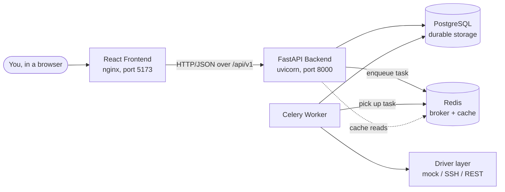
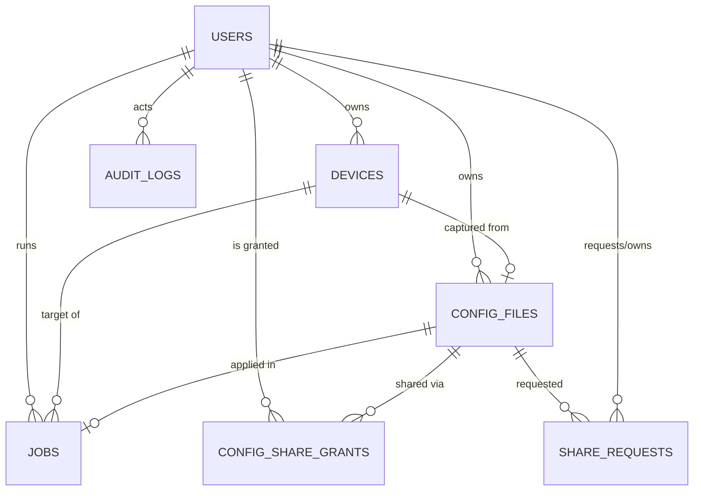
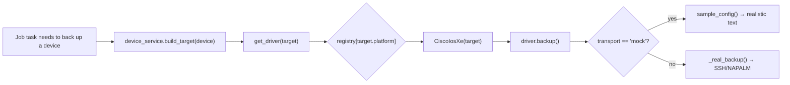
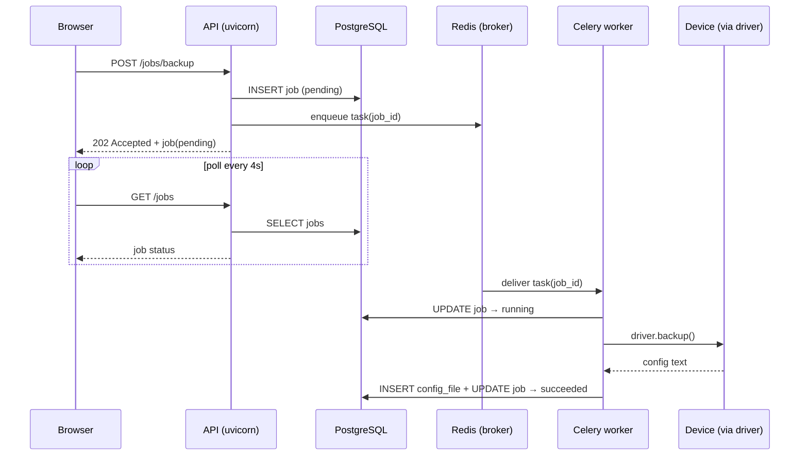
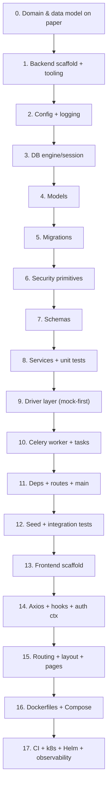

# The Complete Tutorial to Golden Config

> A from-the-ground-up explanation of **every** part of this repository — the
> concepts, the decisions, the code, and the *why* behind it all.
>
> **Who this is for:** You can write basic Python, but you're fuzzy on
> architecture, data structures, web frameworks, databases, async systems,
> queues, TypeScript/React, Docker, and "how real apps are built." By the end of
> this document you should understand every file in this repo, be able to answer
> questions about it in an interview, and be able to rebuild it from scratch
> knowing *why* each piece exists.
>
> Take your time. This is long on purpose. Read it like a textbook, not a memo.
> Each section first teaches the *general concept* (what it is, how it works, why
> we use it), then shows *how this repository uses it*, then shows *the actual
> code*. If you ever feel lost, scroll back to §3 (Foundational concepts) — every
> later section is built on it.

---

## Table of Contents

1. [What this application actually does](#1-what-this-application-actually-does)
2. [The 30,000-foot mental model](#2-the-30000-foot-mental-model)
3. [Foundational concepts you need first](#3-foundational-concepts-you-need-first)
4. [The technology stack, explained](#4-the-technology-stack-explained)
5. [How the repository is organized](#5-how-the-repository-is-organized)
6. [Backend, part 1: configuration, logging, observability](#6-backend-part-1-configuration-logging-observability)
7. [Backend, part 2: security — passwords, JWT, credential encryption](#7-backend-part-2-security--passwords-jwt-credential-encryption)
8. [Backend, part 3: the database layer](#8-backend-part-3-the-database-layer)
9. [Backend, part 4: the models (your tables)](#9-backend-part-4-the-models-your-tables)
10. [Backend, part 5: the schemas (Pydantic)](#10-backend-part-5-the-schemas-pydantic)
11. [Backend, part 6: the services (business logic)](#11-backend-part-6-the-services-business-logic)
12. [Backend, part 7: dependencies & auth wiring](#12-backend-part-7-dependencies--auth-wiring)
13. [Backend, part 8: the API routes](#13-backend-part-8-the-api-routes)
14. [Backend, part 9: the main app](#14-backend-part-9-the-main-app)
15. [Backend, part 10: the driver layer (the clever part)](#15-backend-part-10-the-driver-layer-the-clever-part)
16. [Backend, part 11: background jobs (Celery & Redis)](#16-backend-part-11-background-jobs-celery--redis)
17. [Backend, part 12: caching with Redis](#17-backend-part-12-caching-with-redis)
18. [Backend, part 13: the seed script](#18-backend-part-13-the-seed-script)
19. [Backend, part 14: database migrations (Alembic)](#19-backend-part-14-database-migrations-alembic)
20. [Backend, part 15: the tests](#20-backend-part-15-the-tests)
21. [Frontend, part 1: how a React app boots](#21-frontend-part-1-how-a-react-app-boots)
22. [Frontend, part 2: routing & auth](#22-frontend-part-2-routing--auth)
23. [Frontend, part 3: the API client & data fetching](#23-frontend-part-3-the-api-client--data-fetching)
24. [Frontend, part 4: pages & components](#24-frontend-part-4-pages--components)
25. [Infrastructure: Docker, Compose, CI, Kubernetes, Helm](#25-infrastructure-docker-compose-ci-kubernetes-helm)
26. [Five end-to-end walkthroughs](#26-five-end-to-end-walkthroughs)
27. [How to build this whole thing from scratch](#27-how-to-build-this-whole-thing-from-scratch)
28. [Glossary](#28-glossary)
29. [Interview-style questions & answers](#29-interview-style-questions--answers)

- [Appendix A: File-by-file reading guide](#appendix-a-file-by-file-reading-guide)
- [Appendix B: Rapid-fire concept checks](#appendix-b-rapid-fire-concept-checks)
- [Appendix C: Common pitfalls & gotchas](#appendix-c-common-pitfalls--gotchas)
- [Appendix D: Deeper dives on the hardest concepts](#appendix-d-deeper-dives-on-the-hardest-concepts)
- [Appendix E: Scenario & system-design questions](#appendix-e-scenario--system-design-questions)

---

## 1. What this application actually does

Imagine you work on a team that manages **network equipment**: switches,
routers, firewalls, wireless controllers, access points. A company or a lab
might have dozens, hundreds, or thousands of these devices. Each device has a
**configuration** — a (often very long) text document that describes exactly how
the device is set up: which ports belong to which VLAN, which login method is
used, what the management IP address is, which Wi-Fi networks it broadcasts, and
so on.

Two everyday problems with device configuration are:

1. **"What *is* the current configuration of this device, and can I save a copy
   of a known-good one?"** When a device is working perfectly, you want to
   capture that exact configuration — the **golden configuration** — so you can
   reproduce it later. The verb for capturing it is **backup**.
2. **"This device drifted, broke, or is brand new — can I push a known-good
   configuration onto it to bring it back to a correct state?"** The verb for
   pushing a saved configuration onto a device is **apply**.

Doing this **by hand** — logging into each device over SSH, typing `show
running-config`, copy-pasting the output into a text file, and later pasting a
config back in line by line — is slow, boring, and dangerously error-prone.

**Golden Config** is an internal web tool that automates the whole loop. The name
comes from the industry term "golden configuration" (the canonical, correct
config you want every comparable device to match). The product lets a user:

1. **Register devices** — store metadata about each device: a name, the driver
   *platform* (e.g. `cisco_ios_xe`), vendor, model, the host/IP, the port, the
   transport (mock or real), and login credentials. Credentials are **encrypted**
   before being stored.
2. **Capture (backup) a configuration** — press a button and the system connects
   to the device, runs the right "show config" command, and stores the result as
   a reusable, **versioned** *config file* owned by you.
3. **Apply a configuration** — take a saved config file and push it onto a
   *compatible* device (the platforms must match) to bring it to a known-good
   state. You can also do a **dry run** that shows what *would* change without
   actually changing anything.
4. **Share configurations** — config files are private to the user who created
   them. If another user wants one of your configs, they send a **share request**;
   you (the owner) **accept** or **deny** it. On acceptance, they get read access.
5. **Watch jobs** — backup and apply both run as **background jobs** (because
   talking to devices can be slow), so the UI shows each job moving through
   `pending → running → succeeded`/`failed`, and you can read the resulting logs
   and config diff.

A crucial design detail: every device driver ships with a **mock** implementation.
Instead of actually opening an SSH session to real hardware (which you don't have
on your laptop), the mock generates *fake but realistic* configuration text. This
means the entire system runs locally with **zero network gear** — perfect for a
demo, a portfolio piece, or local development. The code is structured so you can
flip a single field (`transport: real`) to talk to actual devices using real
libraries (Netmiko, NAPALM, httpx).

There's also **authentication** (you log in with a username and password) and
**authorization** (what you're allowed to do depends on your **role**: `admin`,
`operator`, or `viewer`).

> **Why does this project exist?** It is a production-style portfolio project. It
> deliberately demonstrates the skills a backend / full-stack engineer is expected
> to have: REST API design, relational data modeling, authentication and
> role-based access control, asynchronous background job processing, a pluggable
> integration layer, caching, encryption-at-rest, automated testing, containers,
> CI pipelines, Kubernetes deployment, and a clean React/TypeScript frontend.
> Understanding it teaches you how a *real* internal platform is structured and
> *why* each architectural decision was made.

### 1.1 The networking words, so the domain makes sense

You don't need to be a network engineer to understand this codebase — the actual
network communication is *mocked* by default — but the domain vocabulary shows up
in model fields, seed data, sample configs, and driver names, so here's just
enough that you never feel lost. None of these are deep; they're the nouns the app
organizes work around.

- **Switch / router / firewall / access point / wireless LAN controller (WLC)** —
  kinds of network *devices*. A **switch** connects devices within a local
  network; a **router** connects different networks (and to the internet); a
  **firewall** filters traffic for security; an **access point** provides Wi-Fi; a
  **WLC** centrally manages many access points. In this app they're all just rows
  in the `devices` table distinguished by a `platform` field — the code treats
  them fairly uniformly through the **driver** abstraction.
- **Configuration / running-config** — the text document describing how a device
  is set up. On a Cisco device you read it with `show running-config`. Capturing
  this is exactly what *backup* does. Pushing one is exactly what *apply* does.
- **Platform** — in this codebase, the *kind* of device from the software's point
  of view, identified by a **driver key** like `cisco_ios_xe`, `juniper_junos`,
  or `arista_eos`. The platform decides which driver (and which command dialect)
  the system uses. A config captured from one platform can only be applied to a
  device of the *same* platform — that's the compatibility rule enforced in code.
- **Vendor** — who makes the device (Cisco, Juniper, Arista, Dell, HPE, Ruckus…).
  Different vendors speak different command "dialects." In this app it's mostly a
  descriptive label; the `platform` field is what actually drives behavior.
- **VLAN (Virtual LAN)** — a way to split one physical network into separate
  logical networks. You'll see `vlan 10 name USERS` in the sample configs. You
  only need to know it's a common configuration item.
- **Telnet vs. SSH** — two ways to log into a device's command line remotely.
  **Telnet** is old and sends everything (including passwords) in plain text, so
  it's insecure; **SSH** (Secure Shell) is encrypted and the modern standard. The
  real SSH drivers connect over SSH.
- **CLI vs. REST controller** — older/most devices expose a **CLI** (command-line
  interface) you reach over SSH and read a text running-config from. Newer
  cloud-managed wireless systems (Juniper Mist, Ruckus SmartZone, Extreme Site
  Engine) expose a **REST API** instead, where the "configuration" is a JSON
  document you fetch and push over HTTPS. This repo has *both* kinds of driver.
- **Netmiko / NAPALM** — Python libraries for talking to network devices over SSH.
  **Netmiko** sends and reads CLI commands across many vendors. **NAPALM** adds
  higher-level operations like computing a configuration *diff* and doing an
  atomic replace-and-commit. The real SSH drivers use these.
- **httpx** — a modern Python HTTP client library. The real REST drivers use it to
  call controller APIs over HTTPS.

With those nouns in hand, the whole product reads plainly: *register devices,
capture each device's golden config into a private versioned file, apply a
compatible config back to a device when needed, and let users share configs with a
request/accept workflow.* Everything technical from here on is about how to build
that cleanly — the networking itself stays shallow on purpose.

### 1.2 The roles, and what each can do

Because the app has authorization (§3.6, §12), it helps to know the three roles up
front, since they appear in seed data, route guards, and the UI. They form a
ladder of privilege, most to least:

- **admin** — full control, including **user management** (creating and editing
  other users). An admin can also see *everyone's* devices, configs, and jobs.
  The "superuser."
- **operator** — the everyday power user. Can create/edit/delete their own
  devices, capture and apply configs (i.e. *run jobs*), and request/respond to
  shares. Cannot manage other users. This is the role that does the real work.
- **viewer** — read-only. Can log in and look at things they have access to, but
  cannot create devices or run jobs (those endpoints are guarded by
  `require_operator`). The "auditor" persona.

The roles are enforced at the route layer with a small reusable guard
(`require_role`, `require_admin`, `require_operator` — see §12) rather than
scattered `if` checks. Keeping the role list short and the permissions coarse is a
deliberate choice — real systems often grow finer-grained permissions, but three
roles are enough to demonstrate the *pattern* of role-based access control (RBAC)
without drowning the project in permission plumbing.

> One subtlety worth noting now: the code uses two *complementary* mechanisms for
> access control. **Roles** decide *what kind of action* you may take (e.g. only
> operators+ may create devices). **Ownership** decides *which specific rows* you
> may touch (you can only edit *your own* devices and configs, unless you're an
> admin). Sharing is the controlled exception to ownership: an accepted share
> grants one other user read access to one config. Keep "role vs. ownership vs.
> share grant" in mind; it explains almost every permission check in the backend.

---

## 2. The 30,000-foot mental model

Before any code, hold this picture in your head. The running system is made of
**six cooperating programs** (plus your browser):



1. **The browser** runs the **frontend** (a React single-page app). It draws the
   UI and talks to the backend over HTTP, exchanging JSON.
2. **The backend** (FastAPI, served by uvicorn) is the "brain." It receives HTTP
   requests, validates input, checks authentication and permissions, reads and
   writes the database, and returns JSON. It also *enqueues* slow work instead of
   doing it inline.
3. **PostgreSQL** is the **database** — durable, permanent storage for users,
   devices, config files, jobs, share requests, share grants, and audit logs.
4. **Redis** plays *two* roles here. As a **message broker** it's the queue
   between the backend and the worker (Celery uses it to hand off tasks). As a
   **cache** it can hold short-lived copies of frequently-read data to take load
   off Postgres.
5. **The Celery worker** is a *separate* program that watches Redis for tasks,
   picks them up, runs the slow device work (through the driver layer), and writes
   results back into PostgreSQL.
6. **The driver layer** isn't a separate process — it's a body of code the worker
   (and sometimes the backend) calls into. It knows how to "talk to" each kind of
   device, either by faking it (**mock**) or really connecting (**SSH** via
   Netmiko/NAPALM, **REST** via httpx).

The single most important architectural idea here is **#4 and #5: asynchronous
background jobs via a queue.** Capturing or applying a configuration can take many
seconds (real devices are slow; SSH handshakes take time). You don't want the
user's "Backup" button to freeze the web server for 30 seconds. So the backend
doesn't run the device work itself — it just *records that a job should happen* (a
`jobs` row marked `pending`), *drops a task into Redis*, and immediately responds
"202 Accepted, here's job #abc." A separate Celery worker does the slow work in the
background and updates the job row. The frontend then **polls** (asks repeatedly,
every few seconds) "what's the latest on my jobs?" until each shows `succeeded` or
`failed`.

If you understand that one paragraph, you understand the soul of this project.

**Why six programs instead of one?** A beginner's instinct is to put everything in
a single program — and for a tiny app you could. But each split here buys
something concrete:

- The **frontend** is separate from the **backend** because they do fundamentally
  different jobs (drawing pixels in a browser vs. enforcing rules and storing data
  on a server) and even *run in different places* (the frontend runs on the user's
  machine inside their browser; the backend runs on your server).
- Keeping the database in its own process (**PostgreSQL**) means a dedicated,
  battle-tested engine handles the genuinely hard problems of durable, concurrent,
  queryable storage. You would never want to reinvent that.
- The **worker** is separate from the backend so that slow device work doesn't
  clog the fast request/response path. The web server stays snappy and responsive
  while heavy lifting happens elsewhere — and you can scale the two independently
  (run more workers if device jobs pile up, more backends if web traffic grows).
- **Redis** sits between backend and worker as a neutral hand-off point, so the two
  don't have to know about each other or be running at the same instant. The
  backend can enqueue a task even if every worker is momentarily busy; the task
  waits in the queue.

Each boundary is a deliberate division of labor, and the cost — more moving parts
to run — is exactly what Docker Compose (§25) exists to manage.

**The data's journey, in one sentence each.** Trace a single *backup* through the
system and the whole thing snaps into focus. You click "Backup" in the **browser**,
which sends an authenticated HTTP `POST /api/v1/jobs/backup` to the **backend**.
The backend checks you're an operator and that you own the device, writes a new
`jobs` row marked `pending` into **PostgreSQL**, calls Celery's `.delay(...)` which
drops a task message into **Redis**, records the returned task id on the job, and
instantly replies `202 Accepted`. The **Celery worker**, which has been watching
Redis, picks up the task, loads the job from Postgres, marks it `running`, asks the
**driver layer** for the device's configuration (the mock returns realistic sample
text), creates a new `config_files` row with that content, marks the job
`succeeded`, and commits. Meanwhile your browser has been **polling** `GET
/api/v1/jobs` every few seconds — and the moment the worker marks the job
`succeeded`, the next poll sees it and the UI updates. Every concept in this
document is a detail of some step in that journey.

**A note on "stateless" backend, "stateful" database.** A subtle but important
property: the backend itself stores *nothing* permanent in its own memory. Every
fact that must survive — users, devices, configs, jobs — lives in PostgreSQL. This
is why you can run several copies of the backend (or restart it) without losing
anything, and why the worker can be an entirely separate process yet still "see"
the same jobs: they share the *database*, not memory. The Redis queue likewise
carries only an *id*; the worker re-reads the authoritative state from Postgres
rather than trusting anything in the message. Pushing all durable state into the
database and keeping the application processes **stateless** is a foundational
pattern for systems that need to scale horizontally or survive restarts, and you'll
see it reflected everywhere in this code.

---
## 3. Foundational concepts you need first

This section is a mini-textbook of the general computer-science ideas the rest of
the document assumes. The goal is that after reading it you can *explain each idea
out loud* — "what is it, how does it work, why do we use it" — without looking
anything up. Read it slowly; everything later builds on it. If a later section
uses a word you forgot, the definition is here.

### 3.1 Processes, programs, ports, and "a server"

A **program** is a file of instructions on disk (e.g. the Python files in
`backend/`). A **process** is a *running instance* of a program — the operating
system has loaded it into memory and is executing it, giving it its own private
memory space and a slice of CPU time. The six boxes in §2 are six processes.

Processes are *isolated*: by default one process cannot read another's memory.
That isolation is a feature (a crash or bug in one can't silently corrupt
another), but it means processes that need to cooperate must **communicate** —
over a network socket, a file, a database, or a queue. Almost everything in this
document is ultimately about *how separate processes talk to each other safely*.

A **server** is a long-running process that starts up, **listens** on a network
**port**, and waits for incoming requests, handling each and replying. A **client**
is a process that *initiates* requests. The FastAPI backend is a server (it listens
on port 8000). Your browser is a client. Confusingly, the backend is *also* a
client of PostgreSQL (port 5432) and Redis (port 6379) — "client" and "server" are
*roles in a conversation*, not fixed identities. A **port** is just a number (0–
65535) that lets one machine run many listening programs at once; an address +
port (`127.0.0.1:8000`) uniquely identifies one program's "phone line."
`127.0.0.1`, nicknamed **localhost**, always means "this same machine."

### 3.2 Networks, client–server, and HTTP (how two programs talk)

**The problem being solved.** Your browser is one process; the backend is another,
possibly on a different machine across the world. They have separate memory — they
cannot call each other's functions directly. They need to exchange messages over a
network, and to do that reliably they rely on a *stack of protocols*. A **protocol**
is simply an agreed-upon set of rules for formatting and exchanging messages so two
machines built by different people interoperate.

The relevant layers, bottom to top:

1. **IP (Internet Protocol)** gives every machine an **address** (e.g.
   `93.184.216.34`). IP routes a packet of bytes from one address toward another.
   IP alone is *unreliable* — packets can be lost, duplicated, or arrive out of
   order.
2. **TCP (Transmission Control Protocol)** sits on top of IP and adds
   *reliability*. It establishes a **connection** (via a three-way handshake),
   splits your data into numbered packets, re-sends lost ones, and reassembles
   them in order. So TCP gives you a reliable, ordered, two-way stream of bytes,
   plus the **port** concept. (SSH, HTTP, PostgreSQL's protocol, and Redis's
   protocol all run on top of TCP.)
3. **TLS (Transport Layer Security)** optionally wraps a TCP connection in
   *encryption*, so eavesdroppers can't read it and nobody can tamper with it. The
   "S" in **HTTPS** is TLS. The real REST drivers use HTTPS; SSH provides its own
   encryption layer.
4. **HTTP (HyperText Transfer Protocol)** sits on top of TCP (and optionally TLS)
   and defines the *format* of request and response messages for the web. This is
   the layer you actually program against.

So when the frontend calls the backend, the chain is: HTTP message → chopped into
TCP packets → addressed and routed by IP → reassembled → handed to the backend
listening on port 8000. You almost never think about IP/TCP directly — but knowing
they're there lets you answer "what actually happens when I make a request?"

**The anatomy of an HTTP request.** Conceptually a request is text with these
parts:

- A **method** (a verb describing intent): `GET` (read), `POST` (create / submit),
  `PATCH` (partially update), `PUT` (replace), `DELETE` (remove). Methods have
  *semantics* the whole web agrees on — `GET` must never change data (it's
  "safe"); `GET`/`PUT`/`DELETE` should be **idempotent** (doing them twice has the
  same effect as once); `POST` is *not* idempotent (POST twice = two things
  created). This app follows these conventions: listing devices is `GET`,
  creating one is `POST`, editing is `PATCH`, removing is `DELETE`.
- A **path / URL**: `/api/v1/devices`, `/api/v1/jobs/{id}`. It can carry **query
  parameters** after a `?`.
- **Headers** — key–value metadata: `Authorization: Bearer <token>` (who you
  are), `Content-Type: application/json` (the body's format), `Accept:
  application/json` (please respond in JSON).
- An optional **body** — the payload for `POST`/`PATCH`/`PUT`, usually JSON here
  (login is the one exception — see §3.6 and §13.2, it uses form-encoding).

**The anatomy of an HTTP response:**

- A **status code** — a 3-digit number with a precise web-wide meaning, grouped by
  first digit: **2xx** success (`200 OK`, `201 Created`, `202 Accepted`, `204 No
  Content`), **3xx** redirection, **4xx** *client* error (`400 Bad Request`, `401
  Unauthorized`, `403 Forbidden`, `404 Not Found`, `409 Conflict`, `422
  Unprocessable Entity` for validation failures), **5xx** *server* error (`500
  Internal Server Error`). Choosing the correct code is part of good API design;
  clients and humans rely on it. This project is deliberate about codes — e.g. it
  returns `202 Accepted` for "job queued," `409 Conflict` for "you already
  requested this share," and `422` for "config platform incompatible with device."
- **Headers** — e.g. `Content-Type`, or `Content-Disposition: attachment;
  filename="..."` to trigger a file download (used by the config download
  endpoint, §13.4).
- An optional **body** — the returned data, usually JSON.

**HTTP is stateless.** This is crucial: each request is independent and the server
remembers *nothing* about previous requests by default. The server doesn't "know"
you're logged in from one request to the next. That's *why* authentication tokens
exist (§3.6): since the server forgets you instantly, you must re-prove who you are
on *every single request* by attaching your token. Statelessness is what lets you
run many identical copies of a server behind a load balancer — any copy can handle
any request because none hold private memory of you.

You will see every one of these concepts — methods, paths, query params, headers,
status codes, statelessness — used deliberately throughout this codebase.

### 3.3 REST and JSON (how we organize an API)

**REST** (REpresentational State Transfer) is a *style* — a set of conventions —
for designing HTTP APIs. It isn't a library you install; it's a way of thinking.
The core idea: model your application as a collection of **resources** (nouns —
things you can name) and manipulate them with the *standard HTTP methods* (verbs)
rather than inventing your own.

The naive, non-REST way invents a function-style URL for every action:
`/getAllDevices`, `/createNewDevice`, `/deleteDeviceById`. This works but every API
ends up arbitrary; you must read docs for each call. The REST way says: there's a
resource called `devices`; express *what you want* through the method and *which
resource* through the path:

| Intent | Method + Path | Returns |
|---|---|---|
| List devices | `GET /api/v1/devices` | a list of devices |
| Get one device | `GET /api/v1/devices/{id}` | that device |
| Create a device | `POST /api/v1/devices` | the new device (`201`) |
| Update a device | `PATCH /api/v1/devices/{id}` | the updated device |
| Delete a device | `DELETE /api/v1/devices/{id}` | nothing (`204`) |

Notice the *same path* does different things depending on the verb. Once you learn
the pattern for one resource you know it for all of them (`/configs`, `/jobs`,
`/shares`, `/users`). That consistency is the entire payoff of REST, and this
project follows it faithfully. The base path `/api/v1` is **versioning**: putting
`v1` in the URL means you could later introduce a `v2` with breaking changes while
old clients keep using `v1`.

**JSON** (JavaScript Object Notation) is the **data format** used in request and
response bodies. It's just text, structured as nested key–value objects and arrays
— it looks almost exactly like a Python `dict`/`list`:

```json
{
  "id": "7f3c…",
  "name": "core-sw-3850",
  "platform": "cisco_ios_xe",
  "port": 22,
  "transport": "mock",
  "has_secret": true,
  "vendor": null
}
```

JSON has exactly six value types: string, number, boolean, `null`, object (`{}`),
and array (`[]`). No dates, no custom types — dates are sent as strings (ISO-8601
like `"2026-01-01T00:00:00Z"`), and UUIDs as strings. JSON became the universal web
format because it's human-readable, maps naturally onto nearly every language's
data structures, and is far lighter than the older XML. **Serialization** is turning
an in-memory object into a JSON string to send; **deserialization** (parsing) is the
reverse. The Python backend uses **Pydantic** to do this (§10); the TypeScript
frontend uses Axios, which wraps `JSON.stringify`/`JSON.parse`. Both ends agreeing
on JSON is what lets a Python program and a TypeScript program exchange structured
data.

### 3.4 Relational databases and SQL (the deep version)

This is the most important foundational topic, so we go deep. By the end you should
be able to answer "what is SQL," "what is a relational database," "how do
joins/indexes/transactions work," and "why PostgreSQL."

#### What a database even is, and why not just files

Your app must *persist* data — keep it after the process stops. You could write it
to files yourself, but then you'd have to solve, by hand: how to find one record
quickly without reading the whole file; how to let many users read and write at
once without corrupting each other; how to ensure a half-finished update doesn't
leave garbage if the power dies; and how to enforce rules (no two users with the
same email). A **database management system (DBMS)** solves all of these for you. A
**database** is the organized collection of data it manages.

#### "Relational" = data as tables of rows

A **relational database** organizes data into **tables** (a.k.a. *relations*). A
table is like a strict spreadsheet:

- **Columns** define the *shape*: each has a name and a **data type** (integer,
  text/`VARCHAR`, boolean, timestamp, `UUID`, `ENUM`…). The type is enforced — you
  cannot put text in an integer column.
- **Rows** (records) are the actual data; each row is one entity (one device, one
  user, one config file).

This project has tables `users`, `devices`, `config_files`, `config_share_grants`,
`share_requests`, `jobs`, and `audit_logs`. Example of the `devices` table:

| id (uuid) | name | platform | host | transport | owner_id |
|---|---|---|---|---|---|
| 7f3c… | core-sw-3850 | cisco_ios_xe | 10.0.0.11 | mock | 1a2b… |
| 9d8e… | edge-juniper | juniper_junos | 10.0.0.14 | mock | 1a2b… |

The word *relational* comes from this table-of-rows structure and from the fact
that tables can **relate** to one another via keys (below).

#### Keys and relationships (the heart of "relational")

- A **primary key** uniquely identifies each row. In this project it's a column
  named `id` of type **UUID** (more on UUIDs in §3.5). No two rows share an `id`.
- A **foreign key** is a column in one table that stores the primary key of a row
  in *another* table, creating a link. Example: each row in `devices` has an
  `owner_id` column holding the `id` of the `users` row that owns it. That's how
  the database represents "this device belongs to that user." Likewise `jobs` has
  `device_id`, `config_file_id`, and `user_id`.

This models real relationships:

- **One-to-many:** one user owns many devices (the *many* side, `devices`, holds
  the foreign key `owner_id`). One user owns many config files. One device has many
  jobs.
- **Many-to-one** is the same relationship from the other end (many devices belong
  to one user).
- **Many-to-many** (e.g. users ↔ config files, where one user can be granted many
  configs and one config can be shared with many users) needs a third **join
  table**. This project has exactly that: `config_share_grants` is a join table
  linking a `config_file_id` to a `user_id`, expressing "this user may read this
  config." It even has a **unique constraint** on the pair so the same grant can't
  be created twice.

Foreign keys also enforce **referential integrity**: the database refuses to create
a job pointing at a device that doesn't exist. And they can specify what happens
when the *parent* is deleted — the **`ON DELETE`** rule:

- `ON DELETE CASCADE` — delete the children too. Deleting a user cascades to delete
  their devices and config files; deleting a config cascades to delete its share
  grants. This keeps the database tidy with no orphaned rows.
- `ON DELETE SET NULL` — keep the child but null out the link. A job's
  `config_file_id` is `SET NULL` if the config is later deleted, so the job's
  history survives even though the config is gone. The audit log's `actor_id` is
  `SET NULL` if the acting user is deleted, preserving the historical record.

Choosing CASCADE vs. SET NULL per relationship is a real modeling decision, and
this repo makes it thoughtfully (you'll see exactly where in §9).

#### SQL: the language you talk to the database with

**SQL (Structured Query Language)** is the standard language for relational
databases. You send text commands; the database executes them and returns results.
SQL has two halves worth naming:

- **DDL (Data Definition Language)** defines *structure*: `CREATE TABLE`, `ALTER
  TABLE`, `DROP TABLE`, `CREATE INDEX`. Alembic migrations (§19) are essentially
  managed DDL.
- **DML (Data Manipulation Language)** works with *data*. The four commands map
  exactly onto **CRUD** (Create, Read, Update, Delete):

```sql
-- CREATE
INSERT INTO devices (id, name, platform, host, transport, owner_id)
VALUES ('7f3c…', 'sw-01', 'cisco_ios', '10.0.0.1', 'mock', '1a2b…');

-- READ (filter, sort, slice)
SELECT id, name, platform
FROM devices
WHERE owner_id = '1a2b…'
ORDER BY name
LIMIT 100;

-- UPDATE
UPDATE devices SET host = '10.0.0.2' WHERE id = '7f3c…';

-- DELETE
DELETE FROM devices WHERE id = '7f3c…';
```

Reading a `SELECT`: `SELECT` chooses *which columns*, `FROM` chooses *which table*,
`WHERE` filters *which rows*, `ORDER BY` sorts, `LIMIT`/`OFFSET` return a slice (the
basis of pagination). `COUNT(*)`, `SUM(...)` etc. are **aggregate functions** that
compute one number over many rows.

> **You rarely write raw SQL in this project** because the ORM (§3.7) generates it
> for you. But the ORM is *only* generating SQL underneath — `db.get(Device, id)`
> becomes `SELECT * FROM devices WHERE id = …`. Understanding the SQL is
> understanding what your Python actually does.

#### Joins: combining related tables

Because data is split across tables, you often need to recombine it. A **JOIN**
matches rows from two tables on a key:

```sql
-- "For each config file, also show its owner's username"
SELECT config_files.name, users.username
FROM config_files
JOIN users ON config_files.owner_id = users.id;
```

Joins are powerful but slow if the join columns aren't indexed — one reason this
project indexes foreign keys and lookup columns. The ORM often hides joins behind
`relationship()` and *eager loading* (see the N+1 discussion in §11 and the
`selectinload` usage in the share service).

#### Indexes: how lookups stay fast

Imagine finding a user by username in a million-row table. Without help, the
database reads *every* row and checks — a **full table scan**, O(n), slow. An
**index** fixes this. An index is a separate, sorted data structure (almost always
a **B-tree** — a balanced tree kept in sorted order) mapping a column's values to
the locations of matching rows. A lookup in a balanced tree takes O(log n) steps —
for a million rows, ~20 comparisons instead of a million. It's exactly like the
index at the back of a textbook: instead of reading the whole book to find a topic,
you jump to the sorted index and it tells you the page.

The trade-offs (and why you don't index *everything*):

- Indexes **speed up reads** (searches, filters, joins, sorts on that column).
- Indexes **cost storage** (the tree is extra data on disk).
- Indexes **slow down writes** slightly, because each `INSERT`/`UPDATE`/`DELETE`
  must also update the index trees.

So you index the columns you frequently *search, filter, or join by*, and not the
rest. This project indexes `username` and `email` (login + uniqueness), device
`name` and `platform`, config `name` and `platform`, the job's `celery_task_id`,
and the foreign keys. A **unique index** additionally enforces no duplicates — used
on `users.username`, `users.email`, and the `(config_file_id, user_id)` pair in
`config_share_grants`.

#### Transactions and ACID: all-or-nothing correctness

A **transaction** is a group of SQL statements treated as a single, indivisible
unit. Consider accepting a share request (§11): you must mark the request
`accepted` *and* insert a `config_share_grant`. If the first happened but the server
crashed before the second, you'd have an "accepted" request with no actual grant —
a broken state. A transaction prevents that: do all the work, then `COMMIT` (make it
permanent), or if anything goes wrong `ROLLBACK` (undo it all as if nothing
happened). SQLAlchemy's `session.commit()` commits a transaction; the `get_db`
dependency rolls back on exceptions (§8).

Relational databases guarantee transactions are **ACID**:

- **Atomicity** — all statements succeed, or none do. No half-states.
- **Consistency** — the database moves from one valid state to another; all rules
  (types, foreign keys, uniqueness, `NOT NULL`) hold before and after.
- **Isolation** — concurrent transactions don't see each other's uncommitted,
  in-progress changes; the result is as if they ran one at a time. This is what
  lets many users hit the app at once without corrupting data.
- **Durability** — once committed, data survives crashes and power loss (it's
  safely written to disk).

ACID is the big reason to use a relational database for important data (users,
jobs, configs) rather than a plain file or a cache — you get correctness guarantees
you would otherwise build by hand and get subtly wrong.

#### Why PostgreSQL specifically

**PostgreSQL** ("Postgres") is the relational DBMS this project uses in production.
Why it, among the options:

- It is **fully ACID-compliant** and famously reliable with data.
- It is **free and open source** with no licensing cost.
- It is **feature-rich**: real `ENUM` types (which this project uses for roles,
  statuses, formats), a native `UUID` type, native `JSON`/`JSONB`, powerful
  indexing, and strong standards compliance.
- It handles **concurrency** well via **MVCC (Multi-Version Concurrency Control)**:
  instead of locking a row so readers wait for writers, Postgres keeps multiple
  versions of a row, so readers see a consistent snapshot while a writer works.
  Heavy reading and writing happen at once without blocking — important for a web
  app with many simultaneous users.

In *tests* the project can swap Postgres for **SQLite** (a tiny database that lives
in a single file with no separate server — fast and disposable) by setting
`DATABASE_URL=sqlite+aiosqlite:///./test.db`. This is possible only because the ORM
abstracts the specific database. The trade-off is SQLite isn't 100% identical to
Postgres, which is why CI *also* runs the tests against a real Postgres service
(§25).

### 3.5 UUIDs vs. auto-increment integers (a real design choice)

Most beginner tutorials give every row an integer primary key that counts up: 1, 2,
3, … This project instead uses a **UUID** (Universally Unique IDentifier) — a
128-bit random value usually written as `7f3c1e2a-9b4d-4c8e-a1f2-0c3d4e5f6a7b`. The
`UUIDPrimaryKeyMixin` in `db/base.py` gives every table an `id` column that defaults
to `uuid.uuid4()` (a random UUID).

Why UUIDs here?

- **No coordination needed to generate one.** A random UUID is astronomically
  unlikely to collide, so *any* process — even the backend before it touches the
  database — can mint an id without asking a central counter. With auto-increment
  integers, only the database can hand out the next number.
- **They don't leak information.** Sequential integer ids reveal how many rows
  exist and let someone guess other ids (`/devices/41`, `/devices/42`, …). UUIDs are
  unguessable, which closes a class of "enumeration" attacks. (This is defense in
  depth, *not* a substitute for the ownership checks — the app still verifies you
  own the resource.)
- **They're safe to merge across systems.** If you ever combined two databases or
  generated ids on the client, integers would clash; UUIDs wouldn't.

The trade-offs: UUIDs are bigger (16 bytes vs. 4–8) and random, so naive indexing
can be slightly less cache-friendly than monotonically increasing integers. For an
app at this scale that cost is negligible, and the benefits (decentralized
generation, no enumeration) are worth it. Knowing *why* a project picks UUIDs over
integers is exactly the kind of "architectural decision" reasoning this tutorial
wants you to be able to articulate.

### 3.6 Authentication, authorization, hashing, and JWT

These two words sound alike and are constantly confused:

- **Authentication (authn)** = *who are you?* Proving identity (logging in).
- **Authorization (authz)** = *what are you allowed to do?* Checking permissions.

**Password storage and hashing.** You must *never* store passwords as plain text;
if your database leaks, every account is compromised (and people reuse passwords
everywhere). Instead you store a **hash**. A **cryptographic hash function** is a
one-way function: easy to compute forward (`password → hash`) but practically
impossible to reverse (`hash → password`). To check a login you hash the submitted
password and compare hashes. This project uses **bcrypt**, a hashing algorithm
designed specifically for passwords: it is deliberately *slow* and includes a
random **salt** (a per-password random value mixed in) so that two users with the
same password get different hashes, and so an attacker can't precompute a giant
lookup table ("rainbow table"). bcrypt also has an adjustable **work factor** so it
can be made slower as computers get faster. (`passlib` wraps bcrypt here.)

**Encryption vs. hashing — a critical distinction this project makes.** Hashing is
one-way and is correct for *passwords* (you never need the original back, only to
verify it). But **device credentials** are different: the worker must use the
actual device password to open an SSH session, so it needs the *original* value
back. For that you use **encryption** — a two-way, *reversible* transformation
keyed by a secret. This project encrypts device secrets with **Fernet**
(AES-128-CBC + HMAC authentication) in `core/crypto.py`. Same data, opposite tool,
because the requirement is opposite. Being able to explain "why hash passwords but
encrypt device credentials?" is a great litmus test of understanding (§7).

**Sessions vs. tokens.** Because HTTP is stateless (§3.2), the server needs a way
to recognize you on each request. Two classic approaches: server-side **sessions**
(the server stores a session record and gives you a cookie that points to it) or
**tokens** (the server gives you a signed piece of data you send back each time, and
the server doesn't store anything). This project uses **tokens**, specifically
**JWT**.

**JWT (JSON Web Token).** A JWT is a string with three dot-separated parts:
`header.payload.signature`. The **header** says the algorithm; the **payload** is
JSON **claims** (e.g. `sub` = subject = the user id, `exp` = expiry timestamp,
`type` = access/refresh, plus a custom `role`); the **signature** is a cryptographic
stamp the server creates using its **secret key**. Anyone can *read* a JWT (it's
just base64 — it is **not** encrypted, so never put secrets in it), but only the
holder of the secret key can produce a valid **signature**. So when you send a token
back, the server re-checks the signature: if it validates and isn't expired, the
server trusts the claims *without* a database lookup of session state. That's what
makes token auth *stateless* and horizontally scalable.

**Access vs. refresh tokens.** A trade-off: long-lived tokens are convenient but
dangerous if stolen (a thief can use them until they expire). Short-lived tokens are
safer but force frequent re-login. The standard resolution, used here, is *two*
tokens:

- A short-lived **access token** (30 minutes here) you attach to every API request.
- A longer-lived **refresh token** (7 days here) whose *only* job is to obtain a
  fresh access token from `/auth/refresh` when the old one expires.

If an access token leaks, it's useless within half an hour. The frontend's HTTP
client (§23) automates the refresh transparently: when a request gets `401`, it
quietly uses the refresh token to get a new access token and retries, so the user
never notices.

**RBAC (Role-Based Access Control).** Rather than attaching individual permissions
to each user, you give each user a **role** (`admin`/`operator`/`viewer`) and attach
permissions to roles. Checking access becomes "does this user's role allow this
action?" This project implements RBAC with small dependency guards (`require_admin`,
`require_operator`) plus per-row **ownership** checks (§12). Roles answer "what kind
of action," ownership answers "which specific row."

### 3.7 ORM: talking to the database with objects

Writing raw SQL strings in application code has real problems: the SQL is just text,
so the compiler can't catch typos or type errors; you must manually convert query
results (rows of values) into Python objects and back; and if you build SQL by
gluing user input into strings, you open the door to **SQL injection** (an attacker
types `'; DROP TABLE users; --` into a field and your concatenated query executes
it). An **ORM (Object–Relational Mapper)** solves all three.

An ORM is a library that **maps** the relational world (tables/rows/columns) onto
the object world (classes/instances/attributes) and generates the SQL for you. In
this project the ORM is **SQLAlchemy 2.0**. You declare a Python class `Device(Base)`
with typed attributes; SQLAlchemy maps it to the `devices` table. Then:

```python
device = await db.get(Device, some_id)          # SELECT * FROM devices WHERE id = …
device.host = "10.0.0.2"                          # in-memory change
await db.commit()                                 # UPDATE devices SET host = … 
```

You manipulate Python objects; SQLAlchemy emits the SQL, converts rows into objects,
and crucially uses **parameterized queries** (placeholders, with values sent
separately) so user input is *never* interpreted as SQL — that's structural
protection against injection. The ORM also gives you a **session** (a unit-of-work
that batches your changes and wraps them in a transaction) and **relationships**
(navigate `config.owner` instead of writing a join).

The cost of an ORM is some "magic" you must understand (when does it actually hit
the database? what's lazy vs. eager loading? the N+1 problem). We cover those in the
relevant sections. The benefit — type-safe, injection-safe, database-agnostic data
access — is why nearly every serious backend uses one.

### 3.8 Synchronous vs. asynchronous, and concurrency

A normal ("synchronous", "blocking") function runs top to bottom; when it calls
something slow — a network request, a database query — the whole thread *waits*,
doing nothing, until the answer comes back. A web server that handled each request
synchronously on one thread could serve only one user at a time while it waits.

A web backend spends most of its time **waiting on I/O** (input/output): waiting for
Postgres to answer, waiting for the network. **Asynchronous** programming lets a
single thread *start* a slow operation, *set it aside*, and work on another request
while the first is waiting — then resume the first when its data arrives. Python
expresses this with `async def` functions and the `await` keyword: `await` means
"this might take a while; pause me and let the event loop run something else until
it's ready." An **event loop** is the scheduler that juggles all these paused-and-
resumed coroutines on one thread.

This is why almost every function in the backend is `async def` and every database
call is `await`ed: FastAPI runs on an async event loop, the database driver
(`asyncpg`) is async, and SQLAlchemy's async engine ties them together. The payoff:
one backend process handles *many* concurrent requests efficiently, because while
one request waits on the database, others make progress.

Two important caveats this codebase respects:

- **Async is for I/O-bound waiting, not CPU-bound crunching.** If a task is slow
  because it's *computing* (or because it's blocking on a non-async library like
  Netmiko's SSH), `await` doesn't help — it would block the whole event loop. That's
  one reason device work runs in the **Celery worker** (a separate process), not
  inline in the async web server.
- **Celery tasks here are *synchronous* functions** that internally call
  `asyncio.run(...)` to reuse the app's async database code. The worker process can
  afford to block because it's not also serving web requests.

Don't confuse **async concurrency** (one thread juggling many waits) with
**parallelism** (multiple CPU cores doing work literally at the same time) or with
**background processing** (handing slow work to another process via a queue). This
app uses async for the web layer's concurrency and a queue+worker for background
processing; both exist to keep the user-facing server responsive.

### 3.9 Caching and the role of Redis

A **cache** is a small, fast store of *copies* of data that is expensive to compute
or fetch, so repeated requests can be answered quickly without redoing the work. The
classic example: if computing a device inventory list hits the database every time,
you can instead store the result in a fast in-memory store for, say, 60 seconds, and
serve subsequent requests from there. The price of caching is **staleness** (the
cached copy can be out of date) and **invalidation** (deciding when to throw the
copy away) — famously "one of the two hard things in computer science."

**Redis** is an in-memory **key–value store**: extremely fast because it keeps data
in RAM, and it speaks a simple "set this key to this value, optionally expiring
after N seconds" protocol. This project uses Redis for *two* distinct jobs (don't
conflate them):

1. **As a cache** — `core/redis.py` provides `cache_get_json` / `cache_set_json` /
   `cache_delete` helpers with a **TTL (time-to-live)**, so values auto-expire. This
   is optional, best-effort acceleration.
2. **As a message broker for Celery** — the queue that carries background-job
   messages from the backend to the worker (§3.10, §16). This is essential
   infrastructure, not an optimization.

Redis can do both because they're both "fast, ephemeral, shared state." Using
*separate logical databases* (Redis numbers them `/0`, `/1`, `/2`) keeps the broker,
the result backend, and the cache from stepping on each other — you can see this in
`config.py` (`CELERY_BROKER_URL` ends in `/0`, results in `/1`, cache in `/2`).

> **Why Redis and not just a Python dictionary?** A dict lives inside one process's
> memory: the cache wouldn't be shared between multiple backend copies, and a queue
> in a dict couldn't be read by a *separate* worker process. Redis is a *shared*,
> *external* store every process can reach over the network, which is exactly what
> a multi-process architecture needs.

### 3.10 Message queues, brokers, and background workers

A **message queue** is a line where one program drops "please do this" messages and
another program picks them up to process. The dropper is the **producer** (here, the
FastAPI backend); the picker-upper is the **consumer** or **worker** (here, the
Celery worker); the thing that holds the line is the **broker** (here, Redis).

Why bother? Three big reasons, all of which apply to this app:

1. **Responsiveness / decoupling in time.** Slow work (a 30-second device apply)
   shouldn't block the user's request. The producer enqueues and returns
   instantly; the consumer does the slow work later. The user gets a `202 Accepted`
   and polls for the result.
2. **Resilience / decoupling in availability.** If every worker is busy, tasks wait
   safely in the queue instead of being lost. If a worker crashes mid-task, the
   broker can re-deliver the message so another worker retries.
3. **Independent scaling.** Web traffic and device-job volume grow differently. With
   a queue you can run, say, 2 web processes and 8 workers — or vice versa — tuning
   each to its load.

**Celery** is the most popular Python task-queue framework. You decorate a function
with `@celery_app.task`; calling `.delay(args)` *serializes* the arguments to JSON
and pushes a message onto the broker instead of running the function now. A worker
process subscribed to that queue pops the message, deserializes the args, and runs
the function. A separate **result backend** (another Redis database here) can store
the task's return value/status. This project's `worker.py` configures exactly this,
and `tasks/device_tasks.py` defines the `device.backup` and `device.apply` tasks.

The pattern to internalize: **the queue carries only an id, never the heavy
result.** The backend enqueues `run_backup(job_id, name)`. The worker re-reads the
job and device from Postgres (the source of truth), does the work, and writes the
result back to Postgres. The frontend learns the outcome by polling the database via
the API — *not* by reading Celery's result backend. This keeps Postgres as the
single authoritative store and makes the whole flow easy to reason about.

### 3.11 The frontend stack concepts (React, components, state, TypeScript)

The frontend is a **single-page application (SPA)**: the browser loads one HTML
page and a bundle of JavaScript once, and from then on the JavaScript redraws the
page in place and fetches data from the API as needed — no full page reloads when
you click around. Key ideas you'll need:

- **The DOM** (Document Object Model) is the browser's live, in-memory tree of the
  page's elements. JavaScript changes the DOM to change what you see.
- **React** is a library for building UIs as a tree of **components** — reusable
  functions that take inputs (**props**) and return a description of UI (written in
  **JSX**, an HTML-like syntax inside JavaScript). React keeps a lightweight copy of
  the UI (the "virtual DOM"), and when your data changes it efficiently computes the
  minimal real-DOM updates. You describe *what the UI should look like for the
  current data*, and React handles the *how*.
- **State** is data that can change over time and, when it does, should re-render
  the UI. React's `useState` hook holds a piece of state; calling its setter
  triggers a re-render. `useEffect` runs side effects (like fetching data) in
  response to changes. `useContext` shares state (like the logged-in user) across
  many components without passing props down every level.
- **TypeScript** is JavaScript plus a **static type system**. You annotate values
  with types (`string`, `number`, custom `interface`s mirroring the API's JSON), and
  a compiler catches type mismatches *before* the code runs — the same safety idea
  as Python type hints but enforced more strictly and compiled away before shipping.
  The frontend's `api/types.ts` defines interfaces that mirror the backend's
  Pydantic schemas, so the two ends stay in sync.
- **TanStack Query** (React Query) is a data-fetching library that manages the
  *server state* in your UI: it fetches, **caches**, dedupes, and **re-fetches**
  (including **polling** on an interval) API data, and exposes `isLoading`/`error`/
  `data` so components don't hand-roll all that. The jobs page uses its polling to
  watch background jobs progress.
- **Material UI (MUI)** is a component library implementing Google's Material Design
  — ready-made buttons, tables, dialogs, etc. — so the app looks consistent without
  hand-writing CSS.
- **Vite** is the build tool / dev server: it serves the app instantly during
  development (with hot reload) and **bundles**/minifies it into static files for
  production.
- **React Router** maps URL paths (`/devices`, `/configs`) to which component to
  render, giving the SPA multiple "pages" without server round-trips.
- **Axios** is the HTTP client that actually calls the backend; it supports
  **interceptors** (hooks that run on every request/response), which is how the app
  injects the JWT and auto-refreshes it.

Don't worry if these are fuzzy now; §21–§24 walk through each in the actual code.

### 3.12 Containers, images, and orchestration (Docker, Compose, Kubernetes)

Running six cooperating processes, each with its own language runtime and
dependencies, on every developer's laptop *and* in production, is a nightmare of
"works on my machine." **Containers** solve this. A **container** packages a process
together with everything it needs to run — its runtime, libraries, and files — into
an isolated unit that runs identically anywhere. It's lighter than a full virtual
machine because containers share the host's operating-system kernel instead of each
booting their own OS.

- A **Docker image** is the built, read-only template (think "a class"); a
  **container** is a running instance of an image (think "an object"). You build an
  image from a **Dockerfile**, a recipe of steps (start from `python:3.11-slim`,
  copy code, install deps, set the start command). This repo has a `backend/
  Dockerfile` and a multi-stage `frontend/Dockerfile`.
- **Docker Compose** runs *several* containers together from one `docker-compose.yml`
  file, wiring up their networking, environment variables, volumes (for persistent
  data), health checks, and start order. `docker compose up` brings the whole
  six-service stack to life with one command — that's how you run this project
  locally.
- **Kubernetes (k8s)** is a production-grade **orchestrator**: it runs containers
  across a *cluster* of machines, restarts them when they crash, scales them up and
  down, does rolling updates, and provides service discovery and load balancing.
  This repo includes raw k8s manifests (`deploy/k8s/`) and a **Helm chart**
  (`deploy/helm/`) — Helm being a templating/packaging tool for k8s manifests so you
  can deploy the same app to different environments by changing values.

You don't need to master Kubernetes to understand this project, but knowing the
ladder — *Dockerfile builds an image → Compose runs many images locally → Kubernetes
runs them in production* — lets you place every infra file in §25.

### 3.13 Observability: logs, metrics, traces

When a system has six moving parts, "is it healthy and why is it slow?" becomes hard
to answer by guessing. **Observability** is the practice of making a system's
internal state visible from the outside, classically via three "pillars":

- **Logs** — timestamped text records of discrete events ("user logged in," "backup
  failed"). This app uses **structlog** to emit **structured logs** (each line is
  key–value/JSON rather than free-form prose), which machines can search and filter.
- **Metrics** — numeric measurements over time (requests per second, error rate,
  latency percentiles). The app exposes **Prometheus**-format metrics at `/metrics`;
  **Prometheus** scrapes and stores them, and **Grafana** draws dashboards from
  them.
- **Traces** — the path of a single request as it flows through the system, with
  timing for each step. The app can emit **OpenTelemetry (OTel)** traces to an
  **OTel Collector** when enabled.

Crucially, the app's observability is **optional and best-effort**: if the OTel
libraries aren't installed or `OTEL_ENABLED` is false, instrumentation silently
no-ops, so the core app runs without them (§6.3). That "don't let the nice-to-have
break the must-have" posture is itself a design lesson.

---
## 4. The technology stack, explained

You've met these names in passing; here they are in one place, each with *what it
is* and *why this project chose it over alternatives*. Being able to justify each
choice is exactly the "why am I implementing it this way" understanding you asked
for.

### 4.1 Backend stack

| Tool | What it is | Why it's here (vs. alternatives) |
|---|---|---|
| **Python 3.11** | The backend language. | Readable, huge ecosystem for web + networking (Netmiko/NAPALM are Python). 3.11 adds speed and `StrEnum`. |
| **FastAPI** | A modern async web framework for building APIs. | Built on type hints: it *auto-validates* requests and *auto-generates* OpenAPI docs from your Pydantic models. Async-native (good for I/O-bound web work). Less boilerplate than Django REST Framework; more batteries than Flask. |
| **uvicorn** | The ASGI server that actually runs FastAPI. | FastAPI is just the app; uvicorn is the high-performance server process that speaks HTTP and drives the async event loop. |
| **Pydantic v2** | Data validation + serialization via typed models. | Turns "is this JSON valid?" into "does it fit this typed class?" Validates at the system boundary, converts to/from JSON, and powers FastAPI's docs. v2's core is written in Rust → fast. |
| **SQLAlchemy 2.0 (async)** | The ORM + SQL toolkit. | Industry-standard Python ORM; the 2.0 async API pairs with FastAPI's async model. Database-agnostic (Postgres in prod, SQLite in tests). Protects against SQL injection. |
| **asyncpg** | Async PostgreSQL driver. | The fast, async low-level library SQLAlchemy uses to talk to Postgres without blocking the event loop. |
| **Alembic** | Database migration tool (from the SQLAlchemy authors). | Versions your schema as code, so every environment can be brought to the same structure reproducibly (§19). |
| **PostgreSQL** | The relational database. | ACID, free, feature-rich, great concurrency (§3.4). |
| **Redis** | In-memory key–value store. | Doubles as the Celery broker/result backend and the cache (§3.9). |
| **Celery** | Distributed task queue framework. | The de-facto Python way to run background jobs across separate worker processes (§3.10). |
| **passlib + bcrypt** | Password hashing. | bcrypt is purpose-built for passwords (slow, salted); passlib gives a clean API and upgrade path. |
| **python-jose** | JWT creation/verification. | Encodes/decodes and signs the access/refresh tokens (§7). |
| **cryptography (Fernet)** | Symmetric encryption. | Reversibly encrypts device credentials at rest (§7). |
| **Netmiko + NAPALM** | SSH/CLI device libraries. | Real SSH backup/apply across many vendors; NAPALM adds diffs and atomic commits (§15). |
| **httpx** | Async-capable HTTP client. | Talks to REST controllers (Mist, SmartZone) and powers the in-process test client. |
| **structlog** | Structured logging. | Emits machine-parsable key–value logs; JSON in prod, pretty in dev (§6). |
| **OpenTelemetry / Prometheus** | Tracing / metrics. | Optional observability (§13.6 health, §25). |
| **pytest** | Test framework. | Concise tests, fixtures, parametrization; the Python standard for testing (§20). |
| **ruff / black / mypy** | Lint / format / type-check. | Catch errors and enforce a consistent style automatically in CI and pre-commit (§25). |

### 4.2 Frontend stack

| Tool | What it is | Why it's here |
|---|---|---|
| **TypeScript** | Typed JavaScript. | Catches whole classes of bugs at compile time; the `types.ts` interfaces mirror backend schemas so the contract is explicit (§3.11). |
| **React 18** | UI component library. | Declarative components + hooks; the dominant way to build SPAs. |
| **Vite** | Build tool / dev server. | Near-instant dev server with hot reload; fast production bundling. |
| **React Router** | Client-side routing. | Maps URLs to pages without server round-trips. |
| **TanStack Query** | Server-state management. | Fetching, caching, and *polling* for free (§23). |
| **Axios** | HTTP client. | Interceptors enable JWT injection + auto-refresh (§23). |
| **Material UI (MUI)** | Component/design system. | Consistent, accessible UI without hand-rolled CSS. |
| **Vitest** | Test runner. | Vite-native, Jest-compatible; tests the API client (§24). |

### 4.3 Infrastructure & tooling

| Tool | What it is | Why it's here |
|---|---|---|
| **Docker** | Containerization. | One reproducible runtime per service (§3.12, §25). |
| **Docker Compose** | Multi-container local orchestration. | One command brings up all six services locally. |
| **Kubernetes + Helm** | Production orchestration + packaging. | Resilient, scalable deployment; Helm templatizes the manifests (§25). |
| **GitHub Actions** | CI/CD. | Runs lint, type-check, and tests on every push/PR (§25). |
| **pre-commit** | Git hook runner. | Runs formatters/linters before each commit so bad code never lands. |
| **nginx** | Web server / reverse proxy. | Serves the built frontend static files and proxies API calls in the container (§25). |

> **The meta-point.** None of these are arbitrary. Each was chosen because it solves
> a specific problem the architecture creates: async web work → FastAPI/uvicorn;
> typed data at the boundary → Pydantic; injection-safe DB access → SQLAlchemy;
> slow device work → Celery/Redis; reversible secret storage → Fernet; reproducible
> runtime → Docker. When someone asks "why did you use X?", the answer is always
> "because the architecture needed *this specific capability*, and X provides it
> well."

---

## 5. How the repository is organized

A good project layout makes the code *navigable*: you can guess where something
lives before you open it. This repo splits cleanly into `backend/`, `frontend/`,
`deploy/`, and `docs/`, plus top-level orchestration files.

```text
golden-config/
├── docker-compose.yml      # runs all six services locally
├── Makefile                # convenience commands (up, test, lint…)
├── README.md               # quick start + architecture overview
├── .pre-commit-config.yaml # git hooks: format/lint before commit
├── .github/workflows/ci.yml# CI: lint, type-check, test on every push/PR
├── backend/                # the FastAPI application (the "brain")
│   ├── pyproject.toml      # Python deps + tool config (ruff/black/mypy)
│   ├── alembic.ini         # migration tool config
│   ├── Dockerfile          # builds the backend image
│   └── app/
│       ├── main.py         # FastAPI app factory + entrypoint
│       ├── worker.py       # Celery app instance
│       ├── observability.py# optional OTel/Prometheus setup
│       ├── initial_data.py # idempotent seed script (admin + demo data)
│       ├── core/           # cross-cutting infra: config, security, crypto, logging, redis
│       ├── db/             # SQLAlchemy base + async session
│       ├── models/         # ORM models (database tables) + enums
│       ├── schemas/        # Pydantic models (API request/response shapes)
│       ├── services/       # business logic (the "verbs": create, list, decide…)
│       ├── api/            # HTTP layer: dependencies + versioned routers
│       │   ├── deps.py     # shared deps: db session, current user, role guards
│       │   └── v1/         # one router file per resource
│       ├── drivers/        # pluggable device drivers (mock/SSH/REST) + registry
│       ├── tasks/          # Celery tasks (the background work)
│       └── alembic/        # migration environment + versioned migration scripts
│   └── tests/              # unit + integration tests
├── frontend/               # the React + TypeScript single-page app
│   ├── package.json        # JS deps + scripts
│   ├── vite.config.ts      # build/dev config
│   ├── Dockerfile          # multi-stage build → nginx static serve
│   ├── nginx.conf          # serve SPA + proxy /api
│   └── src/
│       ├── main.tsx        # React entrypoint (providers)
│       ├── App.tsx         # top-level routing + auth gate
│       ├── theme.ts        # MUI theme
│       ├── api/            # client.ts (Axios), hooks.ts (TanStack), types.ts
│       ├── auth/           # AuthContext (login state)
│       ├── components/     # shared UI (AppLayout)
│       ├── pages/          # one component per screen
│       └── test/           # Vitest tests
└── deploy/                 # everything about running it in production
    ├── k8s/                # raw Kubernetes manifests
    ├── helm/golden-config/ # Helm chart (templated k8s)
    └── observability/      # Prometheus, Grafana, OTel collector configs
```

### 5.1 The layering principle (this is the key idea)

The backend's folders aren't arbitrary; they form **layers**, and dependencies flow
in *one direction*: outer/HTTP layers depend on inner/business layers, never the
reverse. From the request inward:

```
HTTP request
   │
   ▼
api/v1/*.py        ── routes: parse the request, check permissions, shape the response
   │   (depends on)
   ▼
schemas/*.py       ── validate input & serialize output (Pydantic)
   │
   ▼
services/*.py      ── business logic: the actual rules ("a config's platform must match the device")
   │
   ▼
models/*.py        ── ORM models: the database tables
   │
   ▼
db/ + core/        ── the engine, session, config, security primitives
   │
   ▼
PostgreSQL / Redis
```

Why structure it this way? **Separation of concerns.** Each layer has one job and
can be understood (and tested) in isolation:

- **Routes** know about HTTP (status codes, request bodies, auth headers) but *not*
  how data is stored. They translate between the web and the services.
- **Services** know the *business rules* but not about HTTP. They take a database
  session and plain arguments, do the work, and return models. Because they don't
  import FastAPI, you can call them from a route, from the seed script, *or from a
  Celery task* — and indeed all three happen in this repo. That reuse is the direct
  payoff of keeping logic out of the routes.
- **Models** know about the database shape but not about business rules or HTTP.
- **Schemas** know about the *wire format* (what JSON the API accepts and returns),
  deliberately *separate* from the database models so the two can differ (e.g. the
  API never returns a password hash even though the model stores one).

A function in a route can call a service; a service can use models; nothing calls
"upward." This one-directional dependency rule is what keeps a growing codebase from
turning into a tangle, and it's worth internalizing because it generalizes far
beyond this project.

### 5.2 "Where do I add X?" — a navigation cheat-sheet

- *A new field on devices?* → `models/device.py` (column) + a migration in
  `alembic/versions/` + `schemas/device.py` (expose it) + maybe the frontend types
  and form.
- *A new API endpoint?* → a function in the relevant `api/v1/*.py`, calling a
  service.
- *A new business rule?* → the relevant `services/*.py`.
- *A new device platform?* → a new driver subclass in `drivers/ssh_drivers.py` or
  `drivers/rest_drivers.py` with `@register` — and nothing else, by design (§15).
- *A new background job?* → a task in `tasks/` + a service method to enqueue it.
- *A new screen?* → a component in `frontend/src/pages/` + a route in `App.tsx` + a
  nav entry in `AppLayout.tsx` + hooks in `api/hooks.ts`.

Keep this map handy; the rest of the document fills in each box in detail.

---
## 6. Backend, part 1: configuration, logging, observability

We start the code tour with the `core/` package — the cross-cutting "plumbing" every
other module depends on. These files don't implement any *feature*; they provide the
*foundations* (settings, secrets, logging) the features build on. Getting these
right early is what keeps the rest of the code clean.

### 6.1 Configuration: `core/config.py`

**The problem.** An app has dozens of settings: the database address, the secret
signing key, token lifetimes, the admin bootstrap password, CORS origins, Redis
URLs. These differ between your laptop, CI, and production, and some (the secret
key!) must never be hard-coded in source. The standard solution is the
**Twelve-Factor App** principle: *store configuration in the environment*. The
program reads settings from **environment variables** (and, in development, a local
`.env` file), so the same image runs differently in different places just by changing
the environment.

**The implementation** uses `pydantic-settings`, which gives you a *typed*, *validated*
settings object instead of scattered `os.environ.get(...)` calls:

```python
class Settings(BaseSettings):
    model_config = SettingsConfigDict(
        env_file=".env", env_file_encoding="utf-8", case_sensitive=True, extra="ignore"
    )

    # ---- General ----
    PROJECT_NAME: str = "Golden Config"
    ENVIRONMENT: str = "development"
    LOG_LEVEL: str = "INFO"
    API_V1_PREFIX: str = "/api/v1"

    # ---- CORS ----
    BACKEND_CORS_ORIGINS: list[str] = Field(default_factory=list)

    # ---- Security ----
    SECRET_KEY: str = "insecure-dev-key-change-me"
    ALGORITHM: str = "HS256"
    ACCESS_TOKEN_EXPIRE_MINUTES: int = 30
    REFRESH_TOKEN_EXPIRE_DAYS: int = 7
    CREDENTIAL_ENCRYPTION_KEY: str = ""

    # ---- Database ----
    POSTGRES_USER: str = "goldenconfig"
    POSTGRES_PASSWORD: str = "goldenconfig"
    POSTGRES_DB: str = "goldenconfig"
    POSTGRES_HOST: str = "localhost"
    POSTGRES_PORT: int = 5432
    DATABASE_URL: str | None = None

    # ---- Redis / Celery ----
    REDIS_HOST: str = "localhost"
    REDIS_PORT: int = 6379
    CELERY_BROKER_URL: str = "redis://localhost:6379/0"
    CELERY_RESULT_BACKEND: str = "redis://localhost:6379/1"
    CACHE_REDIS_URL: str = "redis://localhost:6379/2"
    CACHE_TTL_SECONDS: int = 60
    ...
```

Line by line, the important ideas:

- **`class Settings(BaseSettings)`** — by subclassing pydantic-settings'
  `BaseSettings`, every declared attribute is automatically populated from an
  environment variable of the same name, *coerced to the declared type*, and
  validated. If `POSTGRES_PORT` is set to `"5432"` in the environment (env vars are
  always strings), Pydantic converts it to the `int` `5432`. If it were
  `"not-a-number"`, the app would fail loudly at startup rather than mysteriously
  later. **Fail-fast on bad config is a feature.**
- **`model_config = SettingsConfigDict(env_file=".env", ...)`** — in development,
  values can come from a `.env` file (a simple `KEY=value` text file you don't
  commit). `extra="ignore"` means unknown env vars are ignored rather than causing
  errors. `case_sensitive=True` requires exact-case names.
- **Defaults everywhere** — every setting has a sensible default so the app *runs*
  out of the box for a demo. But notice `SECRET_KEY` defaults to
  `"insecure-dev-key-change-me"`: a deliberately obvious placeholder screaming "set
  me in production." Defaults are for convenience, *not* security.
- **`BACKEND_CORS_ORIGINS: list[str]`** with a custom validator (below) — CORS
  (Cross-Origin Resource Sharing) is a browser security rule: by default a page
  served from `http://localhost:5173` is *not allowed* to call an API on
  `http://localhost:8000` (a different "origin") unless the API explicitly opts in
  by returning CORS headers. This list tells the backend which front-end origins to
  trust (§14).
- **The three Redis URLs** ending in `/0`, `/1`, `/2` — separate logical Redis
  databases for the Celery broker, Celery results, and the cache, so they don't
  collide (§3.9).
- **`CREDENTIAL_ENCRYPTION_KEY`** — the key used to encrypt device secrets (§7).
  Empty by default, in which case the code derives a dev key from `SECRET_KEY` (so
  local dev works with no setup) but *production must set it explicitly*.

Two helper properties and a cached factory finish the file:

```python
    @field_validator("BACKEND_CORS_ORIGINS", mode="before")
    @classmethod
    def _split_cors(cls, value: object) -> object:
        """Allow CORS origins as a comma-separated string in the environment."""
        if isinstance(value, str) and not value.startswith("["):
            return [origin.strip() for origin in value.split(",") if origin.strip()]
        return value

    @property
    def sqlalchemy_database_uri(self) -> str:
        if self.DATABASE_URL:
            return self.DATABASE_URL
        return (
            f"postgresql+asyncpg://{self.POSTGRES_USER}:{self.POSTGRES_PASSWORD}"
            f"@{self.POSTGRES_HOST}:{self.POSTGRES_PORT}/{self.POSTGRES_DB}"
        )

    @property
    def is_production(self) -> bool:
        return self.ENVIRONMENT.lower() in {"production", "prod"}


@lru_cache
def get_settings() -> Settings:
    return Settings()

settings = get_settings()
```

- **`_split_cors`** is a Pydantic **validator** that runs *before* type-coercion.
  Env vars are strings, but we want a `list[str]`. This lets you write
  `BACKEND_CORS_ORIGINS=http://localhost:5173,https://app.example.com` (a simple
  comma-separated string) and have it parsed into a Python list. It also still
  accepts a JSON-array string (anything starting with `[`). This is a small
  example of meeting the environment where it is (env vars are flat strings) while
  giving the code a rich type.
- **`sqlalchemy_database_uri`** *builds* the database connection URL. If
  `DATABASE_URL` is set explicitly (as in tests, pointing at SQLite), it's used
  verbatim; otherwise the URL is assembled from the individual Postgres parts. The
  `postgresql+asyncpg://` scheme tells SQLAlchemy "use the async asyncpg driver."
  This is the single seam that lets the *same code* run on Postgres in production and
  SQLite in tests.
- **`is_production`** centralizes the "are we in prod?" check (used by logging to
  choose JSON vs. pretty output).
- **`@lru_cache` on `get_settings`** means `Settings()` is constructed *once* and
  the same instance is returned forever after (memoized). Reading and validating env
  vars repeatedly would be wasteful; the settings don't change while the process
  runs. `settings = get_settings()` at module scope gives every other file a simple
  `from app.core.config import settings` import.

> **Why a typed settings object instead of `os.environ`?** Three wins: (1) one place
> documents every knob the app has; (2) values are validated and typed at startup,
> so misconfiguration fails fast and loudly; (3) the rest of the code reads
> `settings.ACCESS_TOKEN_EXPIRE_MINUTES` (an `int`) instead of
> `int(os.environ["ACCESS_TOKEN_EXPIRE_MINUTES"])` scattered everywhere.

### 6.2 Logging: `core/logging.py`

**The problem with `print`.** Beginners debug with `print(...)`. That's fine for a
script, but a server running in production needs logs that are: *leveled* (debug vs.
info vs. warning vs. error, so you can filter noise), *structured* (machine-parsable
key–value data, not free-form sentences, so you can search "all events where
`job_id = X`"), *timestamped*, and *routed* to stdout (where container platforms
collect them). This file sets that up with **structlog**.

```python
def configure_logging() -> None:
    log_level = getattr(logging, settings.LOG_LEVEL.upper(), logging.INFO)
    logging.basicConfig(format="%(message)s", stream=sys.stdout, level=log_level)

    renderer = (
        structlog.processors.JSONRenderer()
        if settings.is_production
        else structlog.dev.ConsoleRenderer()
    )

    structlog.configure(
        processors=[
            structlog.contextvars.merge_contextvars,
            structlog.processors.add_log_level,
            structlog.processors.TimeStamper(fmt="iso"),
            structlog.processors.StackInfoRenderer(),
            structlog.processors.format_exc_info,
            renderer,
        ],
        wrapper_class=structlog.make_filtering_bound_logger(log_level),
        logger_factory=structlog.PrintLoggerFactory(),
        cache_logger_on_first_use=True,
    )

def get_logger(name=None):
    return structlog.get_logger(name)
```

The key ideas:

- **A processor pipeline.** structlog passes each log event through an ordered list
  of **processors**, each transforming it: merge in context variables, add the level,
  add an ISO timestamp, render stack/exception info, and finally *render* the event
  to text. This pipeline is why you can attach structured key–values (e.g.
  `logger.info("backup_succeeded", job_id=job_id, device=str(device.id))`) and have
  them appear as fields.
- **Environment-aware rendering.** In **production** it uses `JSONRenderer` so each
  log line is a JSON object (perfect for log aggregators like Loki/ELK to index). In
  **development** it uses `ConsoleRenderer` for colorized, human-friendly output.
  Same log calls, different presentation — decided by `settings.is_production`.
- **Log to stdout.** Containers expect apps to write logs to standard output; the
  platform (Docker/Kubernetes) captures and ships them. The app shouldn't manage log
  files itself. This is another Twelve-Factor principle ("treat logs as event
  streams").
- **`get_logger`** is the one function the rest of the app imports. You'll see
  `logger = get_logger(__name__)` at the top of modules and calls like
  `logger.info("startup", environment=..., project=...)`.

> **Why structured logging?** When something breaks at 3 a.m., you want to run "show
> me every event for job `abc-123`, ordered by time." With free-form `print`
> statements that's a grep nightmare; with structured key–value logs it's a trivial
> filter. The cost (calling `logger.info("event_name", key=value)` instead of an
> f-string) is tiny; the payoff in real incidents is huge.

### 6.3 Observability: `core/redis.py`'s neighbor, `observability.py`

`app/observability.py` wires up **metrics** and **traces**, but with a deliberate
twist: it's entirely **optional and best-effort**.

```python
def setup_observability(app) -> None:
    # Prometheus metrics at /metrics (best-effort).
    try:
        from prometheus_fastapi_instrumentator import Instrumentator
        Instrumentator().instrument(app).expose(app, endpoint="/metrics")
    except Exception as exc:
        logger.info("prometheus_instrumentation_skipped", reason=str(exc))

    if not settings.OTEL_ENABLED:
        return

    try:
        from opentelemetry import trace
        ...  # set up a TracerProvider + OTLP exporter + FastAPI instrumentation
    except Exception as exc:
        logger.info("otel_instrumentation_skipped", reason=str(exc))
```

What's going on and why:

- **Prometheus instrumentation** wraps the FastAPI app so it records metrics
  (request counts, latencies, status codes) and exposes them at `GET /metrics` in
  the text format Prometheus scrapes. Prometheus (a separate service, §25) pulls
  that endpoint every few seconds and stores time series; Grafana graphs them.
- **The whole thing is wrapped in `try/except`.** If the optional dependency isn't
  installed (it lives in the `otel` extra in `pyproject.toml`), the import fails, the
  exception is caught, a friendly log line is emitted, and the app **continues
  normally**. The core product never breaks because a nice-to-have observability
  library is missing.
- **OpenTelemetry tracing is gated behind `settings.OTEL_ENABLED`** (default false)
  *and* its own `try/except`. When enabled, it sets up a tracer that exports spans to
  an OTel Collector over OTLP/gRPC and auto-instruments FastAPI so each request
  becomes a trace. When disabled, the function returns early and does nothing.

> **The lesson:** *graceful degradation.* Optional capabilities should never be able
> to take down the mandatory ones. Guarding instrumentation with feature flags and
> `try/except` is a small pattern with a big reliability payoff, and it's the kind of
> judgment that separates a toy from a production-style app.

---

## 7. Backend, part 2: security — passwords, JWT, credential encryption

Security lives in two small but dense files: `core/security.py` (passwords + JWT)
and `core/crypto.py` (reversible credential encryption). Re-read §3.6 first if
"hashing vs. encryption" or "access vs. refresh token" feel shaky — this section is
where those concepts become code.

### 7.1 Password hashing

```python
from passlib.context import CryptContext
_pwd_context = CryptContext(schemes=["bcrypt"], deprecated="auto")

def hash_password(plain_password: str) -> str:
    return _pwd_context.hash(plain_password)

def verify_password(plain_password: str, hashed_password: str) -> bool:
    return _pwd_context.verify(plain_password, hashed_password)
```

- **`CryptContext(schemes=["bcrypt"])`** configures passlib to hash with **bcrypt**
  (§3.6). `deprecated="auto"` means if you later add a stronger scheme, old bcrypt
  hashes are flagged for transparent upgrade on next login.
- **`hash_password`** is called when creating or updating a user (in
  `user_service.py`). It produces a string that bundles the algorithm, the cost
  factor, the random **salt**, and the hash — everything `verify` needs later.
  Because bcrypt salts automatically, two users with password `"password123"` get
  *different* stored hashes.
- **`verify_password`** re-hashes the submitted password *with the stored salt* and
  compares in constant time. It never decrypts anything (there's nothing to
  decrypt — hashing is one-way). The login flow (§13.2) calls this; on mismatch it
  returns `False` and the route answers `401`.

The unit test pins the contract:

```python
def test_password_hash_roundtrip():
    hashed = hash_password("s3cr3t-password")
    assert hashed != "s3cr3t-password"          # never stored in clear
    assert verify_password("s3cr3t-password", hashed)   # right password verifies
    assert not verify_password("wrong", hashed)         # wrong password fails
```

### 7.2 JWT creation and decoding

```python
class TokenType(StrEnum):
    ACCESS = "access"
    REFRESH = "refresh"

def _create_token(subject, token_type, expires_delta, extra_claims=None) -> str:
    now = datetime.now(timezone.utc)
    payload = {
        "sub": str(subject),     # subject: who the token is about (the user id)
        "type": token_type.value,# access or refresh
        "iat": now,              # issued-at
        "exp": now + expires_delta,  # expiry
    }
    if extra_claims:
        payload.update(extra_claims)
    return jwt.encode(payload, settings.SECRET_KEY, algorithm=settings.ALGORITHM)

def create_access_token(subject, **extra_claims) -> str:
    return _create_token(subject, TokenType.ACCESS,
                         timedelta(minutes=settings.ACCESS_TOKEN_EXPIRE_MINUTES), extra_claims)

def create_refresh_token(subject) -> str:
    return _create_token(subject, TokenType.REFRESH,
                         timedelta(days=settings.REFRESH_TOKEN_EXPIRE_DAYS))

def decode_token(token: str) -> dict[str, Any]:
    return jwt.decode(token, settings.SECRET_KEY, algorithms=[settings.ALGORITHM])
```

Walk through it:

- **The claims.** `sub` (subject) holds the user's UUID as a string — the *one*
  identity fact the rest of the app needs. `type` distinguishes access vs. refresh so
  a refresh token can't be used as an access token (the dependency in §12 *checks*
  `type == "access"`). `iat`/`exp` are standard issued-at/expiry timestamps; `exp` is
  what makes a token stop working after its lifetime.
- **`extra_claims`** lets the login route stuff the user's `role` into the access
  token (`create_access_token(user.id, role=user.role.value)`). This is a *hint* for
  the frontend, not the source of truth — the backend still loads the user and checks
  the live role on protected routes (§12), so a stale role in an old token can't
  escalate privileges.
- **`jwt.encode(payload, settings.SECRET_KEY, algorithm="HS256")`** signs the token.
  **HS256** is HMAC-SHA256: a *symmetric* signature where the same `SECRET_KEY` both
  signs and verifies. The signature guarantees integrity — change one byte of the
  payload and verification fails. This is why the secret key must be secret and
  strong: anyone who has it can forge tokens for any user.
- **`decode_token`** verifies the signature *and* expiry (jose checks `exp`
  automatically) and returns the claims dict, or raises `JWTError` if the token is
  forged, tampered, or expired. The auth dependency catches that and returns `401`.

The two token lifetimes encode the access/refresh trade-off from §3.6: 30-minute
access tokens limit the damage of a leak; 7-day refresh tokens spare users from
logging in constantly.

### 7.3 Reversible credential encryption: `core/crypto.py`

This is the file that most clearly demonstrates "right tool for the requirement."
Device passwords/API tokens are stored so the **worker** can later use them to open a
real SSH or REST session — which means we need the *original value back*, so hashing
is wrong here. We need **reversible encryption**:

```python
from cryptography.fernet import Fernet, InvalidToken

def _build_fernet() -> Fernet:
    key = settings.CREDENTIAL_ENCRYPTION_KEY
    if not key:
        # Derive a deterministic dev key from SECRET_KEY so local runs work without
        # extra setup. Production MUST set CREDENTIAL_ENCRYPTION_KEY explicitly.
        digest = hashlib.sha256(settings.SECRET_KEY.encode()).digest()
        key = base64.urlsafe_b64encode(digest).decode()
    return Fernet(key.encode() if isinstance(key, str) else key)

_fernet = _build_fernet()

def encrypt_secret(plaintext: str) -> str:
    return _fernet.encrypt(plaintext.encode()).decode()

def decrypt_secret(token: str) -> str:
    try:
        return _fernet.decrypt(token.encode()).decode()
    except InvalidToken as exc:
        raise ValueError("Unable to decrypt stored credential") from exc
```

What to understand:

- **Fernet** is a recipe from the `cryptography` library that bundles **AES-128 in
  CBC mode** (the actual encryption) with an **HMAC** (an integrity tag that detects
  tampering) and a timestamp, all behind a dead-simple `encrypt`/`decrypt` API. It's
  *symmetric*: one key both encrypts and decrypts. Using a vetted high-level recipe
  instead of hand-assembling AES is itself a security best practice — rolling your
  own crypto is how subtle, catastrophic bugs happen.
- **Key handling with a safe default.** If `CREDENTIAL_ENCRYPTION_KEY` is set, it's
  used. If not (local dev), a key is *derived* from `SECRET_KEY` via SHA-256 so the
  app runs with zero extra setup. The comment is explicit that **production must set
  a real key** — and there's a reason it's separate from `SECRET_KEY`: you might
  rotate your JWT signing key without wanting to make every stored device credential
  undecryptable.
- **`encrypt_secret` / `decrypt_secret`** are the only two functions the rest of the
  app uses. `device_service.create` calls `encrypt_secret(payload.secret)` before
  saving; `device_service.build_target` calls `decrypt_secret(...)` right before
  handing the credential to a driver. The plaintext exists in memory only for the
  instant it's needed and is **never** written to the database or returned by the API.
- **`InvalidToken → ValueError`** translates a low-level crypto error into a clean
  application error (e.g. if the key changed and old data can't be decrypted).

How this is exposed safely through the API: the device model stores
`encrypted_secret`, but the read schema (`DeviceRead`) never includes it. Instead the
route computes a boolean `has_secret = device.encrypted_secret is not None` (§13.3),
so the UI can show "credentials are set" without ever shipping the secret to the
browser. The input schema `DeviceCreate` accepts a plaintext `secret` field marked
`repr=False` (so it won't accidentally print in logs/tracebacks), encrypts it
immediately, and discards the plaintext.

> **Interview gold:** "Why do you *hash* user passwords but *encrypt* device
> credentials?" Answer: a user password only needs to be *verified*, so a one-way
> hash is both sufficient and safer (a leak reveals nothing usable). A device
> credential must be *replayed* to the device by the worker, so it must be
> recoverable — hence reversible encryption, with the key kept outside the database.
> Same category ("protect secrets at rest"), opposite mechanism, dictated by the
> requirement.

---
## 8. Backend, part 3: the database layer

The `db/` package is tiny — two files — but it's where the async ORM machinery is
set up. Everything in §9 (models) and §11 (services) sits on top of it.

### 8.1 The declarative base and mixins: `db/base.py`

```python
class Base(DeclarativeBase):
    """Declarative base for all ORM models."""

class UUIDPrimaryKeyMixin:
    id: Mapped[uuid.UUID] = mapped_column(
        Uuid(as_uuid=True), primary_key=True, default=uuid.uuid4
    )

class TimestampMixin:
    created_at: Mapped[datetime] = mapped_column(
        DateTime(timezone=True), server_default=func.now(), nullable=False
    )
    updated_at: Mapped[datetime] = mapped_column(
        DateTime(timezone=True), server_default=func.now(),
        onupdate=func.now(), nullable=False,
    )
```

This little file teaches several SQLAlchemy 2.0 ideas at once:

- **`Base(DeclarativeBase)`** is the root class every model inherits from. SQLAlchemy
  collects all subclasses' table definitions onto `Base.metadata` — a registry of
  every table. Alembic reads `Base.metadata` to know the *intended* schema (§19), and
  the tests call `Base.metadata.create_all` to build the schema from scratch (§20).
  So `Base` is the single object that "knows" the whole database shape.
- **`Mapped[...]` and `mapped_column(...)`** are the modern (2.0) typed mapping
  syntax. `id: Mapped[uuid.UUID]` declares both the *Python type* (so type-checkers
  and your IDE know `device.id` is a `UUID`) *and*, via `mapped_column`, the *SQL
  column* (a `UUID` primary key). One declaration, both worlds — this is the ORM
  "mapping" from §3.7 made concrete.
- **Mixins for DRY columns.** Rather than repeat `id`, `created_at`, `updated_at` on
  every model, they're factored into reusable **mixin** classes. A model that writes
  `class Device(Base, UUIDPrimaryKeyMixin, TimestampMixin)` inherits all three
  columns. **DRY** ("Don't Repeat Yourself") in action: one change to the mixin
  updates every table.
- **UUID primary keys** — `default=uuid.uuid4` means when you create a model
  *without* specifying an id, Python generates a random UUID *before* the row is even
  inserted (recall §3.5: decentralized id generation). This is why the worker can
  `db.add(config); await db.flush()` and immediately read `config.id`.
- **Timezone-aware timestamps with database defaults.** `DateTime(timezone=True)`
  stores timezone-aware times (always UTC under the hood — never store naive local
  times in a database). `server_default=func.now()` tells the *database* to fill
  `created_at` with its own clock on insert; `onupdate=func.now()` updates
  `updated_at` automatically on every UPDATE. Letting the database stamp times means
  every row is timestamped consistently regardless of which app server wrote it.

### 8.2 The async engine and session factory: `db/session.py`

```python
engine = create_async_engine(
    settings.sqlalchemy_database_uri,
    echo=False,
    pool_pre_ping=True,
    future=True,
)

AsyncSessionLocal = async_sessionmaker(
    bind=engine, class_=AsyncSession, expire_on_commit=False, autoflush=False,
)

async def get_db() -> AsyncGenerator[AsyncSession, None]:
    async with AsyncSessionLocal() as session:
        try:
            yield session
        except Exception:
            await session.rollback()
            raise
```

There are three distinct objects here; keep them straight:

- **The engine** is the long-lived object that manages the **connection pool** to the
  database. Opening a TCP connection to Postgres and authenticating is expensive, so
  the engine keeps a *pool* of open connections and hands them out as needed. There's
  exactly *one* engine per process. `create_async_engine(... )` builds the *async*
  variant (it uses `asyncpg` under the hood because of the `+asyncpg` in the URL).
  - **`pool_pre_ping=True`** sends a tiny "are you alive?" check before reusing a
    pooled connection, so a connection that died (network blip, DB restart) is
    detected and replaced instead of erroring your query. A cheap robustness win.
  - **`echo=False`** keeps SQL out of the logs (set `True` to watch the generated SQL
    while learning — a great way to see the ORM-to-SQL mapping from §3.7).
- **The session factory** `AsyncSessionLocal` is a *callable that makes sessions*. A
  **session** is SQLAlchemy's **unit of work**: it tracks the objects you've loaded
  and changed, batches them, and flushes them to the database inside a transaction
  when you `commit()`.
  - **`expire_on_commit=False`** — by default, after `commit()` SQLAlchemy marks
    loaded objects "expired" so the next attribute access re-queries the database. In
    an async app that surprise re-query would need an `await` and can blow up after
    the session closes. Turning it off lets a route return a just-committed object
    and read its attributes during serialization without a surprise database hit.
  - **`autoflush=False`** disables automatic mid-query flushing for predictability;
    the code flushes/commits explicitly where it intends to.
- **`get_db`** is the **FastAPI dependency** that hands a session to each request. It
  is an *async generator*: `async with AsyncSessionLocal() as session` opens a
  session, `yield session` gives it to the route, and when the request finishes the
  `async with` block closes the session (returning its connection to the pool). The
  `try/except` rolls back on any exception so a failed request never leaves a
  half-written transaction. This **one-session-per-request** pattern is the standard
  way to use an ORM in a web app: each request gets a clean transactional scope that
  is guaranteed to be cleaned up.

> **Why a pool and a per-request session?** The pool amortizes the cost of opening
> database connections across thousands of requests. The per-request session gives
> each request an isolated transaction (so concurrent requests don't see each other's
> half-done work — recall ACID Isolation in §3.4) and a guaranteed cleanup point. The
> worker uses the *same* `AsyncSessionLocal` directly (`async with AsyncSessionLocal()
> as db:`) because it isn't a FastAPI request but still wants the same transactional
> session semantics.

How dependencies thread this through: in `api/deps.py` there's
`DbSession = Annotated[AsyncSession, Depends(get_db)]`, and every route that needs the
database just declares a parameter `db: DbSession`. FastAPI sees the dependency, calls
`get_db`, injects the session, and tears it down afterward. You'll see this in every
route (§13). That's **dependency injection**: the route *declares what it needs* and
the framework *provides it*, instead of the route constructing its own session.

---

## 9. Backend, part 4: the models (your tables)

The `models/` package defines the database tables as Python classes. This is the
**data model** — arguably the most important design artifact in the whole app,
because everything else manipulates these shapes. We'll go table by table, but first
the enums they share.

### 9.1 Enums: `models/enums.py`

An **enum** (enumeration) is a type whose value must be one of a fixed, named set.
Using enums instead of free-form strings means invalid values are impossible and the
allowed set is documented in one place.

```python
class UserRole(StrEnum):
    ADMIN = "admin"
    OPERATOR = "operator"
    VIEWER = "viewer"

class TransportType(StrEnum):
    MOCK = "mock"   # in-memory simulator; default, needs no hardware
    REAL = "real"   # live SSH / REST to physical or virtual gear

class ConfigFormat(StrEnum):
    CLI = "cli"     # raw running-config text
    JSON = "json"   # structured/normalised config
    SET = "set"     # Junos-style `set` commands

class JobType(StrEnum):
    BACKUP = "backup"   # capture running-config -> config file
    APPLY = "apply"     # push a config file -> device

class JobStatus(StrEnum):
    PENDING = "pending"
    RUNNING = "running"
    SUCCEEDED = "succeeded"
    FAILED = "failed"

class ShareStatus(StrEnum):
    PENDING = "pending"
    ACCEPTED = "accepted"
    DENIED = "denied"
```

- **`StrEnum`** (Python 3.11+) is an enum whose members *are* strings. That's a
  deliberate convenience: `UserRole.ADMIN == "admin"` is `True`, so the value
  serializes straight to JSON as `"admin"`, stores in the database as `"admin"`, and
  compares to plain strings without conversion. You'll even see
  `if user.role != "admin"` in `device_service.list_for_user`, which works precisely
  because `UserRole` is a `StrEnum`.
- **One source of truth, three consumers.** These enums are imported by the **models**
  (to type columns), the **schemas** (so the API validates inputs against the same set
  and documents them), and indirectly by the **frontend** (whose `types.ts` mirrors
  them as TypeScript union types like `"admin" | "operator" | "viewer"`). Define the
  allowed set once; everyone agrees.
- **Why these particular state machines matter.** `JobStatus` encodes a lifecycle:
  `pending → running → (succeeded | failed)`. `ShareStatus` encodes
  `pending → (accepted | denied)`. Modeling state as a small enum (rather than a
  scatter of booleans like `is_running`, `is_done`, `is_failed`) makes illegal states
  unrepresentable and the code's transitions easy to read.

In the database these become real Postgres `ENUM` types (e.g. `Enum(UserRole,
name="user_role")`), which the migration creates explicitly (§19). Postgres enforcing
the enum at the storage layer is one more guardrail against bad data.

### 9.2 The `User` model: `models/user.py`

```python
class User(Base, UUIDPrimaryKeyMixin, TimestampMixin):
    __tablename__ = "users"

    username: Mapped[str] = mapped_column(String(64), unique=True, index=True, nullable=False)
    email: Mapped[str] = mapped_column(String(255), unique=True, index=True, nullable=False)
    hashed_password: Mapped[str] = mapped_column(String(255), nullable=False)
    full_name: Mapped[str | None] = mapped_column(String(128), nullable=True)
    role: Mapped[UserRole] = mapped_column(
        Enum(UserRole, name="user_role"), default=UserRole.VIEWER, nullable=False
    )
    is_active: Mapped[bool] = mapped_column(Boolean, default=True, nullable=False)

    devices: Mapped[list["Device"]] = relationship(
        back_populates="owner", cascade="all, delete-orphan"
    )
    config_files: Mapped[list["ConfigFile"]] = relationship(
        back_populates="owner", cascade="all, delete-orphan"
    )
```

Things to notice and why they're done this way:

- **`__tablename__ = "users"`** names the table. (Plural table names is a common
  convention.)
- **`username`/`email` are `unique=True, index=True`.** Uniqueness is enforced by the
  database so two accounts can never share a username/email — even under a race
  between two simultaneous signups, the database rejects the second. The index also
  makes login lookups (`WHERE username = ?`) fast (§3.4).
- **`hashed_password`** stores the bcrypt hash — *never* a plaintext password (§7).
  The name itself documents the intent. No schema ever exposes this column to the API.
- **`full_name: Mapped[str | None]` with `nullable=True`** — the `| None` Python type
  and `nullable=True` SQL constraint agree that this field is optional. Keeping the
  type hint and the column constraint in sync is a small but important discipline.
- **`role` defaults to `VIEWER`** — least privilege by default. A new user can see but
  not break things until an admin promotes them. (The seed script explicitly creates
  the first user as `ADMIN`.)
- **`is_active`** is a soft on/off switch. Rather than *deleting* a user (which would
  cascade and lose history), you can deactivate them; the auth dependency and
  `authenticate` both refuse inactive users. This is the common "disable, don't
  delete" pattern.
- **`relationship(...)` with `back_populates` and `cascade="all, delete-orphan"`.**
  This is the ORM expressing the one-to-many links from §3.4 *in Python*: `user.devices`
  is a list of that user's `Device` objects, and `device.owner` points back (the
  `back_populates` pairs the two sides). `cascade="all, delete-orphan"` means deleting
  a `User` through the ORM also deletes their devices and config files — mirroring the
  `ON DELETE CASCADE` at the database level. (The database constraint is the real
  guarantee; the ORM cascade keeps the in-memory object graph consistent.)
- **Forward references in quotes** (`list["Device"]`) and the `if TYPE_CHECKING:`
  imports in these files avoid **circular imports**: `User` references `Device` and
  `Device` references `User`, so importing each other eagerly would deadlock. Quoting
  the type and importing only under `TYPE_CHECKING` (which is `False` at runtime)
  breaks the cycle while keeping type-checkers happy. This is a standard Python pattern
  worth recognizing.

### 9.3 The `Device` model: `models/device.py`

```python
class Device(Base, UUIDPrimaryKeyMixin, TimestampMixin):
    __tablename__ = "devices"

    name: Mapped[str] = mapped_column(String(128), nullable=False, index=True)
    platform: Mapped[str] = mapped_column(String(64), nullable=False, index=True)  # driver key
    vendor: Mapped[str | None] = mapped_column(String(64), nullable=True)
    model: Mapped[str | None] = mapped_column(String(64), nullable=True)

    host: Mapped[str] = mapped_column(String(255), nullable=False)
    port: Mapped[int] = mapped_column(Integer, default=22, nullable=False)
    transport: Mapped[TransportType] = mapped_column(
        Enum(TransportType, name="transport_type"), default=TransportType.MOCK, nullable=False,
    )

    username: Mapped[str | None] = mapped_column(String(128), nullable=True)
    encrypted_secret: Mapped[str | None] = mapped_column(String(512), nullable=True)

    owner_id: Mapped[uuid.UUID] = mapped_column(
        Uuid(as_uuid=True), ForeignKey("users.id", ondelete="CASCADE"), nullable=False
    )
    owner: Mapped["User"] = relationship(back_populates="devices")
```

- **`platform`** is the **driver registry key** (`cisco_ios_xe`, etc.) — the single
  most important field, because it selects which driver does the work and which
  configs are compatible. It's indexed because you filter/group by it.
- **`transport` defaults to `MOCK`** — devices are simulated unless explicitly set to
  `real`. This is what makes the whole app runnable with no hardware (§1, §15).
- **`username` + `encrypted_secret`** hold the login credential. The secret is stored
  *encrypted* (§7) and is **never** exposed by the API; the route derives a boolean
  `has_secret` instead.
- **`owner_id` foreign key with `ondelete="CASCADE"`** ties each device to the user
  who created it and ensures a user's devices are cleaned up if the user is deleted.
  The matching `owner` relationship lets code navigate `device.owner` directly.
- **No `unique` on `name`** — two users could legitimately each have a device named
  `core-sw`. Uniqueness here is per-owner in spirit, enforced by ownership scoping in
  the service rather than a global unique constraint. (A deliberate modeling choice;
  a stricter app might add a composite unique on `(owner_id, name)`.)

### 9.4 The `ConfigFile` model and the `ConfigShareGrant` join table: `models/config_file.py`

```python
class ConfigFile(Base, UUIDPrimaryKeyMixin, TimestampMixin):
    __tablename__ = "config_files"

    name: Mapped[str] = mapped_column(String(128), nullable=False, index=True)
    description: Mapped[str | None] = mapped_column(String(512), nullable=True)
    platform: Mapped[str] = mapped_column(String(64), nullable=False, index=True)
    format: Mapped[ConfigFormat] = mapped_column(
        Enum(ConfigFormat, name="config_format"), default=ConfigFormat.CLI, nullable=False
    )
    content: Mapped[str] = mapped_column(Text, nullable=False)
    version: Mapped[int] = mapped_column(Integer, default=1, nullable=False)

    owner_id: Mapped[uuid.UUID] = mapped_column(
        Uuid(as_uuid=True), ForeignKey("users.id", ondelete="CASCADE"), nullable=False
    )
    source_device_id: Mapped[uuid.UUID | None] = mapped_column(
        Uuid(as_uuid=True), ForeignKey("devices.id", ondelete="SET NULL"), nullable=True
    )

    owner: Mapped["User"] = relationship(back_populates="config_files")
    grants: Mapped[list["ConfigShareGrant"]] = relationship(
        back_populates="config_file", cascade="all, delete-orphan"
    )
```

- **`content: Mapped[str]` typed as `Text`** — `String(n)` is for short, bounded
  values; `Text` is for arbitrarily long content. A running-config can be thousands of
  lines, so `content` must be `Text`.
- **`platform`** mirrors the device's platform and is the compatibility key: a config
  can only be applied to a device whose platform matches (enforced in `job_service`,
  §11).
- **`version`** is a simple integer that bumps each time the content changes (the
  update service increments it). This gives a lightweight notion of config history
  ("this is v3 of the golden config") without a full versioning system.
- **`format`** records whether the content is CLI text, JSON, or Junos `set` commands
  — which the download endpoint uses to pick a file extension and which is derived
  from the driver's metadata when a backup is captured.
- **`source_device_id` foreign key with `ondelete="SET NULL"`** records which device a
  config was captured from, but uses `SET NULL` (not `CASCADE`): if that device is
  later deleted, the *config survives* with its provenance simply forgotten. Compare
  this to `owner_id`'s `CASCADE` — *deliberately different* delete behaviors expressing
  different intentions ("a config without an owner is meaningless; a config without its
  original device is still useful"). This contrast is exactly the kind of modeling
  judgment to be able to explain.
- **`grants` relationship** with `cascade="all, delete-orphan"` — deleting a config
  deletes its share grants.

The join table that powers sharing:

```python
class ConfigShareGrant(Base, UUIDPrimaryKeyMixin, TimestampMixin):
    __tablename__ = "config_share_grants"
    __table_args__ = (
        UniqueConstraint("config_file_id", "user_id", name="uq_grant_file_user"),
    )
    config_file_id: Mapped[uuid.UUID] = mapped_column(
        Uuid(as_uuid=True), ForeignKey("config_files.id", ondelete="CASCADE"), nullable=False
    )
    user_id: Mapped[uuid.UUID] = mapped_column(
        Uuid(as_uuid=True), ForeignKey("users.id", ondelete="CASCADE"), nullable=False
    )
    config_file: Mapped["ConfigFile"] = relationship(back_populates="grants")
```

- This is the **many-to-many join table** from §3.4: each row says "user U may read
  config C." A user can have many grants; a config can have many grants.
- **`UniqueConstraint("config_file_id", "user_id")`** prevents the *same* grant from
  being created twice — even if two "accept" actions raced, the database would reject
  the duplicate. Enforcing invariants at the database layer (not just in application
  code) is the robust way to guarantee them.
- Both foreign keys `CASCADE`, so a grant disappears automatically when either the
  config or the user is deleted. No dangling permissions.

### 9.5 The `ShareRequest` model: `models/share_request.py`

```python
class ShareRequest(Base, UUIDPrimaryKeyMixin, TimestampMixin):
    __tablename__ = "share_requests"

    config_file_id: Mapped[uuid.UUID] = mapped_column(..., ForeignKey("config_files.id", ondelete="CASCADE"))
    requester_id: Mapped[uuid.UUID]   = mapped_column(..., ForeignKey("users.id", ondelete="CASCADE"))
    owner_id: Mapped[uuid.UUID]       = mapped_column(..., ForeignKey("users.id", ondelete="CASCADE"))
    status: Mapped[ShareStatus] = mapped_column(Enum(ShareStatus, name="share_status"),
                                                default=ShareStatus.PENDING, nullable=False)
    message: Mapped[str | None] = mapped_column(String(512), nullable=True)
    responded_at: Mapped[datetime | None] = mapped_column(DateTime(timezone=True), nullable=True)

    config_file: Mapped["ConfigFile"] = relationship()
    requester: Mapped["User"] = relationship(foreign_keys=[requester_id])
    owner: Mapped["User"] = relationship(foreign_keys=[owner_id])
```

- This is the *workflow* object: it records that `requester` has asked `owner` for
  access to `config_file`, the current `status` (pending/accepted/denied), an optional
  `message`, and when it was answered (`responded_at`).
- **Two foreign keys to the *same* table** (`requester_id` and `owner_id` both point at
  `users`). That forces an interesting detail: SQLAlchemy can't guess which column each
  relationship uses, so each `relationship()` must spell out `foreign_keys=[...]`.
  Recognizing *why* that disambiguation is needed (two links to one table) is a good
  ORM understanding check.
- A `ShareRequest` is distinct from a `ConfigShareGrant`: the *request* is the
  conversation ("may I?"), the *grant* is the resulting permission ("yes, here's
  access"). Accepting a request creates a grant (§11.5). Keeping the audit trail of
  requests separate from the live permissions is cleaner than overloading one row to
  mean both.

### 9.6 The `Job` model: `models/job.py`

```python
class Job(Base, UUIDPrimaryKeyMixin, TimestampMixin):
    __tablename__ = "jobs"

    type: Mapped[JobType] = mapped_column(Enum(JobType, name="job_type"), nullable=False)
    status: Mapped[JobStatus] = mapped_column(Enum(JobStatus, name="job_status"),
                                              default=JobStatus.PENDING, nullable=False)
    device_id: Mapped[uuid.UUID] = mapped_column(..., ForeignKey("devices.id", ondelete="CASCADE"))
    config_file_id: Mapped[uuid.UUID | None] = mapped_column(..., ForeignKey("config_files.id", ondelete="SET NULL"))
    user_id: Mapped[uuid.UUID] = mapped_column(..., ForeignKey("users.id", ondelete="CASCADE"))

    celery_task_id: Mapped[str | None] = mapped_column(String(155), nullable=True, index=True)
    log: Mapped[str | None] = mapped_column(Text, nullable=True)
    error: Mapped[str | None] = mapped_column(Text, nullable=True)

    device: Mapped["Device"] = relationship()
    config_file: Mapped["ConfigFile | None"] = relationship()
    user: Mapped["User"] = relationship()
```

- A `Job` is the durable record of a background operation — *this is the table that
  makes async jobs observable*. The backend creates it `pending`; the worker flips it
  to `running` then `succeeded`/`failed` and fills in `log` (success output / diff) or
  `error` (failure reason).
- **`type`** is `backup` or `apply`; **`config_file_id`** is null for a backup (the
  config doesn't exist yet — the backup *creates* it) and set for an apply. The
  `SET NULL` on that FK means a job's history survives even if its config is later
  deleted.
- **`celery_task_id`** stores the id Celery returned when the task was enqueued
  (indexed, so you could look a job up by its Celery id). It links the database record
  to the queue's record of the same work.
- **`log` and `error` are `Text`** because a config diff or a stack-trace message can
  be long.
- Because the job row carries everything the UI needs (`status`, `log`, `error`,
  timestamps), the frontend can learn the outcome purely by polling `GET /jobs` — it
  never has to ask Celery. Postgres stays the single source of truth (§3.10).

### 9.7 The `AuditLog` model: `models/audit.py`

```python
class AuditLog(Base, UUIDPrimaryKeyMixin, TimestampMixin):
    __tablename__ = "audit_logs"

    actor_id: Mapped[uuid.UUID | None] = mapped_column(..., ForeignKey("users.id", ondelete="SET NULL"))
    action: Mapped[str] = mapped_column(String(128), nullable=False, index=True)
    target_type: Mapped[str | None] = mapped_column(String(64), nullable=True)
    target_id: Mapped[str | None] = mapped_column(String(64), nullable=True)
    detail: Mapped[str | None] = mapped_column(Text, nullable=True)
```

- An **audit log** is an *append-only* record of security-relevant actions: logins
  (success and failure), device/config/user creation, share decisions. It answers "who
  did what, when?" — invaluable for security reviews and debugging.
- **`actor_id` is `SET NULL` on delete**, so the log of "user X created device Y"
  *survives* even after user X is deleted (the action still happened; you just lose the
  link to the now-gone user). This is the correct delete rule for an audit trail —
  you'd never want deleting a user to erase the evidence of what they did.
- **`action` is a dotted string** like `login.success`, `device.create`,
  `share.accept` (indexed, so you can filter by action type). **`target_type` +
  `target_id`** loosely identify the affected object (e.g. `"device"`, the device's
  UUID) *as strings*, deliberately *not* as foreign keys — so the log can reference
  things that may later be deleted without breaking referential integrity. This is a
  common, pragmatic audit-table design: loose references, never cascade-deleted.

### 9.8 The `models/__init__.py` aggregator

```python
from app.models.audit import AuditLog
from app.models.config_file import ConfigFile, ConfigShareGrant
from app.models.device import Device
from app.models.enums import (ConfigFormat, JobStatus, JobType, ShareStatus, TransportType, UserRole)
from app.models.job import Job
from app.models.share_request import ShareRequest
from app.models.user import User
__all__ = [...]
```

This re-exports every model and enum so the rest of the app writes the clean
`from app.models import Device, User, JobStatus` instead of reaching into each
submodule. It *also* serves a subtle but essential second purpose: importing this
package **registers every table on `Base.metadata`**. Alembic's `env.py` does
`from app import models` precisely so that all tables are known when it autogenerates
or applies migrations (§19). If a model were never imported, its table would be
invisible to migrations — a classic gotcha this aggregator prevents.

### 9.9 The whole schema at a glance



Read this as: a **user** owns many **devices** and **config files** and runs many
**jobs**. A **job** targets one device (and, for applies, references one config). A
config can be **shared** with other users via **grants** (created when **share
requests** are accepted). Every meaningful action leaves an **audit log**. If you can
redraw this diagram from memory and explain each `CASCADE` vs. `SET NULL`, you
understand the data model — and the data model *is* the application.

---
## 10. Backend, part 5: the schemas (Pydantic)

If **models** describe what's stored in the database, **schemas** describe what
crosses the *wire* — the JSON the API accepts and returns. They live in `schemas/`
and are **Pydantic** models. This separation (DB model vs. API schema) is one of the
most important habits in the codebase, so let's motivate it before the code.

### 10.1 Why schemas are separate from models

It is tempting to expose your database models directly as your API. That couples two
things that should be free to differ, and it leaks data. Concretely:

- The `User` *model* has a `hashed_password` column. The API must **never** return it.
  A separate `UserRead` *schema* simply doesn't include that field, so it's
  structurally impossible to leak.
- The `Device` *model* stores `encrypted_secret`. The API instead returns a computed
  `has_secret: bool`. Different shape in, different shape out.
- Inputs need **validation** the database doesn't express: a username must be 3–64
  chars, a password ≥ 8, a port in 1–65535, an email actually email-shaped. Pydantic
  enforces these at the boundary.
- The *create* shape, the *update* shape, and the *read* shape of the same resource
  all differ (create needs a password; update makes everything optional; read adds
  server-generated fields like `id` and `created_at`). One database model, several
  schemas.

So schemas are the **contract** between client and server, intentionally decoupled
from storage. FastAPI uses them to *validate* incoming JSON (returning a clean `422`
with field-level errors if it's wrong), to *serialize* outgoing objects to JSON, and
to *auto-generate* the OpenAPI docs at `/docs`.

### 10.2 The shared base: `schemas/common.py`

```python
class ORMModel(BaseModel):
    """Base schema that reads attributes from ORM objects."""
    model_config = ConfigDict(from_attributes=True)

class Message(BaseModel):
    detail: str
```

- **`ORMModel`** sets `from_attributes=True` (Pydantic v2's name for what used to be
  "orm_mode"). Normally a Pydantic model is built from a `dict`. `from_attributes`
  lets it be built from *any object with matching attributes* — like a SQLAlchemy
  model. That's what makes `UserRead.model_validate(user_orm_object)` work: Pydantic
  reads `user.id`, `user.username`, etc. off the ORM instance. Every *read* schema
  inherits `ORMModel`.
- **`Message`** is a tiny generic envelope (`{"detail": "..."}`) for simple text
  responses.

### 10.3 User & auth schemas: `schemas/user.py`

```python
class UserBase(BaseModel):
    username: str = Field(min_length=3, max_length=64)
    email: EmailStr
    full_name: str | None = Field(default=None, max_length=128)

class UserCreate(UserBase):
    password: str = Field(min_length=8, max_length=128)
    role: UserRole = UserRole.VIEWER

class UserUpdate(BaseModel):
    full_name: str | None = Field(default=None, max_length=128)
    password: str | None = Field(default=None, min_length=8, max_length=128)
    role: UserRole | None = None
    is_active: bool | None = None

class UserRead(ORMModel, UserBase):
    id: uuid.UUID
    role: UserRole
    is_active: bool
    created_at: datetime

class UserPublic(ORMModel):
    id: uuid.UUID
    username: str
    full_name: str | None = None
```

The patterns here recur across every resource, so learn them once:

- **A `*Base` with the shared fields**, then `*Create`/`*Update`/`*Read` that
  inherit or diverge. `UserCreate` adds `password` (needed only on the way *in*).
  `UserRead` adds server-owned fields (`id`, `is_active`, `created_at`) and inherits
  the base fields, but pointedly **omits `password`/`hashed_password`** — the
  one-way data flow for secrets.
- **`Field(min_length=…, max_length=…)`** declares validation. If a client sends a
  2-character username, FastAPI rejects it with `422` *before any of your code runs*
  — validation at the boundary (§3.6 idea applied to all input).
- **`EmailStr`** is a Pydantic type that validates the string is email-shaped (it
  uses the `email-validator` dependency). You get format checking for free.
- **`UserUpdate` makes every field optional** (`| None` with `default=None`). This is
  the shape of a `PATCH` (partial update): the client sends only the fields they want
  to change. The service then uses `model_dump(exclude_unset=True)` to apply *only the
  provided* fields (§11.2) — the difference between "field omitted" and "field set to
  null" matters and Pydantic preserves it.
- **`UserPublic`** is a *minimal* projection — just `id`, `username`, `full_name` — used
  when listing users for the share-request picker. A viewer shouldn't see everyone's
  email and role, so a separate, smaller schema enforces minimal disclosure. **Two
  read schemas for one model**, each exposing exactly what a given context should see.

The auth schemas in the same file model the token exchange:

```python
class LoginRequest(BaseModel):
    username: str
    password: str

class Token(BaseModel):
    access_token: str
    refresh_token: str
    token_type: str = "bearer"

class RefreshRequest(BaseModel):
    refresh_token: str

class TokenPayload(BaseModel):
    sub: str | None = None
    type: str | None = None
```

`Token` is exactly the JSON shape `/auth/login` and `/auth/refresh` return (the two
JWTs plus the conventional `"bearer"` type). `RefreshRequest` is the body the client
posts to swap a refresh token for a new access token. These small schemas make the
auth contract explicit and self-documenting in `/docs`.

### 10.4 Device schemas: `schemas/device.py`

```python
class DeviceBase(BaseModel):
    name: str = Field(min_length=1, max_length=128)
    platform: str = Field(description="Driver registry key, e.g. 'cisco_ios_xe'")
    vendor: str | None = None
    model: str | None = None
    host: str = Field(min_length=1, max_length=255)
    port: int = Field(default=22, ge=1, le=65535)
    transport: TransportType = TransportType.MOCK

class DeviceCreate(DeviceBase):
    username: str | None = None
    secret: str | None = Field(default=None, repr=False)   # plaintext in, encrypted before save, never returned

class DeviceUpdate(BaseModel):
    name: str | None = Field(default=None, max_length=128)
    ...
    secret: str | None = Field(default=None, repr=False)

class DeviceRead(ORMModel, DeviceBase):
    id: uuid.UUID
    owner_id: uuid.UUID
    username: str | None = None
    has_secret: bool = False
    created_at: datetime
    updated_at: datetime

class DeviceConnectivity(BaseModel):
    reachable: bool
    detail: str
```

- **`port: int = Field(ge=1, le=65535)`** — `ge`/`le` are "greater-or-equal" /
  "less-or-equal" bounds. Ports outside the valid range are rejected at the boundary.
- **`secret: str | None = Field(repr=False)`** — the *input* carries a plaintext
  secret, but `repr=False` keeps it out of any `repr()`/log line, reducing the chance
  of accidentally printing a credential. The service encrypts it immediately (§11.2).
- **`DeviceRead` exposes `has_secret: bool`, never the secret.** The route sets it via
  `data.has_secret = device.encrypted_secret is not None` (§13.3). The UI shows a lock
  icon / "credentials set" without the secret ever leaving the server. This is the
  clearest example of why read and write schemas must differ.
- **`DeviceConnectivity`** is the small response of the "test connection" endpoint —
  a boolean plus a human-readable detail.

### 10.5 Config, job, and share schemas

The same `Base/Create/Update/Read` rhythm plays out for the rest. A few highlights
worth calling out:

```python
# schemas/config_file.py
class ConfigFileCreate(ConfigFileBase):
    content: str

class ConfigFileRead(ORMModel, ConfigFileBase):
    id: uuid.UUID
    owner_id: uuid.UUID
    source_device_id: uuid.UUID | None = None
    version: int
    content: str
    created_at: datetime
    updated_at: datetime

class ConfigFileSummary(ORMModel):
    """Listing view without the (potentially large) content body."""
    id: uuid.UUID
    name: str
    description: str | None = None
    platform: str
    format: ConfigFormat
    version: int
    owner_id: uuid.UUID
    created_at: datetime
```

- **`ConfigFileSummary` vs. `ConfigFileRead` is a real performance decision.** A
  config's `content` can be huge. The *list* endpoint returns `ConfigFileSummary`
  (metadata only — no `content`), so listing 200 configs doesn't ship megabytes of
  text. Only when you open one config does the *detail* endpoint return the full
  `ConfigFileRead` with `content`. Choosing a lightweight list schema and a heavy
  detail schema is exactly how real APIs keep list endpoints fast (§13.4).

```python
# schemas/job.py
class BackupRequest(BaseModel):
    name: str
    description: str | None = None

class ApplyRequest(BaseModel):
    config_file_id: uuid.UUID
    dry_run: bool = False

class JobRead(ORMModel):
    id: uuid.UUID
    type: JobType
    status: JobStatus
    device_id: uuid.UUID
    config_file_id: uuid.UUID | None = None
    user_id: uuid.UUID
    celery_task_id: str | None = None
    log: str | None = None
    error: str | None = None
    created_at: datetime
    updated_at: datetime
```

`JobRead` returns the full lifecycle state the frontend polls for: `status`, plus the
`log`/`error` produced by the worker. `dry_run` on `ApplyRequest` lets the client ask
for a no-op preview.

```python
# schemas/share.py
class ShareRequestCreate(BaseModel):
    config_file_id: uuid.UUID
    message: str | None = Field(default=None, max_length=512)

class ShareRequestRead(ORMModel):
    id: uuid.UUID
    config_file_id: uuid.UUID
    requester_id: uuid.UUID
    owner_id: uuid.UUID
    status: ShareStatus
    message: str | None = None
    responded_at: datetime | None = None
    created_at: datetime
    requester: UserPublic | None = None      # nested schema!

class ShareRequestDecision(BaseModel):
    accept: bool
```

- **`requester: UserPublic | None`** is a **nested schema**: a `ShareRequestRead`
  *embeds* a `UserPublic` so the owner's UI can show *who* is asking (username) without
  a second API call. This works because the share service eagerly loads the
  `requester` relationship with `selectinload` (§11.5) — if it didn't, serializing the
  nested user would trigger a lazy database access at render time, which in async code
  is a bug. (Nested read schema + eager loading is a pattern pair: whenever a read
  schema nests a relationship, the query that produced it must have loaded that
  relationship.)
- **`ShareRequestDecision` is just `{accept: bool}`** — one boolean encodes
  accept-vs-deny, keeping the decision endpoint minimal.

> **The throughline of §10:** schemas are the typed, validated *edge* of the system.
> They turn untrusted JSON into trustworthy typed objects on the way in, and trusted
> objects into exactly-the-right JSON on the way out, while the OpenAPI docs fall out
> for free. Keeping them separate from the ORM models is what lets the storage shape
> and the wire shape evolve independently and keeps secrets from ever leaking.

---

## 11. Backend, part 6: the services (business logic)

The `services/` package is where the **business rules** live. A service function
takes a database session plus plain arguments, does the actual work (queries,
mutations, rule checks), and returns models — *without knowing anything about HTTP*.
That HTTP-ignorance is the whole point: the same service can be called from a route, a
Celery task, or the seed script. (And all three do call services in this repo.)

### 11.1 Why a service layer at all?

You *could* put the database queries directly in the route functions. For a trivial
CRUD app that's fine. But as soon as an operation has *rules* (a config's platform
must match the device's; you can't share a config you already own; accepting a request
must also create a grant), those rules want a home that is:

- **Reusable** — invoked from multiple entry points (HTTP, worker, seed).
- **Testable** — exercised without spinning up the web layer.
- **Readable** — the route stays a thin "parse → authorize → call service → shape
  response," and the *interesting logic* is in one place.

This is the **service layer** (a.k.a. "business logic layer") pattern. Routes handle
*the web*; services handle *the domain*.

### 11.2 `user_service` and `device_service`: CRUD with care

User service highlights:

```python
async def get_by_username(db, username):
    result = await db.execute(select(User).where(User.username == username))
    return result.scalar_one_or_none()

async def create_user(db, payload: UserCreate) -> User:
    user = User(
        username=payload.username, email=payload.email, full_name=payload.full_name,
        hashed_password=hash_password(payload.password),   # hash here, never store plaintext
        role=payload.role,
    )
    db.add(user); await db.commit(); await db.refresh(user)
    return user

async def authenticate(db, username, password) -> User | None:
    user = await get_by_username(db, username)
    if not user or not user.is_active:
        return None
    if not verify_password(password, user.hashed_password):
        return None
    return user
```

- **`select(User).where(...)` + `scalar_one_or_none()`** is the SQLAlchemy 2.0 way to
  run a query: build a `select`, `await db.execute` it, then extract results.
  `scalar_one_or_none` returns the single matching object or `None` (and would error if
  there were *multiple* — a sanity check that this really is a unique lookup).
- **`create_user` hashes the password in the service**, so no caller ever has to
  remember to. `db.add` stages the new row, `commit` writes it in a transaction,
  `refresh` reloads it so server-generated fields (`id`, timestamps) are populated on
  the returned object.
- **`authenticate` encodes the login rule**: unknown user → `None`; inactive user →
  `None`; wrong password → `None`; otherwise the user. Returning `None` (rather than
  raising) lets the route decide the HTTP response (`401`). Note it checks
  `is_active` *and* the password — a disabled account can't log in even with the right
  password.
- **Timing/enumeration nuance:** returning the same `None` for "no such user" and
  "wrong password" means the *route* returns an identical `401` either way, so an
  attacker can't tell which usernames exist. Small detail, real security thinking.

`update_user` shows the partial-update pattern that recurs everywhere:

```python
async def update_user(db, user, payload: UserUpdate) -> User:
    data = payload.model_dump(exclude_unset=True)      # only the fields the client actually sent
    if "password" in data and data["password"]:
        user.hashed_password = hash_password(data.pop("password"))
    else:
        data.pop("password", None)
    for field, value in data.items():
        setattr(user, field, value)
    await db.commit(); await db.refresh(user)
    return user
```

- **`model_dump(exclude_unset=True)`** is the key: it yields a dict of *only the fields
  the client included* in the PATCH. Fields they omitted aren't touched. This is how a
  partial update avoids clobbering existing data with defaults.
- **Password is special-cased**: if present, it's hashed and the field is renamed to
  `hashed_password`; otherwise it's removed so it can't overwrite the stored hash with
  `None`. Everything else is applied generically with `setattr`.

Device service adds two ideas worth dwelling on. First, **ownership-scoped listing**:

```python
async def list_for_user(db, user: User) -> list[Device]:
    stmt = select(Device).order_by(Device.name)
    if user.role != "admin":
        stmt = stmt.where(Device.owner_id == user.id)   # non-admins see only their own
    result = await db.execute(stmt)
    return list(result.scalars().all())
```

The query is *built conditionally*: admins get everything; everyone else gets a
`WHERE owner_id = me`. This enforces the ownership rule (§1.2) at the data layer, so a
non-admin literally cannot retrieve another user's devices. (Note `user.role != "admin"`
works because `UserRole` is a `StrEnum`.)

Second, **encrypt on write, decrypt on use**:

```python
async def create(db, owner: User, payload: DeviceCreate) -> Device:
    device = Device(
        ..., username=payload.username,
        encrypted_secret=encrypt_secret(payload.secret) if payload.secret else None,
        owner_id=owner.id,
    )
    db.add(device); await db.commit(); await db.refresh(device)
    return device

def build_target(device: Device) -> DeviceTarget:
    secret = decrypt_secret(device.encrypted_secret) if device.encrypted_secret else None
    return DeviceTarget(
        platform=device.platform, host=device.host, port=device.port,
        username=device.username, password=secret, transport=device.transport.value,
    )
```

- On **create/update**, the plaintext `secret` is encrypted *before* it touches the
  database (§7). The plaintext is never persisted.
- **`build_target`** is the bridge from the *storage* world to the *driver* world: it
  decrypts the secret and packs the connection details into a `DeviceTarget`
  dataclass (§15) that drivers understand. Decryption happens at the last possible
  moment, right before the credential is handed to a driver, and the result lives only
  in memory. This function is called by the connectivity-test route and by the Celery
  tasks.

### 11.3 `config_service`: CRUD plus access control

```python
async def user_has_access(db, user: User, config: ConfigFile) -> bool:
    if user.role == UserRole.ADMIN or config.owner_id == user.id:
        return True
    result = await db.execute(
        select(ConfigShareGrant.id).where(
            ConfigShareGrant.config_file_id == config.id,
            ConfigShareGrant.user_id == user.id,
        )
    )
    return result.scalar_one_or_none() is not None
```

- **`user_has_access` is the single, central authorization predicate for configs**, and
  it encodes the three-way rule from §1.2 in order of cheapness: admin? owner? else,
  is there a share grant? Centralizing this means every config endpoint asks the *same*
  question the same way — no subtly different copy-pasted checks that could drift apart.
- It `select`s only `ConfigShareGrant.id` (not the whole row) because it only needs to
  know *whether* a grant exists — a small efficiency.

Listing accessible configs combines ownership and grants in one query:

```python
async def list_accessible(db, user: User) -> list[ConfigFile]:
    if user.role == UserRole.ADMIN:
        return (await db.execute(select(ConfigFile).order_by(ConfigFile.name))).scalars().all()
    granted_subq = select(ConfigShareGrant.config_file_id).where(ConfigShareGrant.user_id == user.id)
    result = await db.execute(
        select(ConfigFile)
        .where(or_(ConfigFile.owner_id == user.id, ConfigFile.id.in_(granted_subq)))
        .order_by(ConfigFile.name)
    )
    return list(result.scalars().all())
```

- **A subquery + `OR`** does the work in a *single* round-trip: "configs I own OR
  configs whose id is in the set of ids I've been granted." `granted_subq` is a
  subquery selecting the granted config ids; `ConfigFile.id.in_(granted_subq)` filters
  to those. Doing this in one SQL statement (rather than fetching grants and then
  fetching configs in a loop) avoids the **N+1 query problem** — the performance trap
  where you accidentally issue one query per item. Recognizing and avoiding N+1 is a
  hallmark of someone who understands ORMs.

`update` shows the **versioning** rule:

```python
async def update(db, config, payload: ConfigFileUpdate) -> ConfigFile:
    data = payload.model_dump(exclude_unset=True)
    if data.get("content") is not None and data["content"] != config.content:
        config.version += 1                              # bump version only on real content change
    for field, value in data.items():
        setattr(config, field, value)
    await db.commit(); await db.refresh(config)
    return config
```

The `version` only increments when `content` actually *changes* (not when you just
rename the file), giving a meaningful sense of "edits to the configuration itself."

### 11.4 `job_service`: creating jobs and dispatching to Celery

This service is the heart of the async story (read alongside §16).

```python
class JobError(Exception):
    """Raised on invalid job creation (e.g. platform mismatch)."""

async def create_backup_job(db, user, device) -> Job:
    job = Job(type=JobType.BACKUP, device_id=device.id, user_id=user.id)
    db.add(job); await db.commit(); await db.refresh(job)
    return job

async def create_apply_job(db, user, device, config) -> Job:
    if config.platform != device.platform:
        raise JobError(
            f"Config platform '{config.platform}' is incompatible with device "
            f"platform '{device.platform}'."
        )
    job = Job(type=JobType.APPLY, device_id=device.id, config_file_id=config.id, user_id=user.id)
    db.add(job); await db.commit(); await db.refresh(job)
    return job
```

- **The compatibility rule lives here, not in the route.** `create_apply_job` refuses
  to create an apply job if the config's platform doesn't match the device's, raising a
  domain-specific `JobError`. The route catches it and turns it into a `422` (§13.5).
  Putting the rule in the service means it's enforced no matter who calls it.
- **Creating the job and running it are separate steps.** `create_*_job` only writes
  the `pending` row. Dispatching to the queue is a separate function:

```python
def dispatch(job, *, backup_name=None, dry_run=False) -> str:
    from app.tasks import device_tasks                  # lazy import to avoid a cycle
    if job.type == JobType.BACKUP:
        async_result = device_tasks.run_backup.delay(str(job.id), backup_name or "backup")
    else:
        async_result = device_tasks.run_apply.delay(str(job.id), dry_run)
    return async_result.id

async def mark_dispatched(db, job, task_id) -> Job:
    job.celery_task_id = task_id
    job.status = JobStatus.PENDING
    await db.commit(); await db.refresh(job)
    return job
```

- **`.delay(...)`** is Celery's "enqueue this" call: it serializes the arguments and
  pushes a message onto the Redis broker, returning an `AsyncResult` whose `.id` is the
  Celery task id (§3.10, §16). Crucially, it passes **only `str(job.id)`** (and a name
  or flag) — *not* the whole job — so the worker re-reads authoritative state from
  Postgres. `str(job.id)` because Celery serializes args to JSON and a UUID must become
  a string.
- **`dispatch` is a *synchronous* function** (no `async`) because `.delay` is itself
  synchronous — it just enqueues, it doesn't wait for the task. It's also a plain
  function so it can be **monkey-patched in tests** (the integration conftest replaces
  `dispatch` with a stub so tests don't need a running broker, §20).
- **The lazy `import` inside the function** avoids a circular import: `device_tasks`
  imports services, so services can't import `device_tasks` at module load — importing
  it *inside the function*, only when called, breaks the cycle.
- **`mark_dispatched`** records the returned task id on the job so the DB row links to
  the queue's record.

The route orchestrates these three calls in order: create the job → dispatch it →
mark it dispatched (§13.5).

### 11.5 `share_service`: the request/accept workflow

This is the richest piece of domain logic, implementing the whole sharing handshake
with its guard rails:

```python
class ShareError(Exception): ...

async def create_request(db, requester, config, message) -> ShareRequest:
    if config.owner_id == requester.id:
        raise ShareError("You already own this config file.")
    # already a pending request?
    existing = await db.execute(select(ShareRequest).where(
        ShareRequest.config_file_id == config.id,
        ShareRequest.requester_id == requester.id,
        ShareRequest.status == ShareStatus.PENDING))
    if existing.scalar_one_or_none():
        raise ShareError("You already have a pending request for this config file.")
    # already granted?
    grant = await db.execute(select(ConfigShareGrant.id).where(
        ConfigShareGrant.config_file_id == config.id,
        ConfigShareGrant.user_id == requester.id))
    if grant.scalar_one_or_none():
        raise ShareError("You already have access to this config file.")
    request = ShareRequest(config_file_id=config.id, requester_id=requester.id,
                           owner_id=config.owner_id, message=message)
    db.add(request); await db.commit()
    return await _load_with_requester(db, request.id)
```

- **Three guard rails** prevent nonsensical or duplicate requests: you can't request
  your own config, you can't stack a second pending request, and you can't request
  something you already have. Each raises a `ShareError` the route maps to `409
  Conflict` (§13.6). Encoding these invariants in the service keeps the data clean.
- **`_load_with_requester`** re-fetches the request with its `requester` eagerly
  loaded:

```python
async def _load_with_requester(db, request_id) -> ShareRequest:
    result = await db.execute(
        select(ShareRequest).options(selectinload(ShareRequest.requester))
        .where(ShareRequest.id == request_id))
    return result.scalar_one()
```

- **`selectinload(ShareRequest.requester)`** is **eager loading**: it tells SQLAlchemy
  to fetch the related `User` *now*, in a second batched query, rather than lazily on
  first access. This matters because the response schema `ShareRequestRead` nests a
  `UserPublic` (§10.5); serializing it touches `request.requester`, and in async
  SQLAlchemy a *lazy* load at serialization time would raise (you can't transparently
  `await` inside attribute access). Eager-loading up front is the correct fix and a key
  async-ORM lesson. The list endpoints (`list_incoming`, `list_outgoing`) use the same
  `selectinload` for the same reason.

Accepting/denying is one atomic transaction that does *two* things:

```python
async def decide(db, request, *, accept: bool) -> ShareRequest:
    if request.status != ShareStatus.PENDING:
        raise ShareError("This request has already been answered.")
    request.status = ShareStatus.ACCEPTED if accept else ShareStatus.DENIED
    request.responded_at = datetime.now(timezone.utc)
    if accept:
        db.add(ConfigShareGrant(config_file_id=request.config_file_id,
                                user_id=request.requester_id))
    await db.commit()                                   # request update + grant insert commit together
    return await _load_with_requester(db, request.id)
```

- **Idempotency guard:** you can't decide an already-decided request.
- **Atomicity:** marking the request `accepted` *and* inserting the `ConfigShareGrant`
  happen in **one transaction** (one `commit`). Either both land or neither does — so
  you can never end up with an "accepted" request that granted no access, or a grant
  with no record of the request (§3.4 Atomicity made concrete). This is the textbook
  reason transactions exist, realized in a few lines.

### 11.6 `audit_service`: the append-only trail

```python
async def record(db, *, actor_id, action, target_type=None, target_id=None,
                 detail=None, commit=True) -> AuditLog:
    entry = AuditLog(actor_id=actor_id, action=action, target_type=target_type,
                     target_id=str(target_id) if target_id is not None else None, detail=detail)
    db.add(entry)
    if commit:
        await db.commit()
    return entry
```

- A single `record(...)` helper is called from routes after meaningful actions
  (`login.success`, `device.create`, `share.accept`, …). Keyword-only arguments (the
  `*`) force callers to label each field, so call sites read clearly.
- **`commit=True` by default**, but it can be set `False` to fold the audit write into
  a *larger* surrounding transaction — flexibility for callers who want the audit entry
  to commit atomically with the action it records.
- `target_id` is coerced to `str` because the audit columns store loose string
  references, not foreign keys (§9.7).

> **The pattern to carry away from §11:** routes are thin and HTTP-shaped; **services
> own the rules** and speak in models and domain exceptions (`JobError`, `ShareError`).
> Because services don't import FastAPI, they're reusable (worker + seed both call them)
> and testable in isolation. Every interesting "why is this allowed / how is this
> enforced" question is answered in a service.

---
## 12. Backend, part 7: dependencies & auth wiring

`api/deps.py` is small but pivotal: it's where **dependency injection** turns a raw
JWT in a header into a verified `User` object, and where the RBAC guards live. Every
protected route reaches through this file.

### 12.1 What "dependency injection" means in FastAPI

A FastAPI route is a function. Its parameters can be ordinary request data (path,
query, body) *or* **dependencies** — values FastAPI computes and injects by calling a
function you point it at with `Depends(...)`. The framework builds a small graph of
dependencies, resolves them in order (caching within a request), injects the results,
and tears them down afterward. The benefit: routes *declare what they need* and the
framework *provides it*, so cross-cutting concerns (a DB session, the current user, a
permission check) are written once and reused declaratively.

### 12.2 The session and current-user dependencies

```python
oauth2_scheme = OAuth2PasswordBearer(tokenUrl=f"{settings.API_V1_PREFIX}/auth/login")
DbSession = Annotated[AsyncSession, Depends(get_db)]

async def get_current_user(db: DbSession, token: Annotated[str, Depends(oauth2_scheme)]) -> User:
    credentials_exc = HTTPException(
        status_code=status.HTTP_401_UNAUTHORIZED,
        detail="Could not validate credentials",
        headers={"WWW-Authenticate": "Bearer"},
    )
    try:
        payload = decode_token(token)
        if payload.get("type") != TokenType.ACCESS.value:
            raise credentials_exc
        user_id = payload.get("sub")
        if not user_id:
            raise credentials_exc
    except JWTError as exc:
        raise credentials_exc from exc

    import uuid
    try:
        user = await user_service.get_by_id(db, uuid.UUID(user_id))
    except ValueError as exc:
        raise credentials_exc from exc
    if user is None or not user.is_active:
        raise credentials_exc
    return user

CurrentUser = Annotated[User, Depends(get_current_user)]
```

Unpack the auth flow, because this is the security core of every request:

- **`OAuth2PasswordBearer(tokenUrl=...)`** declares "this API uses bearer tokens; the
  login endpoint is here." Practically it does two things: it tells FastAPI to pull the
  token from the `Authorization: Bearer <token>` header (and `401` if absent), and it
  makes the `/docs` page show an "Authorize" button.
- **`DbSession` and `CurrentUser` as `Annotated` aliases** are a clean trick: instead
  of repeating `db: AsyncSession = Depends(get_db)` in every route, you write
  `db: DbSession` and `current_user: CurrentUser`. The dependency is baked into the
  type alias. Readable *and* DRY.
- **`get_current_user` is the gate.** It (1) decodes and verifies the JWT signature and
  expiry (`decode_token`, which raises `JWTError` on any problem), (2) checks the token
  is an **access** token, not a refresh token (`type == "access"`), (3) extracts the
  `sub` claim (the user id), (4) loads that user from the database, and (5) confirms the
  user exists and is active. *Any* failure raises the **same** generic `401` —
  deliberately uniform so the response never reveals *why* (forged? expired? unknown
  user? disabled?). The `WWW-Authenticate: Bearer` header is the HTTP-standard hint that
  a bearer token is expected.
- **It loads the live user every request.** Even though the token *contains* a `role`
  claim, the dependency re-fetches the user and the route guards check the *database*
  role. So if an admin demotes someone, the change takes effect on their very next
  request — a stale token can't preserve lost privileges. (The token's `role` is just a
  convenience hint for the UI.)
- **Statelessness in action:** the server kept no session record; it reconstructed
  "who you are" purely from the signed token plus a single user lookup. That's the §3.6
  story made literal.

### 12.3 The role guards (RBAC)

```python
def require_role(*roles: UserRole):
    async def _guard(current_user: CurrentUser) -> User:
        if current_user.role not in roles:
            raise HTTPException(status_code=status.HTTP_403_FORBIDDEN,
                                detail="Insufficient permissions for this action.")
        return current_user
    return _guard

require_admin = require_role(UserRole.ADMIN)
require_operator = require_role(UserRole.ADMIN, UserRole.OPERATOR)
```

- **`require_role` is a dependency *factory*** — a function that *returns a dependency*.
  You call it with the allowed roles, and it hands back a `_guard` coroutine that
  FastAPI can inject. `_guard` itself depends on `CurrentUser` (so authentication runs
  first), then checks the role and either returns the user or raises **`403
  Forbidden`**. Note the status-code distinction: **`401`** means "I don't know who you
  are" (authentication failed); **`403`** means "I know who you are, but you may not do
  this" (authorization failed). Using the right one is correct API design.
- **`require_admin` and `require_operator`** are the two reusable guards. `require_admin`
  allows only admins (user management). `require_operator` allows admins *and* operators
  (creating devices, running jobs) — note an admin satisfies an operator requirement,
  reflecting the privilege ladder.
- **Two ways routes use them.** When a route doesn't need the user object, it lists the
  guard in `dependencies=[Depends(require_operator)]` (a pure side-effect check). When it
  *does* need the user, it takes `current_user: CurrentUser` and the per-row ownership
  check happens in the body. You'll see both in §13.

> **Role vs. ownership, one more time.** `require_operator` answers "may this *kind* of
> user create devices at all?" The `_get_owned_or_404` helper in the device routes
> answers "may this *specific* user touch *this specific* device?" Both are needed:
> roles gate *capabilities*, ownership gates *instances*. Almost every mutating route
> applies both layers.

---

## 13. Backend, part 8: the API routes

The `api/v1/` package has one router file per resource, plus a `router.py` that
assembles them. Each route is intentionally thin: **parse → authorize → call a service
→ shape the response**. Now that you understand schemas (§10), services (§11), and
deps (§12), the routes read like glue.

### 13.1 Assembling the routers: `api/v1/router.py`

```python
api_router = APIRouter()
api_router.include_router(health.router)
api_router.include_router(auth.router)
api_router.include_router(users.router)
api_router.include_router(drivers.router)
api_router.include_router(devices.router)
api_router.include_router(configs.router)
api_router.include_router(jobs.router)
api_router.include_router(shares.router)
```

An **`APIRouter`** is a mountable group of routes. Each resource file defines its own
router with a `prefix` (e.g. `/devices`) and `tags` (for grouping in the docs); this
aggregator includes them all into one `api_router`, which `main.py` then mounts under
`/api/v1` (§14). The result: `devices.router`'s `GET ""` becomes `GET
/api/v1/devices`. This modular structure means adding a resource is "write a file, add
one `include_router` line."

### 13.2 Auth routes: `api/v1/auth.py`

```python
@router.post("/login", response_model=Token)
async def login(db: DbSession, form_data: Annotated[OAuth2PasswordRequestForm, Depends()]) -> Token:
    user = await user_service.authenticate(db, form_data.username, form_data.password)
    if not user:
        await audit_service.record(db, actor_id=None, action="login.failed", detail=form_data.username)
        raise HTTPException(status_code=401, detail="Incorrect username or password",
                            headers={"WWW-Authenticate": "Bearer"})
    await audit_service.record(db, actor_id=user.id, action="login.success")
    return Token(access_token=create_access_token(user.id, role=user.role.value),
                 refresh_token=create_refresh_token(user.id))
```

- **`OAuth2PasswordRequestForm`** is why login uses *form-encoding*, not JSON. The OAuth2
  "password" standard specifies a form body with `username`/`password` fields; FastAPI's
  built-in form makes the `/docs` "Authorize" button work and matches what the frontend
  sends (`application/x-www-form-urlencoded`, §22). It's the one endpoint that breaks the
  "everything is JSON" rule, *on purpose*, for standards compliance.
- It delegates the actual credential check to `user_service.authenticate` (§11.2),
  audits both failure and success, and on success returns the **token pair**, stuffing
  the user's role into the access token as a hint.
- **Auditing the failed login with the attempted username** (but `actor_id=None`, since
  we don't trust the identity) gives you a record of brute-force attempts.

```python
@router.post("/refresh", response_model=Token)
async def refresh(db: DbSession, payload: RefreshRequest) -> Token:
    invalid = HTTPException(status_code=401, detail="Invalid refresh token")
    try:
        claims = decode_token(payload.refresh_token)
        if claims.get("type") != TokenType.REFRESH.value:
            raise invalid
        user = await user_service.get_by_id(db, uuid.UUID(claims["sub"]))
    except (JWTError, KeyError, ValueError) as exc:
        raise invalid from exc
    if user is None or not user.is_active:
        raise invalid
    return Token(access_token=create_access_token(user.id, role=user.role.value),
                 refresh_token=create_refresh_token(user.id))

@router.get("/me", response_model=UserRead)
async def read_me(current_user: CurrentUser) -> UserRead:
    return UserRead.model_validate(current_user)
```

- **`/refresh`** implements the access/refresh dance (§3.6): it verifies the refresh
  token, insists it really is a *refresh* token (not an access token replayed here),
  reloads the user, and issues a fresh pair. The frontend's Axios interceptor calls this
  automatically on a `401` (§23).
- **`/me`** returns the current user — the frontend calls it right after login (and on
  page load with a stored token) to know who's logged in. `model_validate(current_user)`
  serializes the ORM `User` through `UserRead` (dropping `hashed_password`).

### 13.3 Device routes: `api/v1/devices.py`

These show the full route pattern with both auth layers and the secret-hiding trick.

```python
def _to_read(device: Device) -> DeviceRead:
    data = DeviceRead.model_validate(device)
    data.has_secret = device.encrypted_secret is not None     # expose boolean, not the secret
    return data

async def _get_owned_or_404(db, device_id, user) -> Device:
    device = await device_service.get(db, device_id)
    if not device:
        raise HTTPException(404, "Device not found")
    if device.owner_id != user.id and user.role != UserRole.ADMIN:
        raise HTTPException(403, "Not your device")
    return device

@router.get("", response_model=list[DeviceRead])
async def list_devices(db: DbSession, current_user: CurrentUser) -> list[DeviceRead]:
    devices = await device_service.list_for_user(db, current_user)
    return [_to_read(d) for d in devices]

@router.post("", response_model=DeviceRead, status_code=201,
             dependencies=[Depends(require_operator)])
async def create_device(db: DbSession, current_user: CurrentUser, payload: DeviceCreate) -> DeviceRead:
    if payload.platform not in registry:
        raise HTTPException(422, "Unknown platform")
    device = await device_service.create(db, current_user, payload)
    await audit_service.record(db, actor_id=current_user.id, action="device.create",
                               target_type="device", target_id=device.id)
    return _to_read(device)
```

- **`_to_read`** is the small adapter that serializes a device *and* sets the computed
  `has_secret` boolean — the secret-hiding contract from §7/§10.4 enforced in one place
  reused by every device endpoint.
- **`_get_owned_or_404`** centralizes the ownership check used by get/update/delete/test:
  not found → `404`; found but not yours (and you're not admin) → `403`. Centralizing it
  means the rule is identical everywhere. (Subtle nicety: returning `404` vs `403`
  carefully — here it returns `403` for "exists but not yours"; some apps return `404`
  even then to avoid revealing existence. Either is defensible; consistency is what
  matters.)
- **`create_device` shows both authorization layers**: `dependencies=[Depends(require_operator)]`
  (role gate) *plus* it validates `payload.platform` is a real registered driver
  (`422` if not), then delegates to the service and writes an audit entry. Note creation
  is naturally owner-scoped because the service stamps `owner_id=current_user.id`.
- **`status_code=201`** for create (a resource was created), and you'll see `204` for
  delete (no content) and `202` for the async job endpoints — deliberate, correct codes.

The remaining device routes (`get`, `update` via `PATCH`, `delete` via `DELETE`) all
funnel through `_get_owned_or_404` and then call the matching service method. The
connectivity test is the one that reaches into the driver layer:

```python
@router.post("/{device_id}/test", response_model=DeviceConnectivity)
async def test_connectivity(db, current_user, device_id) -> DeviceConnectivity:
    device = await _get_owned_or_404(db, device_id, current_user)
    target = device_service.build_target(device)          # decrypts secret, builds DeviceTarget
    try:
        reachable = get_driver(target).test_connection()  # mock → always True; real → SSH/REST probe
        return DeviceConnectivity(reachable=reachable, detail="Connection OK")
    except DriverError as exc:
        return DeviceConnectivity(reachable=False, detail=str(exc))
```

This is a *synchronous* check (it runs inline, not as a background job) because it's
meant to be quick. It builds a driver target (decrypting the credential at the last
moment), asks the driver to test the connection (the mock returns `True` instantly), and
returns a friendly result — turning a `DriverError` into `reachable=False` with a
message rather than a 500.

### 13.4 Config routes: `api/v1/configs.py`

```python
async def _get_readable_or_404(db, config_id, user) -> ConfigFile:
    config = await config_service.get(db, config_id)
    if not config:
        raise HTTPException(404, "Config file not found")
    if not await config_service.user_has_access(db, user, config):
        raise HTTPException(403, "You do not have access to this config")
    return config

def _require_owner(config, user) -> None:
    if config.owner_id != user.id and user.role != UserRole.ADMIN:
        raise HTTPException(403, "Only the owner can modify this config")
```

- **Two different gates for two different actions.** Reading a config uses
  `_get_readable_or_404`, which calls the `user_has_access` predicate (owner *or* admin
  *or* grantee, §11.3) — so a user you shared with can read. *Modifying* a config uses
  `_require_owner` — only the owner (or admin) can edit/delete, even if others have read
  grants. This cleanly separates "read access" (shareable) from "write access"
  (owner-only), which is exactly how file sharing should behave.

The download endpoint demonstrates returning a non-JSON response:

```python
@router.get("/{config_id}/download", response_class=PlainTextResponse)
async def download_config(db, current_user, config_id) -> PlainTextResponse:
    config = await _get_readable_or_404(db, config_id, current_user)
    ext = "json" if config.format.value == "json" else "txt"
    filename = f"{config.name.replace(' ', '_')}.{ext}"
    return PlainTextResponse(config.content,
        headers={"Content-Disposition": f'attachment; filename="{filename}"'})
```

- **`PlainTextResponse`** returns the raw config text (not JSON). The
  **`Content-Disposition: attachment; filename=...`** header is the HTTP mechanism that
  makes the browser *download a file* rather than display it — and the extension is
  chosen from the config's `format`. This is how the UI's "Download" button works.
- The list endpoint returns `list[ConfigFileSummary]` (no `content`) while the detail
  endpoint returns the full `ConfigFileRead` — the lightweight-list/heavy-detail split
  from §10.5, realized at the route layer.

### 13.5 Job routes: `api/v1/jobs.py` (the async trigger)

```python
@router.post("/backup", response_model=JobRead, status_code=202,
             dependencies=[Depends(require_operator)])
async def start_backup(db, current_user, payload: BackupJobRequest) -> JobRead:
    device = await _owned_device_or_404(db, payload.device_id, current_user)
    job = await job_service.create_backup_job(db, current_user, device)   # 1. write pending job row
    task_id = job_service.dispatch(job, backup_name=payload.name)         # 2. enqueue to Redis
    job = await job_service.mark_dispatched(db, job, task_id)             # 3. record task id
    await audit_service.record(db, actor_id=current_user.id, action="job.backup",
                               target_type="device", target_id=device.id)
    return JobRead.model_validate(job)
```

- **`status_code=202` (Accepted)** is the correct code for "I've accepted your request
  and will process it asynchronously" — *not* `200 OK` (which implies the work is done)
  or `201 Created` (which implies a finished resource). The response body is the job in
  `pending` state; the *real* work happens later in the worker. Choosing `202` here is a
  small but precise piece of REST literacy.
- **The three-step dance** (create row → dispatch → mark dispatched) is the producer
  side of §3.10 exactly. After this returns, the user's browser starts polling `GET
  /jobs` to watch the status change.

```python
@router.post("/apply", response_model=JobRead, status_code=202,
             dependencies=[Depends(require_operator)])
async def start_apply(db, current_user, payload: ApplyJobRequest) -> JobRead:
    device = await _owned_device_or_404(db, payload.device_id, current_user)
    config = await config_service.get(db, payload.config_file_id)
    if not config:
        raise HTTPException(404, "Config file not found")
    if not await config_service.user_has_access(db, current_user, config):
        raise HTTPException(403, "No access to this config file")
    try:
        job = await job_service.create_apply_job(db, current_user, device, config)
    except JobError as exc:
        raise HTTPException(422, str(exc)) from exc       # platform mismatch → 422
    task_id = job_service.dispatch(job, dry_run=payload.dry_run)
    job = await job_service.mark_dispatched(db, job, task_id)
    ...
    return JobRead.model_validate(job)
```

- **Apply is more guarded than backup** because it *changes a device*: you must own the
  device, you must have access to the config (own/admin/granted), and the platforms must
  match (the `JobError → 422` translation). Notice how the service's domain exception
  becomes a clean HTTP error — the route is the only place that knows about HTTP status
  codes.
- **`dry_run`** flows straight through to the task, which will preview the change
  instead of committing it (§15, §16).

The read routes are ordinary, with ownership scoping:

```python
@router.get("", response_model=list[JobRead])
async def list_jobs(db, current_user):
    return [JobRead.model_validate(j) for j in await job_service.list_for_user(db, current_user)]

@router.get("/{job_id}", response_model=JobRead)
async def get_job(db, current_user, job_id):
    job = await job_service.get(db, job_id)
    if not job: raise HTTPException(404, "Job not found")
    if job.user_id != current_user.id and current_user.role != UserRole.ADMIN:
        raise HTTPException(403, "Not your job")
    return JobRead.model_validate(job)
```

`list_for_user` scopes to the caller's jobs (admins see all), and `get_job` re-checks
ownership — the same role+ownership combo as devices.

### 13.6 Share, user, driver, and health routes

**Shares** (`api/v1/shares.py`) wire the workflow service to HTTP, translating
`ShareError` to `409 Conflict`:

```python
@router.post("", response_model=ShareRequestRead, status_code=201)
async def request_share(db, current_user, payload: ShareRequestCreate):
    config = await config_service.get(db, payload.config_file_id)
    if not config: raise HTTPException(404, "Config file not found")
    try:
        request = await share_service.create_request(db, current_user, config, payload.message)
    except ShareError as exc:
        raise HTTPException(409, str(exc)) from exc       # duplicate/self-share → 409
    ...
    return ShareRequestRead.model_validate(request)

@router.post("/{request_id}/decision", response_model=ShareRequestRead)
async def decide_request(db, current_user, request_id, payload: ShareRequestDecision):
    request = await share_service.get(db, request_id)
    if not request: raise HTTPException(404, "Share request not found")
    if request.owner_id != current_user.id:               # only the config's owner may decide
        raise HTTPException(403, "Only the owner can answer this request")
    try:
        request = await share_service.decide(db, request, accept=payload.accept)
    except ShareError as exc:
        raise HTTPException(409, str(exc)) from exc
    ...
    return ShareRequestRead.model_validate(request)
```

- **`409 Conflict`** is the right code for "your request conflicts with current state"
  (you already own it / already requested it / already answered it). The `/incoming` and
  `/outgoing` GETs let each user see requests awaiting their decision vs. requests they
  made — the two sides of the workflow.
- **Only the owner may decide** — a per-row authorization check distinct from any role.

**Users** (`api/v1/users.py`) is admin-managed:

```python
@router.get("", response_model=list[UserPublic])
async def list_users(db, current_user):                   # any logged-in user, but only PUBLIC fields
    return [UserPublic.model_validate(u) for u in await user_service.list_users(db)]

@router.post("", response_model=UserRead, status_code=201, dependencies=[Depends(require_admin)])
async def create_user(db, current_user, payload: UserCreate):
    if await user_service.get_by_username(db, payload.username):
        raise HTTPException(409, "Username already exists")
    if await user_service.get_by_email(db, payload.email):
        raise HTTPException(409, "Email already exists")
    user = await user_service.create_user(db, payload)
    ...
    return UserRead.model_validate(user)
```

- **`list_users` returns `UserPublic`** (id/username/full_name only) and is open to any
  logged-in user — because the share picker needs to choose a recipient, but shouldn't
  expose everyone's email/role. **`create_user`/`update_user` are `require_admin`** —
  only admins manage accounts. The duplicate-username/email checks return `409` *before*
  hitting the database's unique constraint, giving a friendlier error (the constraint is
  still the ultimate backstop).

**Drivers** (`api/v1/drivers.py`) exposes the catalog so the UI can populate dropdowns:

```python
@router.get("", response_model=list[DriverInfo])
async def list_supported_drivers(current_user: CurrentUser):
    return [DriverInfo(**meta.__dict__) for meta in list_drivers()]
```

It just serializes the driver registry's metadata (§15). It requires a logged-in user
but no special role.

**Health** (`api/v1/health.py`) provides probes for orchestrators:

```python
@router.get("/health")
async def health(): return {"status": "ok"}              # liveness: am I running?

@router.get("/ready")
async def ready(db: DbSession):                           # readiness: are my deps reachable?
    checks = {}
    try:
        await db.execute(text("SELECT 1")); checks["database"] = "ok"
    except Exception as exc:
        checks["database"] = f"error: {exc}"
    try:
        await get_redis().ping(); checks["redis"] = "ok"
    except Exception as exc:
        checks["redis"] = f"error: {exc}"
    checks["status"] = "ok" if all(v == "ok" for v in checks.values()) else "degraded"
    return checks
```

- **Liveness vs. readiness** is a Kubernetes distinction (§25). `/health` answers "is
  the process alive?" (restart me if not). `/ready` answers "can I actually serve
  traffic?" by *pinging the database and Redis* (don't send me users until my
  dependencies are up). `SELECT 1` is the canonical "is the DB reachable" no-op query;
  `redis.ping()` is its Redis equivalent. Returning a per-dependency breakdown makes
  debugging an outage easy.

> **The route layer, summarized:** every route is the same recipe — declare the deps
> (session, current user, role guard), validate/authorize (schemas + ownership helpers),
> call exactly one service to do the work, audit if it mutated state, and serialize the
> result through a read schema. HTTP concerns (status codes, error translation,
> downloads) live *only* here; domain logic lives *only* in services. That clean split
> is what makes the backend easy to read and change.

---

## 14. Backend, part 9: the main app

`app/main.py` is the **composition root** — the place where all the pieces are wired
into a runnable FastAPI application. It's short because the heavy lifting lives in the
modules it assembles.

```python
@asynccontextmanager
async def lifespan(app: FastAPI):
    configure_logging()
    logger.info("startup", environment=settings.ENVIRONMENT, project=settings.PROJECT_NAME)
    yield
    logger.info("shutdown")

def create_app() -> FastAPI:
    app = FastAPI(title=settings.PROJECT_NAME, version="0.1.0",
                  openapi_url=f"{settings.API_V1_PREFIX}/openapi.json",
                  docs_url="/docs", lifespan=lifespan)

    if settings.BACKEND_CORS_ORIGINS:
        app.add_middleware(CORSMiddleware,
            allow_origins=settings.BACKEND_CORS_ORIGINS, allow_credentials=True,
            allow_methods=["*"], allow_headers=["*"])

    app.include_router(api_router, prefix=settings.API_V1_PREFIX)

    @app.get("/", tags=["meta"])
    async def root():
        return {"name": settings.PROJECT_NAME, "docs": "/docs"}

    setup_observability(app)
    return app

app = create_app()
```

Every line earns its place:

- **The application factory (`create_app`).** Building the app inside a function (rather
  than as bare module-level code) is a deliberate pattern: tests can build a fresh app,
  and configuration is explicit and ordered. The module ends with `app = create_app()`
  so uvicorn can find `app.main:app`.
- **`lifespan`** is FastAPI's **startup/shutdown hook** (an async context manager).
  Everything before `yield` runs once at startup (configure logging, log a startup
  event); everything after runs at shutdown. This is where you'd open/close shared
  resources for the whole app's life. (Note migrations and seeding are *not* here —
  they're run by the container command before uvicorn starts, §25 — keeping the web
  process focused on serving.)
- **CORS middleware.** **Middleware** wraps every request/response. The `CORSMiddleware`
  adds the response headers that tell a browser "it's OK for the frontend origin to call
  me" (§6.1). It's only added if `BACKEND_CORS_ORIGINS` is configured — no origins, no
  middleware. Without this, the browser would block the React app's API calls as a
  cross-origin violation. (Note: CORS is a *browser* enforcement; tools like `curl`
  ignore it. It protects users, not the server.)
- **Mounting the router under `/api/v1`.** This is where the version prefix from §13.1 is
  applied, so every resource lands under `/api/v1/...`.
- **`openapi_url` and `docs_url`.** FastAPI auto-generates an **OpenAPI** spec (a
  machine-readable description of every endpoint, derived from your routes and Pydantic
  schemas) and serves interactive **Swagger UI** docs at `/docs`. This is a free,
  always-accurate API reference — one of FastAPI's headline benefits and a direct payoff
  of using typed schemas everywhere.
- **The `/` root route** is a tiny friendliness endpoint pointing visitors to the docs.
- **`setup_observability(app)`** attaches the optional metrics/tracing (§6.3), last so it
  can instrument the fully-assembled app.

> **"Composition root" is the concept to take away.** Throughout the codebase, modules
> avoid global wiring and instead *export* pieces (routers, services, settings). One
> place — `main.py` — *composes* them into the running whole. That keeps modules
> independent and testable and makes the app's structure legible at a glance.

---
## 15. Backend, part 10: the driver layer (the clever part)

The `drivers/` package is the most interesting piece of design in the repo. It answers
a hard question — "how do I talk to a Cisco switch *and* a Juniper router *and* a
Mist cloud controller, when each speaks a different protocol, without my business logic
caring which?" — with a classic, beautiful pattern: an **abstract base class** plus a
**registry**. Understanding this section is understanding what makes the system
extensible.

### 15.1 The problem drivers solve

A network "device" might be:

- a Cisco switch you reach over **SSH** and configure with IOS CLI commands,
- a Juniper router you reach over SSH but configure with `set`-style commands,
- a Juniper **Mist** controller you reach over an **HTTPS REST API** with JSON.

The *backup* and *apply* operations mean something for all of them, but the *mechanics*
are wildly different (SSH session vs. HTTP request; CLI text vs. JSON). The rest of the
system — the job tasks, the services — must not be littered with `if platform ==
"cisco": ... elif platform == "juniper_mist": ...`. That kind of branching is the thing
good design eliminates.

The solution is **polymorphism**: define one *interface* ("a driver can `test_connection`,
`backup`, and `apply`"), then write one *implementation per platform*. Callers program
to the interface; the right implementation is selected at runtime.

### 15.2 The contract: `BaseDriver` (an abstract base class)

```python
@dataclass(slots=True)
class DeviceTarget:
    platform: str
    host: str
    port: int
    username: str | None
    password: str | None
    transport: str            # "mock" | "ssh" | "rest"

@dataclass(slots=True)
class ApplyResult:
    diff: str
    applied: bool
    log: str

class BaseDriver(ABC):
    platform: ClassVar[str]
    display_name: ClassVar[str]
    vendor: ClassVar[str]
    transport_kind: ClassVar[str]            # "ssh" or "rest"
    default_port: ClassVar[int] = 22
    config_format: ClassVar[str] = "cli"     # "cli" | "set" | "json"

    def __init__(self, target: DeviceTarget) -> None:
        self.target = target

    def test_connection(self) -> bool:
        if self.target.transport == "mock":
            return True
        return self._real_test()

    def backup(self) -> str:
        if self.target.transport == "mock":
            return self.sample_config()
        return self._real_backup()

    def apply(self, config_text: str, *, dry_run: bool = False) -> ApplyResult:
        if self.target.transport == "mock":
            return self._mock_apply(config_text, dry_run=dry_run)
        return self._real_apply(config_text, dry_run=dry_run)

    @abstractmethod
    def sample_config(self) -> str: ...

    def _mock_apply(self, config_text, *, dry_run=False) -> ApplyResult:
        return ApplyResult(diff=config_text, applied=not dry_run,
                           log="[mock] dry-run preview" if dry_run else "[mock] applied")

    def _real_test(self) -> bool: raise NotImplementedError
    def _real_backup(self) -> str: raise NotImplementedError
    def _real_apply(self, config_text, *, dry_run=False): raise NotImplementedError
```

Several ideas are packed in here:

- **`ABC` (Abstract Base Class).** `BaseDriver` inherits from `ABC` and marks
  `sample_config` with `@abstractmethod`. That means you *cannot instantiate*
  `BaseDriver` directly, and any concrete subclass *must* implement `sample_config`.
  The ABC defines the **contract** that all drivers obey — the "interface" idea Python
  expresses through abstract base classes.
- **`ClassVar` metadata.** `platform`, `vendor`, `config_format`, etc. are *class*
  attributes (`ClassVar`), not per-instance data. They describe the *kind* of device, so
  they belong on the class. `config_format` is especially important: it's how a Cisco
  driver says "I produce CLI text," Juniper says "I produce `set` commands," and Mist
  says "I produce JSON" — and the task layer uses it to tag stored configs (§16).
- **`@dataclass(slots=True)`.** `DeviceTarget` and `ApplyResult` are **dataclasses** —
  Python auto-generates `__init__`, `__repr__`, etc. from the field declarations.
  `slots=True` makes instances more memory-efficient and prevents accidental attribute
  typos. `DeviceTarget` is the neutral "connection details" object the service builds
  (§11.2); `ApplyResult` bundles the three things an apply produces (a **diff**, whether
  it was **applied**, and a **log**).
- **The mock/real split — the single most important design choice in the driver layer.**
  Each public method (`test_connection`, `backup`, `apply`) checks `transport == "mock"`
  and either returns *fabricated-but-realistic* data or calls the `_real_*`
  implementation. This means **the entire application is fully usable, demoable, and
  testable without a single real network device.** The mock backup returns
  `sample_config()` (believable device output); the mock apply echoes the config as a
  "diff" and reports success. You can run jobs, see configs appear, share them — all
  against fake devices. The `_real_*` methods raise `NotImplementedError` in the base so
  a platform that hasn't implemented real I/O fails loudly rather than silently.

> **Why the mock transport is genius, not lazy.** Real network gear is expensive,
> stateful, and dangerous to misconfigure. By making "mock" a first-class transport at
> the *driver* level, every layer above (services, tasks, API, UI, tests) exercises the
> *exact same code paths* it would for a real device — only the leaf I/O differs. This is
> the difference between a system that's testable by design and one that needs a lab to
> run. It also means a new contributor can `docker compose up` and immediately use the
> whole app.

### 15.3 The registry: turning a class into a plugin

```python
@dataclass(frozen=True)
class DriverMeta:
    platform: str
    display_name: str
    vendor: str
    transport_kind: str
    default_port: int
    config_format: str

registry: dict[str, type[BaseDriver]] = {}

def register(cls: type[BaseDriver]) -> type[BaseDriver]:
    registry[cls.platform] = cls
    return cls

def get_driver_class(platform: str) -> type[BaseDriver]:
    try:
        return registry[platform]
    except KeyError:
        raise DriverError(f"No driver registered for platform '{platform}'")

def get_driver(target: DeviceTarget) -> BaseDriver:
    return get_driver_class(target.platform)(target)

def list_drivers() -> list[DriverMeta]:
    return [DriverMeta(platform=c.platform, display_name=c.display_name, vendor=c.vendor,
                       transport_kind=c.transport_kind, default_port=c.default_port,
                       config_format=c.config_format)
            for c in sorted(registry.values(), key=lambda c: c.display_name)]
```

- **`registry` is a dictionary mapping `platform` string → driver class.** It's the
  phone book: given `"cisco_ios_xe"`, it hands back the `CiscoIosXe` class.
- **`register` is a decorator.** Writing `@register` above a driver class runs
  `register(CiscoIosXe)` at import time, which inserts the class into the registry keyed
  by its `platform`. **This is the decorator/registry pattern**: a class announces "I
  exist and handle this platform" simply by being decorated. There's no central list to
  edit — adding a platform is purely *additive*.
- **`get_driver(target)`** is the factory the rest of the app calls: look up the class
  by platform, instantiate it with the target, return the ready driver. The caller
  (`device_service.test`, the Celery tasks) never names a concrete class — it just gets
  "the right driver."
- **`list_drivers`** produces the catalog the `/drivers` endpoint serves so the UI can
  show "these are the platforms you can pick," sorted by display name.



### 15.4 The concrete SSH drivers: `ssh_drivers.py`

Most platforms talk SSH, so they share a **mixin** that holds the real I/O, and each
concrete class supplies only its identity and a `sample_config`:

```python
class NetmikoDriver(BaseDriver):
    """Mixin providing real SSH backup/apply via Netmiko, with NAPALM preferred for apply."""
    netmiko_device_type: ClassVar[str] = "cisco_ios"

    def _connect_netmiko(self):
        from netmiko import ConnectHandler
        return ConnectHandler(device_type=self.netmiko_device_type, host=self.target.host,
                              port=self.target.port, username=self.target.username,
                              password=self.target.password)

    def _real_backup(self) -> str:
        conn = self._connect_netmiko()
        try:
            return conn.send_command("show running-config")
        finally:
            conn.disconnect()

    def _real_apply(self, config_text, *, dry_run=False) -> ApplyResult:
        # Prefer NAPALM for a real diff + atomic commit/rollback; fall back to Netmiko.
        ...
```

```python
@register
class CiscoIosXe(NetmikoDriver):
    platform = "cisco_ios_xe"
    display_name = "Cisco IOS-XE"
    vendor = "Cisco"
    transport_kind = "ssh"
    netmiko_device_type = "cisco_xe"
    config_format = "cli"
    def sample_config(self) -> str:
        return "! Cisco IOS-XE running-config\nhostname core-sw-3850\n..."

@register
class JuniperJunos(NetmikoDriver):
    platform = "juniper_junos"
    display_name = "Juniper Junos"
    vendor = "Juniper"
    transport_kind = "ssh"
    netmiko_device_type = "juniper_junos"
    config_format = "set"                 # Junos uses `set`-style config
    def sample_config(self) -> str:
        return "set system host-name edge-juniper\n..."
```

- **The mixin holds the *shared* real I/O** (`_connect_netmiko`, `_real_backup`,
  `_real_apply`) so it's written once. **Netmiko** is a Python library that automates SSH
  to network gear (it knows the quirks of each vendor's CLI via `device_type`). **NAPALM**
  is a higher-level library the apply path prefers because it can produce a real
  configuration **diff** and do an **atomic commit with rollback** — exactly the safety
  you want when pushing config to live equipment.
- **Each concrete driver is tiny**: a few `ClassVar`s declaring its identity and Netmiko
  device type, plus a `sample_config` returning believable mock output. That's the payoff
  of the design — the *interesting* code is shared; per-platform code is just declaration
  + sample data.
- The file registers nine SSH platforms (Cisco IOS-XE, Cisco IOS, Cisco 9800 WLC,
  Juniper Junos, Arista EOS, Brocade ICX, Dell OS, HP ProCurve, Ruckus Unleashed),
  each differing mainly in `netmiko_device_type`, `config_format`, and sample text.

### 15.5 The REST drivers: `rest_drivers.py`

Cloud-managed platforms don't do SSH — you configure them through an HTTPS API. They
share a different mixin:

```python
class RestControllerDriver(BaseDriver):
    transport_kind = "rest"
    config_format = "json"
    default_port = 443

    def _real_backup(self) -> str:
        import httpx
        resp = httpx.get(f"https://{self.target.host}:{self.target.port}/api/config",
                         headers=self._auth_headers(), timeout=30)
        resp.raise_for_status()
        return json.dumps(resp.json(), indent=2)
    ...

@register
class JuniperMist(RestControllerDriver):
    platform = "juniper_mist"
    display_name = "Juniper Mist"
    vendor = "Juniper"
    def sample_config(self) -> str:
        return json.dumps({"site": {"name": "hq", "wlans": [...]}}, indent=2)
```

- **`httpx`** is a modern Python HTTP client (the requests-style API, but it also
  supports async). The REST mixin's real backup is just an authenticated `GET` returning
  JSON; the config "format" is therefore `json`, `default_port` is `443` (HTTPS), and
  `transport_kind` is `rest`. Three cloud platforms register this way (Juniper Mist,
  Ruckus SmartZone, Extreme Site Engine).
- **The key insight:** from the caller's perspective a REST driver and an SSH driver are
  *identical* — both expose `backup()`/`apply()`. The fact that one opens an SSH session
  and the other makes an HTTPS call is hidden behind the `BaseDriver` interface. That's
  polymorphism delivering on its promise: **two utterly different transports, one
  uniform contract.**

### 15.6 Why this design is worth studying

> **Adding support for a brand-new platform is: write one subclass, decorate it with
> `@register`, give it a `sample_config`. Nothing else in the codebase changes.** No
> service edits, no route edits, no `if/elif` to extend, no database migration. The new
> platform automatically appears in `/drivers` (so the UI dropdown gets it), works with
> mock transport immediately, and — once you fill in `_real_*` or set the right
> `netmiko_device_type` — works with real gear too. This is the **Open/Closed
> Principle** in action: the system is *open for extension* (drop in a class) but *closed
> for modification* (you don't touch existing code). When an interviewer asks "how would
> you make this extensible?", *this* is the answer to point at.

The driver layer also cleanly separates three concerns most beginners tangle together:
*identity* (class metadata), *behavior* (the shared mixin methods), and *selection*
(the registry/factory). Keep them apart and the system scales to dozens of platforms
without growing more complex — only longer.

---

## 16. Backend, part 11: background jobs (Celery & Redis)

This section ties together the queue concepts from §3.10, the job service from §11.4,
and the driver layer from §15 into the full async story: what *actually happens* when
you click "Backup" and the job runs in a separate process.

### 16.1 Why backups and applies must be asynchronous

Talking to a real network device is **slow and unreliable**: an SSH login, a `show
running-config`, maybe a NAPALM commit — seconds at best, and it can hang or fail. If the
API did this work *inside the HTTP request*, the user's browser would freeze for the
duration, a single uvicorn worker could be tied up by one slow device, and a network
timeout would surface as an ugly `504`. The fix (§3.10) is to **hand the slow work to a
background worker** and let the API return *immediately*. The architecture:



### 16.2 The Celery app: `app/worker.py`

```python
celery_app = Celery("golden_config",
    broker=settings.CELERY_BROKER_URL,      # redis://.../0
    backend=settings.CELERY_RESULT_BACKEND, # redis://.../1
    include=["app.tasks.device_tasks"])

celery_app.conf.update(
    task_serializer="json", result_serializer="json", accept_content=["json"],
    task_track_started=True, task_time_limit=300, result_expires=3600,
    timezone="UTC", enable_utc=True)
```

- **`Celery(...)`** creates the Celery application — the worker's equivalent of
  `create_app()`. The **broker** is the queue tasks are pushed onto (Redis DB 0); the
  **result backend** stores task return values/status (Redis DB 1). Using *separate Redis
  databases* for broker, results, and cache (DB 2, §17) keeps the three concerns from
  stepping on each other while sharing one Redis server.
- **`include=[...]`** tells the worker which modules hold task definitions to import on
  startup, so it knows about `run_backup`/`run_apply`.
- **The config choices matter:** `task_serializer="json"` (messages are JSON — which is
  *why* the job id is passed as a string, §11.4), `task_track_started=True` (records a
  `started` state so you can tell "queued" from "running"), `task_time_limit=300` (kill a
  task that runs longer than 5 minutes — a hung SSH session won't block a worker slot
  forever), `result_expires=3600` (clean up results after an hour so Redis doesn't grow
  unbounded), and UTC everywhere (§9.4).

### 16.3 The tasks: `app/tasks/device_tasks.py`

A Celery task is just a function decorated with `@celery_app.task`. The twist here:
Celery tasks are *synchronous*, but all our database and driver code is *async*. The
bridge is `asyncio.run`:

```python
@celery_app.task(name="device.backup")
def run_backup(job_id: str, backup_name: str) -> str:
    return asyncio.run(_run_backup(job_id, backup_name))

@celery_app.task(name="device.apply")
def run_apply(job_id: str, dry_run: bool) -> str:
    return asyncio.run(_run_apply(job_id, dry_run))
```

- **`@celery_app.task(name=...)`** registers the function as a runnable task with a
  stable name. The synchronous wrapper exists because Celery calls tasks synchronously;
  it immediately hands off to an `async` implementation via **`asyncio.run(...)`**, which
  spins up an event loop, runs the coroutine to completion, and tears the loop down. Each
  task invocation gets its own loop — clean and isolated.

The real work is the async `_run_backup`:

```python
async def _run_backup(job_id: str, backup_name: str) -> str:
    async with AsyncSessionLocal() as db:                 # the worker makes its OWN db session
        job = await job_service.get(db, uuid.UUID(job_id))
        if job is None:
            return "job-missing"
        await job_service.mark_running(db, job)           # status → running
        device = await device_service.get(db, job.device_id)
        try:
            target = device_service.build_target(device)  # decrypt secret, build target
            driver = get_driver(target)                   # registry → concrete driver
            content = driver.backup()                     # mock → sample_config; real → SSH
            config = await config_service.create(db, owner_id=job.user_id, payload=ConfigFileCreate(
                name=backup_name, platform=device.platform, format=_format_for(driver),
                content=content, source_device_id=device.id))
            await job_service.mark_succeeded(db, job, log=f"Backed up to config {config.id}")
            return "ok"
        except Exception as exc:                          # any failure → mark the job failed
            await job_service.mark_failed(db, job, error=str(exc))
            logger.error("backup_failed", job_id=job_id, error=str(exc))
            return "failed"
```

Several deeply important points:

- **The worker creates its *own* database session** (`AsyncSessionLocal()`), separate
  from any web request. It runs in a *different process*; it shares *nothing* in memory
  with the API. The only things it received were the job id and a name — everything else
  it re-reads from Postgres. **This is why we passed only the id (§11.4):** the database
  is the single source of truth that both processes coordinate through. Passing the whole
  object would risk acting on stale data.
- **The job's lifecycle is driven here:** `mark_running` at the start, then either
  `mark_succeeded` (recording a log) or `mark_failed` (recording the error). Those status
  transitions are exactly what the frontend's polling observes — the UI's status chip
  goes pending → running → succeeded/failed because the worker is writing those rows.
- **The driver call is the whole point of §15 paying off:** `get_driver(target).backup()`
  doesn't know or care whether it's a Cisco SSH session or a Mist REST call or a mock.
  On a backup, the returned text becomes a new `ConfigFile` (tagged with the driver's
  `config_format` via `_format_for`), owned by the user who ran the job.
- **Everything is wrapped in `try/except`.** A background job *must not* crash silently —
  if anything fails, the job is marked `failed` with the error text, which the user sees
  in the UI. The error is also logged. Robust failure handling is non-negotiable for
  async work because there's no user waiting to see a stack trace.

`_run_apply` is the same skeleton but pushes config *to* the device and stores the
result of the apply:

```python
async def _run_apply(job_id: str, dry_run: bool) -> str:
    async with AsyncSessionLocal() as db:
        job = await job_service.get(db, uuid.UUID(job_id))
        await job_service.mark_running(db, job)
        device = await device_service.get(db, job.device_id)
        config = await config_service.get(db, job.config_file_id)
        try:
            driver = get_driver(device_service.build_target(device))
            result = driver.apply(config.content, dry_run=dry_run)   # ApplyResult(diff, applied, log)
            log = f"dry_run={dry_run} applied={result.applied}\n--- diff ---\n{result.diff}\n{result.log}"
            await job_service.mark_succeeded(db, job, log=log)
            return "ok"
        except Exception as exc:
            await job_service.mark_failed(db, job, error=str(exc))
            return "failed"
```

- **`dry_run`** flows from the UI checkbox → API → job → here → the driver. A dry run
  produces the **diff** and a log but doesn't commit the change (`applied=False`), letting
  an operator *preview* what would change before doing it for real — the safe-by-default
  habit you want when touching production gear.
- The full `ApplyResult` (diff + applied flag + log) is serialized into the job's `log`
  field so the user can read exactly what happened.

### 16.4 How the two processes coordinate

> **The mental model to lock in:** the API process and the worker process are *peers*
> that never call each other directly. They communicate through two shared stores —
> **Redis** (the queue: "here's a job id to run") and **PostgreSQL** (the truth: job
> status, the resulting config). The API *produces* a message and writes a `pending` row;
> the worker *consumes* the message and updates the row; the browser *polls* the row. No
> component blocks on another. This decoupling is why you can scale workers independently
> (run five worker containers for more throughput), restart the API without losing
> queued work, and survive a slow device without freezing the UI. It's the single most
> important *systems* idea in the whole project.

---
## 17. Backend, part 12: caching with Redis

Redis plays *three* roles in this system, and it's worth pausing to separate them
because beginners often conflate them. Redis is the Celery **broker** (the queue, DB 0),
the Celery **result backend** (DB 1), and a general-purpose **cache** (DB 2). §16 covered
the first two. This section is about the third.

### 17.1 What a cache is and why Redis is good at it

A **cache** stores the answer to an expensive question so the next asker gets it cheaply.
The canonical pattern is **cache-aside**:

1. Need some data → **look in the cache first**.
2. **Hit** (it's there) → return it immediately, skip the expensive work.
3. **Miss** (not there) → do the expensive work, **store the result in the cache** with a
   time-to-live (**TTL**), then return it.
4. When the underlying data changes → **invalidate** (delete) the cached entry so stale
   data isn't served.

Redis is ideal for this because it keeps everything **in RAM** (microsecond reads), it's
a **key→value** store (perfect for "key = question, value = answer"), and it supports
**TTL** natively (`SET key value EX 300` auto-expires the key in 300 seconds, so the
cache self-cleans and never serves *very* stale data even if you forget to invalidate).

### 17.2 The cache helpers: `app/core/redis.py`

```python
_redis: aioredis.Redis | None = None

def get_redis() -> aioredis.Redis:
    global _redis
    if _redis is None:
        _redis = aioredis.from_url(settings.CACHE_REDIS_URL, encoding="utf-8",
                                   decode_responses=True)
    return _redis

async def cache_get_json(key: str) -> Any | None:
    raw = await get_redis().get(key)
    return json.loads(raw) if raw else None

async def cache_set_json(key: str, value: Any, *, ttl: int = 300) -> None:
    await get_redis().set(key, json.dumps(value), ex=ttl)

async def cache_delete(*keys: str) -> None:
    if keys:
        await get_redis().delete(*keys)
```

- **`get_redis` is a lazy singleton.** The connection isn't opened at import; it's
  created on first use and then reused (the `global _redis` cache). Opening one shared
  connection pool rather than a new connection per call is the efficient pattern.
  `aioredis` is the **async** Redis client — `await`able, so it fits the async stack
  (§3.8) without blocking the event loop.
- **`decode_responses=True`** makes Redis return `str` instead of raw `bytes`, so the
  JSON helpers can work directly with text.
- **`cache_get_json` / `cache_set_json`** wrap the raw bytes-and-strings Redis API in a
  friendly "store/fetch a JSON-serializable Python object" interface, with `cache_set_json`
  defaulting to a **300-second TTL**. **`cache_delete`** is the invalidation half.
- This module is the *toolkit*; the same `get_redis()` is also what the `/ready` health
  probe pings (§13.6) to confirm Redis is reachable. The helpers give you the three
  cache-aside primitives — get, set-with-TTL, delete — and nothing more, which is exactly
  the right surface area.

### 17.3 Why caching is "ready" but used sparingly here

> **An honest note worth understanding.** This application's read endpoints are already
> fast (indexed Postgres lookups over modest data), so aggressive caching isn't necessary
> — and *premature caching is a classic mistake* because every cache adds the hard problem
> of **invalidation** ("there are only two hard things in computer science: cache
> invalidation and naming things"). The repo therefore provides a clean, correct caching
> *toolkit* and wires Redis fully into the stack, rather than sprinkling caches where they
> aren't needed. The right place to reach for it would be a genuinely expensive,
> read-heavy, rarely-changing computation (say, an aggregated dashboard). When you do, the
> pattern is: `cache_get_json` first, compute on miss, `cache_set_json` with a TTL, and
> `cache_delete` in the service method that mutates the underlying data. Knowing *when not
> to cache* is as important as knowing how — and being able to explain that tradeoff is
> exactly the kind of judgment an interviewer is listening for.

---

## 18. Backend, part 13: the seed script

A brand-new database is empty — no users, so you can't even log in. `app/initial_data.py`
fixes that by **seeding** a first admin and some demo devices, so the app is usable the
moment it starts.

```python
async def seed() -> None:
    async with AsyncSessionLocal() as db:
        admin = await user_service.get_by_username(db, settings.FIRST_ADMIN_USERNAME)
        if admin is None:
            admin = await user_service.create_user(db, UserCreate(
                username=settings.FIRST_ADMIN_USERNAME, email=settings.FIRST_ADMIN_EMAIL,
                password=settings.FIRST_ADMIN_PASSWORD, role=UserRole.ADMIN))
            logger.info("seed.admin_created", username=admin.username)

        for spec in DEMO_DEVICES:
            existing = await device_service.get_by_name(db, owner=admin, name=spec["name"])
            if existing is None:
                device = await device_service.create(db, admin, DeviceCreate(**spec))
                # pre-capture a golden config for the flagship device
                if spec["platform"] == "cisco_ios_xe":
                    driver = get_driver(device_service.build_target(device))
                    await config_service.create(db, owner_id=admin.id, payload=ConfigFileCreate(
                        name=f"{device.name} golden", platform=device.platform,
                        format=ConfigFormat.CLI, content=driver.backup(),
                        source_device_id=device.id))

def main() -> None:
    asyncio.run(seed())

if __name__ == "__main__":
    main()
```

The ideas to absorb:

- **Idempotency.** The script checks "does this admin already exist?" and "does this
  device already exist?" *before* creating anything. Running it twice does **not** create
  duplicates or error — the second run sees everything present and does nothing. This is
  the **idempotent** property, and it's essential because the startup command runs the
  seed *every* time the container boots (§25). An idempotent seed is safe to re-run; a
  non-idempotent one would crash on the second start with a unique-constraint violation.
- **It reuses services, not raw SQL.** Seeding goes through `user_service.create_user`
  and `device_service.create`, so the *exact same rules* apply — passwords get hashed,
  device secrets get encrypted, defaults get set. The seed can't drift out of sync with
  how the rest of the app creates data because it *is* the rest of the app.
- **The admin credentials come from settings** (`FIRST_ADMIN_USERNAME/EMAIL/PASSWORD`,
  defaulting to `admin` / `admin12345`), so you can override them via environment
  variables — and *must*, in any real deployment (§7.6).
- **Pre-capturing a golden config** for the flagship Cisco device means a fresh install
  already has something to look at on the Config Files page — using the *mock* driver's
  `sample_config()` via the normal backup path, so the demo data is generated the same
  way a real backup would be.
- **`asyncio.run(seed())` + `if __name__ == "__main__"`.** Like the Celery tasks, the
  async `seed()` is driven by `asyncio.run`. The `if __name__ == "__main__"` guard makes
  the module runnable as `python -m app.initial_data` (which is exactly how the container
  invokes it) while still being importable without side effects.

> **Takeaway:** a good seed script is *idempotent* and *reuses application logic*. Those
> two properties let you run it unconditionally at every startup, which means "fresh
> checkout → `docker compose up` → log in as admin and click around" just works — a huge
> part of why this project is approachable.

---

## 19. Backend, part 14: database migrations (Alembic)

Your `models/` define what the tables *should* look like in Python. But the database is a
separate, persistent thing that already has tables from yesterday's version of your code.
How do you evolve the live schema — add a column, a table, an index — *without dropping
and recreating it* (which would delete all the data)? That's the **migration** problem,
and **Alembic** is the tool that solves it for SQLAlchemy.

### 19.1 What a migration is and why you can't skip it

A **migration** is a versioned, ordered script that transforms the database schema from
one state to the next (and, ideally, back). Think of it as **version control for your
database structure**. You never edit the live schema by hand; instead you write (or
generate) a migration that says "add column X to table Y," check it into git alongside the
code change, and run it on every environment. The benefits:

- **Reproducibility** — every environment (your laptop, CI, production) ends up with the
  identical schema by running the same ordered migrations.
- **Safety** — migrations transform *existing* data in place; they don't wipe it.
- **History & rollback** — each migration has an `upgrade()` (apply) and a `downgrade()`
  (undo), so you can move the schema forward and backward deliberately.

Without migrations, the only way to get a schema change onto production would be manual
SQL run by hand — error-prone, unrepeatable, and untracked. Migrations make schema
changes a normal, reviewable part of the codebase.

### 19.2 How Alembic is configured: `alembic.ini` and `alembic/env.py`

```python
# app/alembic/env.py (essence)
from app.db.base import Base
from app import models            # importing the package registers every table on Base.metadata
from app.core.config import settings

target_metadata = Base.metadata   # Alembic compares THIS to the live DB to autogenerate diffs

def run_migrations_online() -> None:
    connectable = create_async_engine(settings.SQLALCHEMY_DATABASE_URI)
    async def do_run():
        async with connectable.connect() as connection:
            await connection.run_sync(lambda c: context.configure(
                connection=c, target_metadata=target_metadata, compare_type=True))
            await connection.run_sync(lambda _: context.run_migrations())
    asyncio.run(do_run())
```

- **`from app import models` is load-bearing.** Importing the models package executes each
  model module, and each `class Device(Base)` *registers itself* on `Base.metadata` (§9).
  If you forgot this import, Alembic's `target_metadata` would be empty and it would think
  every table should be *dropped*. This single import is why Alembic "knows" your whole
  schema.
- **`target_metadata = Base.metadata`** is the "desired state." When you run autogenerate,
  Alembic introspects the *actual* database, compares it to this metadata, and writes a
  migration containing the difference.
- **`compare_type=True`** tells Alembic to also notice *column type* changes (not just
  added/removed columns), catching more schema drift.
- The engine is the **async** engine (§8) because this project is async top to bottom;
  `run_sync` bridges Alembic's synchronous migration API onto the async connection.

### 19.3 The initial migration: `versions/0001_initial.py`

```python
revision = "0001"
down_revision = None              # this is the very first migration; nothing precedes it

def upgrade() -> None:
    user_role = sa.Enum("admin", "operator", "viewer", name="user_role")
    job_status = sa.Enum("pending", "running", "succeeded", "failed", name="job_status")
    ...                           # create every enum type
    op.create_table("users",
        sa.Column("id", postgresql.UUID(as_uuid=True), primary_key=True),
        sa.Column("username", sa.String(64), nullable=False, unique=True),
        sa.Column("hashed_password", sa.String(255), nullable=False),
        sa.Column("role", user_role, nullable=False),
        ...)
    op.create_index("ix_users_username", "users", ["username"], unique=True)
    op.create_table("devices", ...)
    ...                           # all tables, FKs, indexes

def downgrade() -> None:
    op.drop_table("share_requests"); op.drop_table("config_share_grants")
    op.drop_table("config_files"); op.drop_table("jobs")
    op.drop_table("devices"); op.drop_table("audit_logs"); op.drop_table("users")
    ...                           # drop enums too, in reverse dependency order
```

- **`revision` / `down_revision` form a linked list.** Each migration has a unique
  `revision` id and points back to the one before it via `down_revision`. The first
  migration's `down_revision = None`. Alembic walks this chain to know the order and which
  migrations are already applied (it tracks the current head in an `alembic_version` table
  it manages). Your second migration would set `down_revision = "0001"`, and so on.
- **`upgrade()` builds the schema; `downgrade()` reverses it** — note `downgrade` drops
  tables in *reverse dependency order* (children before parents) so foreign keys don't
  block the drops, mirroring the order constraints discussed in §9.
- **`op.create_table` / `op.create_index` / `sa.Enum`** are Alembic's schema-construction
  operations. This single migration stands up the entire database: all the enum types
  (`user_role`, `job_status`, etc.), every table with its columns and constraints, and the
  indexes that make lookups fast (§9.6). Because the project is young, there's just one
  migration; a mature project accumulates dozens, each a small, reviewed step.

### 19.4 How migrations run in practice

You generally don't write migrations entirely by hand. The workflow is:

1. **Change a model** in Python (add a column, a table).
2. **Autogenerate**: `alembic revision --autogenerate -m "add foo column"`. Alembic
   diffs your models against the DB and writes a migration draft.
3. **Review and edit** the generated script (autogenerate is good but not perfect —
   always read it).
4. **Apply**: `alembic upgrade head` runs all not-yet-applied migrations up to the latest
   ("head").

In this project, **`alembic upgrade head` runs automatically at container startup**,
right before seeding and launching uvicorn (§25):

```yaml
command: sh -c "alembic upgrade head && python -m app.initial_data && uvicorn app.main:app --host 0.0.0.0 --port 8000"
```

So every time the backend container boots, it first brings the database schema up to date,
then seeds, then serves. New deployment, new schema — automatically and in the right order.

> **The mental model:** models are *desired state* in code; the database is *actual state*
> on disk; migrations are the *reviewed, ordered, reversible steps* that move actual toward
> desired without losing data. "How do you change a production database safely?" → "a
> migration, applied automatically and idempotently at deploy time, checked into git like
> any other code." That answer signals real operational maturity.

---

## 20. Backend, part 15: the tests

The `tests/` tree is what lets you change the code with confidence: if you break
something, a test fails *before* your users do. The project splits tests into **unit**
(small, isolated, fast) and **integration** (exercise the real API end to end), and uses
**pytest** with **fixtures** to set up the world.

### 20.1 Why test, and the unit/integration split

A **test** is code that runs your code and asserts the result is what you expect. **Unit
tests** check one small piece in isolation (a driver returns sensible mock config;
hashing/verifying a password round-trips); they're fast and pinpoint failures.
**Integration tests** check that many pieces work *together* through the real HTTP API
(register → log in → create a device → run a backup → see the config), catching the bugs
that live *between* units — wrong status codes, broken auth wiring, serialization
mistakes. You want both: units for precision, integrations for confidence that the whole
thing actually works.

### 20.2 pytest and fixtures, briefly

**pytest** discovers any function named `test_*`, runs it, and reports pass/fail based on
plain `assert` statements. A **fixture** is a reusable setup function (decorated
`@pytest.fixture`) that pytest *injects* into a test by matching the parameter name — the
same dependency-injection idea as FastAPI's `Depends`, applied to test setup. Fixtures
build the things tests need (a database, an HTTP client, a logged-in user) and clean them
up afterward.

### 20.3 The fixtures: `conftest.py`

`conftest.py` is pytest's special file for shared fixtures — anything defined here is
available to tests in that directory automatically. The integration suite's `conftest`
does the clever setup:

```python
@pytest_asyncio.fixture
async def app(monkeypatch):
    # 1. Use a throwaway SQLite database instead of Postgres
    engine = create_async_engine("sqlite+aiosqlite:///:memory:")
    TestSessionLocal = async_sessionmaker(engine, expire_on_commit=False)
    async with engine.begin() as conn:
        await conn.run_sync(Base.metadata.create_all)     # build schema straight from models

    # 2. Override the get_db dependency so the app uses the test session
    async def override_get_db():
        async with TestSessionLocal() as session:
            yield session
    application = create_app()
    application.dependency_overrides[get_db] = override_get_db

    # 3. Stub Celery dispatch so no broker/worker is needed; run the job inline
    def fake_dispatch(job, *, backup_name=None, dry_run=False):
        ...                                                # do the work synchronously, return a fake id
    monkeypatch.setattr(job_service, "dispatch", fake_dispatch)
    yield application

@pytest_asyncio.fixture
async def client(app):
    transport = ASGITransport(app=app)
    async with AsyncClient(transport=transport, base_url="http://test") as c:
        yield c
```

This fixture is a masterclass in testing a complex async app, so unpack it:

- **SQLite in-memory instead of Postgres.** Tests spin up a throwaway
  `sqlite+aiosqlite:///:memory:` database that lives only in RAM for the duration of the
  test and vanishes after — no external Postgres needed, and every test starts from a
  pristine, empty schema built directly from the models via `Base.metadata.create_all`.
  This is *fast* and *hermetic*. (The tradeoff: SQLite isn't *identical* to Postgres, so a
  handful of Postgres-specific behaviors aren't covered — a known, acceptable compromise
  for speed. CI also runs against real Postgres, §25.)
- **`dependency_overrides[get_db]`** is FastAPI's built-in test seam: it *replaces* the
  real `get_db` dependency with one that yields the test session, *for this app instance
  only*. Because every route gets its session through `Depends(get_db)` (§12), this single
  override redirects the *entire* application onto the test database without touching any
  route code. This is the dividend of dependency injection — the whole app is testable by
  swapping one provider.
- **Monkey-patching `job_service.dispatch`** replaces the "enqueue to Redis" call (§11.4)
  with a `fake_dispatch` that just runs the job *inline* and returns a fake task id. So an
  integration test can `POST /jobs/backup` and immediately see a `succeeded` job *without
  a running Redis broker or Celery worker*. This is exactly *why* `dispatch` was written as
  a separate, plain, synchronous function (§11.4) — it was designed to be a clean
  substitution point. Good seams in the code make good tests possible.
- **`AsyncClient` + `ASGITransport`** runs HTTP requests against the app **in-process** —
  no real network, no running server. `ASGITransport` feeds requests straight into the
  FastAPI app object, so tests are fast and deterministic while still going through the
  *real* routing, validation, auth, and serialization stack.

### 20.4 What the tests actually check

```python
# tests/unit/test_security.py
def test_password_hash_roundtrip():
    h = hash_password("secret123")
    assert h != "secret123"                  # it's hashed, not stored plaintext
    assert verify_password("secret123", h)   # correct password verifies
    assert not verify_password("wrong", h)   # wrong password rejected

# tests/unit/test_drivers.py
def test_every_driver_has_sample_config():
    for platform in registry:
        driver = get_driver(DeviceTarget(platform=platform, host="x", port=22,
                                         username=None, password=None, transport="mock"))
        assert driver.backup()               # mock backup returns non-empty sample config

# tests/integration/test_auth.py
async def test_login_and_me(client):
    r = await client.post("/api/v1/auth/login",
                          data={"username": "admin", "password": "admin12345"})
    assert r.status_code == 200
    token = r.json()["access_token"]
    me = await client.get("/api/v1/auth/me", headers={"Authorization": f"Bearer {token}"})
    assert me.json()["username"] == "admin"
```

- **Unit tests** pin down invariants: passwords are hashed and verify correctly (§7.2);
  *every* registered driver returns a non-empty mock config (so a new driver can't be
  added without sample data); JWTs encode/decode correctly.
- **Integration tests** walk real user journeys through the API: logging in returns a
  token and `/me` identifies you; creating a device requires the operator role; running a
  backup produces a config; the share request/accept workflow grants access; ownership
  rules return `403`/`404` correctly. These are the tests that prove the *system* works,
  not just the parts.

> **Why this test design is worth copying:** it makes the slow, external dependencies
> (Postgres, Redis, Celery, real devices) *disappear* during tests — SQLite for the DB,
> an inline stub for the queue, mock transport for devices — while still exercising the
> genuine application code through its real HTTP interface. The result is a test suite
> that's fast enough to run on every keystroke and trustworthy enough to gate
> deployments. The enabling design choices (DI for the session, a substitutable
> `dispatch`, a mock transport) were made *in the application code* precisely so testing
> would be easy. Testable architecture is not an accident; it's designed in.

---
## 21. Frontend, part 1: how a React app boots

Now we cross to the browser. The `frontend/` folder is a **single-page application
(SPA)** built with React, TypeScript, and Vite. Before any specific feature, you need
the mental model of *how a React app starts and renders*, because the backend half of
your understanding won't transfer — the frontend is a different paradigm.

### 21.1 What "single-page application" actually means

A traditional website fetches a brand-new HTML page from the server for every click. An
**SPA** loads *one* HTML page and a bundle of JavaScript *once*; thereafter, JavaScript
*re-renders the page in place* and fetches only *data* (JSON) from the API as needed.
Navigation, forms, and updates happen without full page reloads. The upside is a fast,
app-like feel; the cost is that the browser is now running a real program, which is why
there's a whole build system and component framework involved.

So the division of labor is: the **backend** (everything in §6–20) serves *data* as
JSON over `/api/v1`; the **frontend** is a separate program that runs *in the user's
browser*, renders the UI, and calls that API. They're developed and deployed separately
(§25) and only ever talk over HTTP.

### 21.2 The toolchain: TypeScript, Vite, and the bundle

- **TypeScript** is JavaScript plus *types*. Just as Python type hints + Pydantic catch
  mistakes in the backend, TypeScript catches "you passed a string where a number was
  expected" *before the code runs*, in your editor. The `.tsx` files are TypeScript with
  embedded HTML-like markup (JSX, below). Browsers don't understand TypeScript, so it's
  compiled to plain JavaScript during the build.
- **Vite** is the **build tool / dev server**. In development it serves your code
  instantly with hot-reload (you save a file, the browser updates without a full
  refresh). For production it **bundles** all your TypeScript/React into a few optimized,
  minified JavaScript and CSS files the browser can load fast. `vite.config.ts` configures
  it; `npm run dev` starts the dev server; `npm run build` produces the production bundle
  that ends up in the nginx image (§25).
- **`package.json`** is the frontend's dependency manifest (the npm equivalent of
  `pyproject.toml`): it lists the libraries (React, MUI, TanStack Query, Axios, React
  Router) and the scripts (`dev`, `build`, `test`, `lint`).

### 21.3 JSX and components — the core React idea

React UIs are built from **components**: functions that return **JSX**, an HTML-like
syntax that describes what should appear on screen.

```tsx
function Greeting({ name }: { name: string }) {
  return <h1>Hello, {name}</h1>;   // JSX: looks like HTML, is really a function call
}
// used as: <Greeting name="world" />
```

- A **component** is a function whose name is Capitalized and that returns JSX. You
  compose your UI by nesting components (`<AppLayout><DevicesPage/></AppLayout>`), exactly
  like nesting HTML tags — but each tag can be your own component with its own logic.
- **JSX** isn't really HTML; it compiles to JavaScript function calls that build a tree
  describing the UI. The curly braces `{name}` embed live JavaScript values into the
  markup. This "describe the UI as a function of your data" approach is what makes React
  *declarative*: you say *what* the screen should look like for the current data, and
  React figures out the DOM changes to make it so.
- **Props** are the inputs to a component (`{ name }` above) — read-only values passed
  from parent to child, like function arguments.

### 21.4 The entry point: `main.tsx`

Every React app has one file that mounts the whole tree into the page's root `<div>`.
Here it is, and notice it's a stack of **providers**:

```tsx
const queryClient = new QueryClient({
  defaultOptions: { queries: { retry: 1, refetchOnWindowFocus: false } },
});

ReactDOM.createRoot(document.getElementById("root")!).render(
  <React.StrictMode>
    <QueryClientProvider client={queryClient}>   {/* server-data cache (§23) */}
      <ThemeProvider theme={theme}>              {/* MUI styling */}
        <CssBaseline />                          {/* CSS reset */}
        <BrowserRouter>                          {/* URL ↔ which page (§22) */}
          <AuthProvider>                         {/* who is logged in (§22) */}
            <App />                              {/* the actual app */}
          </AuthProvider>
        </BrowserRouter>
      </ThemeProvider>
    </QueryClientProvider>
  </React.StrictMode>,
);
```

- **`ReactDOM.createRoot(...).render(...)`** is the one line that hands control of the
  `#root` div to React. From here on, React owns that part of the page.
- **The provider stack is the app's "context plumbing."** Each `*Provider` is a React
  **Context** that makes some capability available to *every* component nested inside it,
  without passing props down by hand. `QueryClientProvider` gives every component access
  to the server-data cache (§23); `ThemeProvider` gives MUI styling; `BrowserRouter`
  enables URL-based routing (§22); `AuthProvider` exposes "who's logged in" (§22). The
  order matters only in that inner providers can use outer ones.
- **`QueryClient` config**: `retry: 1` (retry a failed fetch once), `refetchOnWindowFocus:
  false` (don't auto-refetch every time the user tabs back — sensible for this app).
- **`React.StrictMode`** is a development-only wrapper that surfaces potential bugs (it
  intentionally double-invokes certain functions to catch impure code); it has no effect
  in production.

> **The boot model:** one HTML page loads the JS bundle → `main.tsx` mounts a tree of
> providers → `<App/>` decides which page to show based on the URL and auth state →
> components fetch data through hooks and render it. Everything after the initial load is
> JavaScript re-rendering in place. Hold onto this; the next sections drill into routing,
> auth, and data.

---

## 22. Frontend, part 2: routing & auth

Two cross-cutting concerns shape every screen: *which page am I on* (routing) and *who am
I* (auth). Both are handled near the top of the tree so every page can rely on them.

### 22.1 Client-side routing: `App.tsx`

In an SPA the *URL* still changes as you navigate (`/devices`, `/jobs`), but instead of
the server returning a new page, **React Router** maps the URL to a component and swaps it
in — no reload. `App.tsx` is where that mapping lives, and it doubles as the **auth
gate**:

```tsx
export default function App() {
  const { user, loading } = useAuth();          // read auth state from context

  if (loading) return <FullScreenLoader />;     // still checking the stored token

  if (!user) {                                  // NOT logged in → only the login route
    return (
      <Routes>
        <Route path="/login" element={<LoginPage />} />
        <Route path="*" element={<Navigate to="/login" replace />} />
      </Routes>
    );
  }

  return (                                       // logged in → the real app, inside the layout
    <AppLayout>
      <Routes>
        <Route path="/devices" element={<DevicesPage />} />
        <Route path="/configs" element={<ConfigsPage />} />
        <Route path="/jobs" element={<JobsPage />} />
        <Route path="/shares" element={<SharesPage />} />
        <Route path="*" element={<Navigate to="/devices" replace />} />
      </Routes>
    </AppLayout>
  );
}
```

- **`<Routes>` / `<Route>`** declare "for this URL path, render this component." `path="*"`
  is the catch-all. `<Navigate>` redirects.
- **The auth gate is the whole point of this file.** It reads `user`/`loading` from the
  auth context (§22.2) and branches: while the app is still verifying a stored token, show
  a spinner; if there's *no* user, the *only* reachable route is `/login` (any other URL
  redirects there); if there *is* a user, mount the full app inside `AppLayout` with all
  the real pages. So **authentication is enforced structurally** — the protected pages
  literally aren't in the route table until you're logged in. There's no way to "navigate
  around" the login.
- **`loading` prevents a flicker.** On page refresh, the app has a token in localStorage
  but hasn't yet confirmed it's valid (`/auth/me` hasn't returned). Showing a spinner
  during that check avoids briefly flashing the login page before snapping to the app.

### 22.2 The auth context: `auth/AuthContext.tsx`

This is the single source of truth for "who is logged in," exposed to the whole app via
React Context. It holds the user, and the `login`/`logout` functions.

```tsx
export function AuthProvider({ children }: { children: ReactNode }) {
  const [user, setUser] = useState<User | null>(null);
  const [loading, setLoading] = useState(true);

  const loadUser = useCallback(async () => {       // on startup: is there a valid token?
    if (!tokenStore.access) { setLoading(false); return; }
    try {
      const { data } = await api.get<User>("/auth/me");   // validate token, get user
      setUser(data);
    } catch {
      tokenStore.clear();                          // bad/expired token → drop it
    } finally {
      setLoading(false);
    }
  }, []);
  useEffect(() => { void loadUser(); }, [loadUser]);   // run once on mount

  const login = useCallback(async (username, password) => {
    const form = new URLSearchParams();            // form-encoded, not JSON (§13.2)!
    form.append("username", username);
    form.append("password", password);
    const { data } = await api.post<TokenPair>("/auth/login", form, {
      headers: { "Content-Type": "application/x-www-form-urlencoded" },
    });
    tokenStore.set(data);                          // store both tokens
    const me = await api.get<User>("/auth/me");
    setUser(me.data);
  }, []);

  const logout = useCallback(() => { tokenStore.clear(); setUser(null); }, []);

  useEffect(() => {                                // listen for the global "force logout" event
    const handler = () => logout();
    window.addEventListener("gc:logout", handler);
    return () => window.removeEventListener("gc:logout", handler);
  }, [logout]);
  ...
}
```

You need a few React primitives to read this, so here they are in context:

- **`useState`** declares a piece of *state* — data that, when changed via its setter
  (`setUser`), causes React to **re-render** the components that use it. `user` and
  `loading` are state; flipping `user` from `null` to an object is what makes `App.tsx`
  switch from the login screen to the app. This is the heart of React: *UI is a function
  of state; change the state, the UI updates.*
- **`useEffect`** runs side effects (things outside rendering — API calls, event
  listeners) *after* render. `useEffect(fn, [deps])` runs `fn` when the component mounts
  and whenever a dependency changes. Here one effect loads the user once on startup;
  another subscribes to the `gc:logout` window event and *returns a cleanup function* that
  unsubscribes (the `return () => ...`). Cleanup-on-unmount is how React avoids leaking
  listeners.
- **`useCallback`/`useMemo`** memoize functions/values so they keep a stable identity
  between renders (a performance/correctness detail that keeps effects from re-running
  needlessly).
- **The login flow mirrors the backend exactly.** It posts **form-encoded** credentials
  (because `/auth/login` uses `OAuth2PasswordRequestForm`, §13.2 — the one non-JSON
  endpoint), stores the returned token pair, then calls `/auth/me` to populate the user.
  On startup, `loadUser` does the reverse: if a token is sitting in localStorage, it
  validates it via `/auth/me` and either restores the session or clears the bad token.
- **The `gc:logout` event is the elegant bridge between the Axios layer and React.** When
  a token refresh fails deep inside an API call (§23), the Axios interceptor can't call
  React's `logout()` directly — it's not a component. So it *dispatches a browser event*,
  and `AuthProvider` *listens* for it and logs out. This decouples the low-level HTTP
  layer from React state cleanly. (You saw the *sender* of this event in §23's
  interceptor; here is the *receiver*.)

### 22.3 The shell: `components/AppLayout.tsx`

Once logged in, every page renders *inside* `AppLayout`, which provides the persistent
chrome: a top **AppBar** and a side **Drawer** with navigation links (Devices, Config
Files, Jobs, Shares), the current user's name in a chip, and a logout button. It uses
MUI components for all of this and renders `{children}` (the current page) in the main
content area. The nav links are React Router `<Link>`s, so clicking them changes the URL
and swaps the page *without a reload* — the SPA navigation from §22.1. Factoring the shell
into one layout component means every page automatically gets the same frame, and the nav
lives in exactly one place.

> **Auth, end to end:** `AuthProvider` holds the session and talks to `/auth/*`; `App.tsx`
> uses it to gate routes; `AppLayout` offers logout; the Axios interceptors keep the token
> fresh and fire `gc:logout` when they can't. The token lives in `localStorage` so a
> refresh doesn't log you out, and the *backend* re-checks the user on every request (§12)
> so the frontend never has to be the security authority — it's just the UX.

---

## 23. Frontend, part 3: the API client & data fetching

This is where the frontend meets the backend. Two layers cooperate: **Axios** (the raw
HTTP client, with interceptors that handle auth) and **TanStack Query** (a smart cache
that turns "fetch this data" into a one-line hook). Understanding both is understanding how
data flows into the UI.

### 23.1 The Axios instance and the token store: `api/client.ts`

**Axios** is a promise-based HTTP client. The app configures *one* shared instance with
the API base URL, then attaches two **interceptors** — functions that run on every request
and every response.

```ts
const BASE_URL = import.meta.env.VITE_API_BASE_URL ?? "http://localhost:8000/api/v1";
export const tokenStore = {
  get access() { return localStorage.getItem("gc_access_token"); },
  get refresh() { return localStorage.getItem("gc_refresh_token"); },
  set(t) { localStorage.setItem("gc_access_token", t.access_token);
           localStorage.setItem("gc_refresh_token", t.refresh_token); },
  clear() { localStorage.removeItem("gc_access_token");
            localStorage.removeItem("gc_refresh_token"); },
};
export const api = axios.create({ baseURL: BASE_URL });

// REQUEST interceptor: attach the JWT to every outgoing call
api.interceptors.request.use((config) => {
  const token = tokenStore.access;
  if (token) config.headers.Authorization = `Bearer ${token}`;
  return config;
});
```

- **`tokenStore`** wraps `localStorage` (a browser key-value store that *survives page
  reloads and browser restarts*) so the two JWTs persist. That persistence is why you stay
  logged in across refreshes. (Trade-off worth knowing: `localStorage` is readable by any
  JS on the page, so it's vulnerable to XSS; the mitigation is to not have XSS — React
  escapes rendered content by default. An alternative is httponly cookies; this project
  chose localStorage for simplicity.)
- **The request interceptor injects `Authorization: Bearer <token>` automatically** on
  every call. This is why none of the data-fetching hooks ever mention the token — it's
  added centrally, once. Forgetting auth on a request is structurally impossible.
- **`import.meta.env.VITE_API_BASE_URL`** is Vite's way of reading a build-time
  environment variable, with a localhost default for dev. In production it points at the
  real API.

The response interceptor is the clever bit — **transparent token refresh**:

```ts
api.interceptors.response.use(
  (response) => response,                          // success: pass through
  async (error) => {
    const original = error.config;
    const isAuthCall = original?.url?.includes("/auth/");
    if (error.response?.status === 401 && original && !original._retried && !isAuthCall) {
      original._retried = true;                    // only retry once
      refreshing = refreshing ?? refreshAccessToken();   // dedupe concurrent refreshes
      const newToken = await refreshing;
      refreshing = null;
      if (newToken) {
        original.headers.Authorization = `Bearer ${newToken}`;
        return api(original);                      // replay the original request
      }
      window.dispatchEvent(new Event("gc:logout")); // refresh failed → force logout
    }
    return Promise.reject(error);
  },
);
```

This implements the access/refresh dance (§3.6, §13.2) *invisibly*:

- When any request comes back **`401`** (access token expired), the interceptor
  *automatically* calls `/auth/refresh` to get a new access token, then **replays the
  original request** with it. The user never notices — their click just works, even though
  their 30-minute token had expired. This is the entire payoff of the short-access/
  long-refresh token scheme: seamless sessions without long-lived access tokens.
- **`_retried`** ensures it only tries once (so a genuinely-unauthorized request doesn't
  loop forever). **`isAuthCall`** skips this logic for `/auth/*` calls themselves (a failed
  *login* shouldn't trigger a refresh).
- **`refreshing = refreshing ?? refreshAccessToken()`** is **request deduplication**: if
  *five* API calls all `401` at once, they share a *single* in-flight refresh promise
  rather than firing five competing refresh calls. A small but professional touch.
- **If refresh fails** (the refresh token is also expired/invalid), it dispatches the
  `gc:logout` event — caught by `AuthProvider` (§22.2) — which cleanly ends the session and
  sends the user back to login.

`apiErrorMessage(error)` is a small helper that digs the backend's `detail` message out of
an Axios error (handling both the string form and Pydantic's validation-error array form),
so the UI can show a meaningful message instead of "Request failed."

### 23.2 TanStack Query: declarative server state

Raw Axios gives you *a way to fetch*. But UI data fetching has a lot of incidental
complexity: loading spinners, error states, caching, re-fetching after a change, avoiding
duplicate requests. **TanStack Query** (a.k.a. React Query) handles all of that. You
describe *what* data you want with a **query key** and a fetch function; it gives you back
`{ data, isLoading, error }` and manages the cache.

```ts
// api/hooks.ts
export function useDevices() {
  return useQuery({
    queryKey: ["devices"],                                  // cache identity
    queryFn: async () => (await api.get<Device[]>("/devices")).data,
  });
}

export function useCreateDevice() {
  const qc = useQueryClient();
  return useMutation({
    mutationFn: async (payload: DeviceCreate) =>
      (await api.post<Device>("/devices", payload)).data,
    onSuccess: () => qc.invalidateQueries({ queryKey: ["devices"] }),  // refetch the list
  });
}
```

- **`useQuery`** is for *reading*. The **`queryKey`** (`["devices"]`) is the cache
  identity: any component that calls `useDevices()` shares the *same* cached result, so the
  device list is fetched once and reused everywhere, not re-fetched per component.
  `queryFn` is just "how to get it" (an Axios call). The hook returns loading/error/data so
  the component can render a spinner, an error, or the list with zero manual bookkeeping.
- **`useMutation`** is for *writing* (create/update/delete). Its key feature here is
  **`onSuccess: invalidateQueries(["devices"])`**: after a successful create, it marks the
  `["devices"]` cache **stale**, and TanStack Query *automatically re-fetches* it. So you
  create a device and the list updates itself — no manual "add the new row to local state."
  This **invalidate-on-mutation** pattern keeps the UI consistent with the server with
  almost no code, and it's the single most important data-flow idea in the frontend.
- Some mutations invalidate *multiple* keys: `useBackupJob` invalidates both `["jobs"]` and
  `["configs"]` (a backup creates a new config), so *both* lists refresh. The cache keys
  model the data dependencies.

### 23.3 Polling for job status

The jobs hook adds the one piece needed for the async backend (§16) — **polling**:

```ts
export function useJobs(pollMs = 4000) {
  return useQuery({
    queryKey: ["jobs"],
    queryFn: async () => (await api.get<Job[]>("/jobs")).data,
    refetchInterval: pollMs,                       // re-fetch every 4 seconds
  });
}
```

- **`refetchInterval: 4000`** tells TanStack Query to silently re-fetch the jobs list
  every four seconds. This is the *consumer* side of the async story: the worker updates a
  job's status in Postgres (§16), and the UI polls until it sees `succeeded`/`failed`, then
  the status chip updates on its own. Polling is the *simplest* way to reflect background
  progress (the alternative, WebSockets, is more complex and unnecessary here). When you
  navigate away from the Jobs page, the hook unmounts and the polling stops automatically.
- `useDrivers` sets a one-hour `staleTime` because the driver catalog never changes during
  a session — no point re-fetching it. Tuning `staleTime` per query is how you balance
  freshness against chatter.

> **Data flow, summarized:** components call `use*` hooks → TanStack Query checks its cache
> and, on a miss, calls Axios → the Axios request interceptor attaches the JWT → the
> backend responds → the response interceptor transparently refreshes the token if needed →
> the data lands in the cache and the component renders. Writes go through `useMutation`,
> which invalidates the relevant cache keys so reads refresh themselves. The developer
> writes almost none of the spinner/error/refetch plumbing — the two libraries provide it.

---

## 24. Frontend, part 4: pages & components

With routing, auth, and data-fetching understood, the pages are where it all comes
together into actual screens. Each page in `pages/` is a component that calls the hooks
from §23, renders the data with MUI components, and wires buttons to mutations. They share
one structure, so learn it once.

### 24.1 The anatomy of a page

Every page follows the same shape:

```tsx
export function DevicesPage() {
  const { data: devices, isLoading } = useDevices();        // read (§23)
  const createDevice = useCreateDevice();                   // write (§23)
  const deleteDevice = useDeleteDevice();
  const testDevice = useTestDevice();
  const [dialogOpen, setDialogOpen] = useState(false);      // local UI state

  if (isLoading) return <CircularProgress />;               // loading branch

  return (
    <Box>
      <Button onClick={() => setDialogOpen(true)}>Add device</Button>
      <Table>
        {devices?.map((d) => (
          <TableRow key={d.id}>
            <TableCell>{d.name}</TableCell>
            <TableCell>{d.platform}</TableCell>
            <TableCell>
              <Button onClick={() => testDevice.mutate(d.id)}>Test</Button>
              <Button onClick={() => deleteDevice.mutate(d.id)}>Delete</Button>
            </TableCell>
          </TableRow>
        ))}
      </Table>
      {/* a Dialog with a form that calls createDevice.mutate(form) on submit */}
    </Box>
  );
}
```

The recurring ingredients:

- **Data via hooks, not props.** A page pulls exactly the server data it needs from
  TanStack Query hooks (`useDevices`, `useDrivers`, …). Because the cache is shared, two
  pages needing the same data don't double-fetch.
- **A loading branch.** `if (isLoading) return <CircularProgress/>` renders MUI's spinner
  until data arrives. With TanStack Query this is a one-liner per page.
- **Rendering a list with `.map()` and `key`.** `devices.map(d => <TableRow key={d.id}>)`
  turns an array of data into an array of rows. The **`key={d.id}`** is required: it gives
  React a stable identity per row so it can update the list efficiently when it changes.
  Forgetting `key` is the most common React beginner mistake.
- **Buttons call `mutation.mutate(...)`.** Clicking "Delete" calls
  `deleteDevice.mutate(d.id)`, which fires the DELETE and (via `onSuccess` invalidation,
  §23.2) refreshes the list. The UI updates itself.
- **Local UI state with `useState`.** Things that are purely about *this screen* — is the
  "Add device" dialog open, what's typed in the form — live in `useState`, separate from
  *server* state (which lives in TanStack Query). Keeping these two kinds of state distinct
  is a key frontend discipline: server state is cached/shared/refetched; UI state is
  ephemeral and local.

### 24.2 What each page does

- **`LoginPage.tsx`** — a username/password form that calls `auth.login(...)` from the
  auth context (§22.2). On success, `user` becomes non-null and `App.tsx` swaps from the
  login screen to the app automatically (state-driven navigation). On failure it shows the
  error message via `apiErrorMessage`. This is the only page reachable while logged out.
- **`DevicesPage.tsx`** — the largest page. Lists the user's devices, offers an "Add
  device" dialog (whose platform dropdown is populated by `useDrivers()`, tying back to the
  driver registry in §15), a connectivity "Test" button (calls the synchronous
  `/devices/{id}/test`, §13.3), and per-device "Backup" / "Apply" actions that kick off
  jobs (§24.3). It's the hub of the app.
- **`ConfigsPage.tsx`** — lists config files (using the lightweight `ConfigFileSummary`,
  §10.5), lets you open one to view its full content, download it (hitting the
  `Content-Disposition` endpoint, §13.4), delete your own, and request a share of someone
  else's. The version number from §11.3 is shown here.
- **`JobsPage.tsx`** — lists jobs using `useJobs()` with its 4-second polling (§23.3). The
  status chip (pending → running → succeeded/failed) updates on its own as the worker makes
  progress, and the job's `log`/`error` is viewable. This page is the visible face of the
  whole async architecture.
- **`SharesPage.tsx`** — two lists: **incoming** requests (configs others want from you,
  with Accept/Deny buttons that call the decision endpoint, §13.6) and **outgoing**
  requests (configs you've asked for, with their status). Accepting an incoming request
  invalidates both `["shares","incoming"]` and `["configs"]` (§23.2), so the newly-granted
  config appears in your config list immediately.

### 24.3 How a page triggers the async backend

The clearest end-to-end moment is clicking "Backup" on a device:

```tsx
const backup = useBackupJob();
// ...
<Button onClick={() => backup.mutate({ device_id: d.id, name: `${d.name} backup` })}>
  Backup
</Button>
```

`backup.mutate(...)` POSTs to `/jobs/backup`, which returns `202` with a `pending` job
(§13.5). Its `onSuccess` invalidates `["jobs"]`, so the Jobs page (if open, and on next
visit) shows the new job. There, `useJobs`'s polling watches the status flip to
`succeeded` as the worker finishes (§16), and `onSuccess` also invalidated `["configs"]` so
the new backup config appears on the Config Files page. One button click flows through:
mutation → API `202` → Celery → worker → Postgres → polling → UI update. **That single
trace touches every layer of the system** — it's the best thing to be able to narrate end
to end.

> **The frontend, in one breath:** pages are thin views that read server state through
> TanStack Query hooks, render it with MUI components, and write through mutations that
> invalidate the cache so the UI re-syncs itself. The genuinely hard problems — auth token
> lifecycle, caching, background-job progress — were solved *once* in the client/hooks/auth
> layers, so the pages stay simple. Simple pages on top of a well-designed data layer is
> exactly the goal.

---
## 25. Infrastructure: Docker, Compose, CI, Kubernetes, Helm

You've now seen all the *code*. This section is about *how it runs* — packaging, local
orchestration, automated testing, and production deployment. For a beginner this is often
the most mysterious part, so we'll build it up from the single concept of a container.

### 25.1 Containers and Docker, from scratch

"It works on my machine" is the oldest problem in software: code that runs on your laptop
fails on a server because the Python version, the installed libraries, or the OS differs. A
**container** solves this by packaging your application *together with* its entire
environment — the right Python, the exact dependencies, the system libraries — into one
**image** that runs *identically* anywhere a container runtime exists.

- An **image** is a built, immutable snapshot of "app + environment." A **container** is a
  running instance of an image. (Image is to container as class is to object.)
- **Docker** is the tool that builds images (from a `Dockerfile`) and runs containers.
- A container is lighter than a virtual machine: it shares the host's OS kernel and just
  isolates the process and filesystem, so it starts in seconds and uses little overhead.

The payoff: the *exact* image tested in CI is the image that runs in production. No drift.

### 25.2 The backend image: `backend/Dockerfile`

A **Dockerfile** is a recipe for building an image, one instruction per line:

```dockerfile
FROM python:3.11-slim                 # start from a minimal Python 3.11 base image
WORKDIR /app                          # set the working directory inside the image
COPY pyproject.toml ./                # copy dependency manifest FIRST (layer caching)
RUN pip install --no-cache-dir .      # install dependencies
COPY . .                              # then copy the application code
EXPOSE 8000                           # document the port the app listens on
CMD ["uvicorn", "app.main:app", "--host", "0.0.0.0", "--port", "8000"]
```

- **`FROM python:3.11-slim`** picks a small, official Python base so the image is lean.
- **The copy order is a deliberate optimization.** Docker builds images in **layers** and
  *caches* each one. By copying *only* `pyproject.toml` and installing dependencies
  *before* copying the app code, the expensive `pip install` layer is **cached** and only
  re-runs when dependencies change — not on every code edit. Copying code last means a
  one-line code change rebuilds only the fast final layers. This layer-ordering trick
  dramatically speeds up rebuilds and is worth understanding.
- **`CMD`** is the default command the container runs. (Compose overrides this for the
  backend to also run migrations and seeding first, §25.4.)

### 25.3 The frontend image: a multi-stage build

The frontend Dockerfile is **multi-stage** — it uses one image to *build* and a different,
tiny image to *serve*:

```dockerfile
# --- stage 1: build the static bundle ---
FROM node:20-alpine AS build
WORKDIR /app
COPY package*.json ./
RUN npm ci                            # install exact dependency versions
COPY . .
RUN npm run build                     # Vite compiles TS/React → static HTML/JS/CSS in /app/dist

# --- stage 2: serve the bundle with nginx ---
FROM nginx:alpine
COPY --from=build /app/dist /usr/share/nginx/html   # copy ONLY the built files
COPY nginx.conf /etc/nginx/conf.d/default.conf
EXPOSE 80
```

- **Why two stages?** Building React needs Node and hundreds of megabytes of npm
  packages — but *serving* the result needs none of that, just a web server handing out
  static files. The multi-stage build does the heavy compilation in the `node` stage, then
  copies *only the finished `dist/` folder* (`--from=build`) into a tiny `nginx` image. The
  build toolchain is **thrown away**; the shipped image is just nginx + a few static files,
  which is small, fast, and has a minimal attack surface. This "build big, ship small"
  pattern is standard for compiled frontends.
- **nginx** is a fast, battle-tested web server. Here it serves the SPA's static files and
  (per `nginx.conf`) routes all unknown paths back to `index.html` so React Router's
  client-side routes work on a hard refresh.

### 25.4 Local orchestration: `docker-compose.yml`

The app is *many* services (database, cache, API, worker, frontend, plus observability).
Starting them by hand would be tedious. **Docker Compose** declares all of them in one YAML
file and starts the whole stack with `docker compose up`:

```yaml
services:
  postgres:
    image: postgres:16-alpine
    environment: { POSTGRES_USER: gc, POSTGRES_PASSWORD: gc, POSTGRES_DB: golden_config }
    volumes: [ "pgdata:/var/lib/postgresql/data" ]      # persist data across restarts

  redis:
    image: redis:7-alpine

  backend:
    build: ./backend
    command: sh -c "alembic upgrade head && python -m app.initial_data && uvicorn app.main:app --host 0.0.0.0 --port 8000"
    environment: { DATABASE_URL: ..., CELERY_BROKER_URL: ..., ... }
    depends_on: [ postgres, redis ]
    ports: [ "8000:8000" ]

  worker:
    build: ./backend
    command: celery -A app.worker.celery_app worker --loglevel=info
    depends_on: [ postgres, redis ]

  frontend:
    build: ./frontend
    ports: [ "5173:80" ]

  prometheus: { image: prom/prometheus, ... }
  grafana:    { image: grafana/grafana, ... }
  otel-collector: { ... }

volumes:
  pgdata:
```

The concepts to take from this:

- **One file describes the whole system.** Each entry under `services` is a container;
  Compose creates a private network where they reach each other *by service name*
  (`postgres`, `redis`) — which is why the backend's `DATABASE_URL` says
  `postgresql://...@postgres/...`, not an IP. Service discovery by name is a core
  orchestration idea.
- **`backend` and `worker` build the *same* image but run different commands** — uvicorn vs.
  `celery worker`. This is the §16 architecture made literal: the API and the background
  worker are the same code, deployed as two processes against the same database and Redis.
- **The backend's startup command chains three steps**: `alembic upgrade head` (bring the
  schema up to date, §19) `&&` `python -m app.initial_data` (idempotent seed, §18) `&&`
  `uvicorn ...` (serve). Because the seed is idempotent and migrations are versioned, this
  is safe to run on *every* boot — the app is self-initializing.
- **`depends_on`** controls start order (start Postgres/Redis before the backend).
  **`ports: "8000:8000"`** maps the container's port to your host so you can reach it at
  `localhost:8000`. **`volumes: pgdata`** persists the database on disk so your data
  survives `docker compose down` and restart — without it, every restart would be a blank
  database.
- The **observability** services (Prometheus, Grafana, OpenTelemetry Collector) are wired
  in too, so a local `up` gives you metrics dashboards alongside the app (§6.3, §25.7).

> **What `docker compose up` gives you:** one command builds every image and starts the
> full stack — Postgres, Redis, the API (migrated + seeded), the worker, the frontend, and
> monitoring — all networked together. A new contributor goes from `git clone` to a
> running, usable system in minutes, with no manual environment setup. That frictionless
> onboarding is the entire point of containerizing.

### 25.5 Continuous Integration: `.github/workflows/ci.yml`

**Continuous Integration (CI)** means: every time you push code, an automated system builds
it and runs the tests, so broken code is caught *before* it merges. This repo uses **GitHub
Actions** (CI built into GitHub). A **workflow** is a YAML file describing jobs that run on
each push/PR:

```yaml
on: [push, pull_request]
jobs:
  backend:
    runs-on: ubuntu-latest
    services:                                  # real Postgres & Redis, just for the test run
      postgres: { image: postgres:16, ... }
      redis: { image: redis:7, ... }
    steps:
      - uses: actions/checkout@v4
      - uses: actions/setup-python@v5
      - run: pip install -e ".[dev]"
      - run: ruff check .                      # lint: style & error checks
      - run: mypy app                          # type-check the Python
      - run: pytest                            # run the test suite (§20)

  frontend:
    runs-on: ubuntu-latest
    steps:
      - uses: actions/checkout@v4
      - uses: actions/setup-node@v4
      - run: npm ci
      - run: npm run lint
      - run: npm run test
      - run: npm run build                     # ensure it actually compiles

  docker:
    needs: [backend, frontend]                 # only if tests pass
    steps: [ build the images ]
```

- **Three jobs run in parallel-ish**: backend (lint with **ruff**, type-check with
  **mypy**, test with **pytest**), frontend (lint, test, build), and a docker job that
  builds the images (gated on the first two passing via `needs:`). If *any* step fails, the
  push is flagged red and a PR can be blocked from merging.
- **The backend job spins up *real* Postgres and Redis as `services`** — so CI exercises
  the code against the genuine databases (not just the SQLite test shim, §20.3), catching
  Postgres-specific issues. This complements the fast in-memory tests with a
  closer-to-production run.
- **What CI buys you:** confidence. Every change is automatically linted, type-checked, and
  tested in a clean environment before it can break `main`. It's the safety net that makes
  a codebase changeable by many people without fear.

### 25.6 Production deployment: Kubernetes & Helm

Compose is great for local dev, but production wants self-healing, scaling, and rolling
updates across many machines. **Kubernetes (k8s)** is the industry-standard **container
orchestrator** that provides those. You don't *run* containers directly; you *declare* the
desired state ("I want 3 copies of the backend running") and Kubernetes continuously makes
reality match — restarting crashed containers, rescheduling them if a machine dies, and
load-balancing traffic.

The repo ships raw k8s manifests in `deploy/k8s/`:

- **`00-namespace.yaml`** — a **Namespace**, a logical partition to group all the app's
  objects.
- **`10-config.yaml`** — a **ConfigMap** (non-secret settings) and **Secret** (passwords,
  keys) injected into the containers as environment variables. This is the production answer
  to "where do settings come from" (§6.2): not in the image, but in cluster config.
- **`20-data.yaml`** — Postgres and Redis as **StatefulSets** with **PersistentVolumes**
  (durable storage that outlives a pod restart — the k8s equivalent of the Compose volume).
- **`30-backend.yaml`** — **Deployments** for the API and the worker (each a `Deployment`
  managing a set of identical **Pods** — a pod is one or more containers running together),
  plus a **Service** (a stable network endpoint load-balancing across the pods). The
  backend Deployment wires the **liveness probe to `/health`** and the **readiness probe to
  `/ready`** (§13.6) — Kubernetes restarts a pod that fails liveness and stops routing
  traffic to one that fails readiness. *That's why those two endpoints exist.*
- **`40-frontend.yaml`** — the nginx frontend Deployment + Service, often behind an
  **Ingress** that routes external traffic to the right service.

The key shift in thinking: Kubernetes is **declarative**. You hand it YAML describing the
*desired* end state and it reconciles continuously. You don't script "start this, then
that"; you declare "this is what should be true" and the cluster keeps it true.

### 25.7 Helm: templating the manifests

Writing separate YAML for dev, staging, and prod means copy-paste with small differences —
error-prone. **Helm** is "a package manager for Kubernetes": it **templates** the manifests
and fills in **values** per environment.

```
deploy/helm/golden-config/
  Chart.yaml          # metadata: the chart's name and version
  values.yaml         # default values (image tags, replica counts, resource limits)
  templates/          # k8s manifests with {{ .Values.xxx }} placeholders
```

- A **chart** is a packaged, parameterized Kubernetes app. `templates/` holds the same kind
  of manifests as §25.6 but with `{{ .Values.backend.replicas }}`-style placeholders;
  `values.yaml` supplies the defaults. Installing with `helm install` (optionally with
  `--values prod.yaml` to override) renders the templates into final manifests and applies
  them.
- **Why it matters:** one chart deploys to every environment, differing only by a values
  file (more replicas and bigger resources in prod, fewer in dev). It turns "deploy the app"
  into one repeatable, versioned command — the same reproducibility goal as everything else
  in this project, applied to deployment.

### 25.8 Observability in production: `deploy/observability/`

Tying back to §6.3, the `deploy/observability/` folder holds the configs for the monitoring
stack: an **OpenTelemetry Collector** (receives traces/metrics the app emits), a
**Prometheus** config (`prometheus.yml` — scrapes the `/metrics` endpoint the app exposes
when enabled, storing time-series data), and **Grafana** provisioning (dashboards that
visualize those metrics). In production this is how operators *see* the system: request
rates, error rates, latency, job throughput. The application is instrumented to emit this
data (§6.3); these configs are what collect and display it.

> **The infrastructure story, top to bottom:** Dockerfiles package each service into a
> reproducible image; Compose runs the whole stack locally with one command; GitHub Actions
> lints/type-checks/tests every push and builds the images; Kubernetes runs the images in
> production with self-healing, scaling, and health-probe-driven traffic management; Helm
> parameterizes that deployment per environment; and Prometheus/Grafana/OTel make the
> running system observable. Every layer chases the same two goals: **reproducibility** (it
> runs the same everywhere) and **resilience** (it keeps running when things go wrong).

---

## 26. Five end-to-end walkthroughs

Concepts stick when you trace them through the *whole* system. Here are five complete
journeys, each following a single user action across every layer you've learned. If you can
narrate these from memory, you understand the repo.

### 26.1 Logging in

1. **Browser:** on `LoginPage` you type `admin` / `admin12345` and submit. The form's
   handler calls `auth.login(username, password)` from the auth context (§22.2).
2. **Auth context:** `login` builds a `URLSearchParams` body (form-encoded, *not* JSON) and
   POSTs it to `/api/v1/auth/login` via Axios (§22.2).
3. **Axios:** the request interceptor sees no token yet (you're logging in) and sends the
   request as-is to the backend (§23.1).
4. **Backend route `/auth/login`:** FastAPI parses the form into `OAuth2PasswordRequestForm`
   and calls `user_service.authenticate(db, username, password)` (§13.2).
5. **Service:** `authenticate` loads the user by username, checks `is_active`, and calls
   `verify_password(password, user.hashed_password)` — **bcrypt** re-hashes the input with
   the stored salt and compares (§7.2, §11.2). It matches.
6. **Route:** records an audit `login.success`, then mints two JWTs —
   `create_access_token` (30 min, with the role claim) and `create_refresh_token` (7 day) —
   and returns them as a `Token` (§7.3, §13.2).
7. **Auth context:** stores both tokens in `localStorage` via `tokenStore.set`, then calls
   `/auth/me` to fetch the user, and `setUser(me)` (§22.2).
8. **React re-renders:** `user` is now non-null, so `App.tsx`'s gate falls through to the
   authenticated branch and mounts `AppLayout` + the pages — you're "in" (§22.1).

Concepts touched: form-encoded OAuth2 login, password hashing/verification, JWT issuance,
localStorage persistence, state-driven navigation. **One login exercises auth end to end.**

### 26.2 Creating a device

1. **Browser:** on `DevicesPage` you click "Add device," fill the dialog (name, platform
   from the `useDrivers()` dropdown, host, transport=mock), and submit, which calls
   `createDevice.mutate(payload)` (§24.1).
2. **Axios:** the request interceptor attaches `Authorization: Bearer <access token>`
   automatically (§23.1).
3. **Backend route `POST /devices`:** the `require_operator` dependency runs first — your
   `admin` role passes the role gate (§12.3). FastAPI validates the body against
   `DeviceCreate` (port in range, etc., §10.4). The route checks `payload.platform` is a
   registered driver (§13.3, §15.3).
4. **Service `device.create`:** if a secret was provided it's **Fernet-encrypted** before
   saving (§7.4, §11.2); `owner_id` is stamped as your user id; the row is committed (§11.2).
5. **Route:** records an audit `device.create`, serializes via `_to_read` (setting
   `has_secret`, never the secret, §13.3), and returns `201 Created`.
6. **TanStack Query:** the mutation's `onSuccess` invalidates `["devices"]`, so the device
   list **re-fetches automatically** and your new device appears — no manual list update
   (§23.2).

Concepts touched: role authorization, schema validation, the driver registry check,
credential encryption, ownership stamping, auditing, correct status code, and
cache-invalidation-driven UI refresh.

### 26.3 Running a backup (the async flagship)

1. **Browser:** you click "Backup" on a device; `useBackupJob().mutate({device_id, name})`
   POSTs to `/jobs/backup` (§24.3).
2. **Backend route `POST /jobs/backup`:** `require_operator` passes; the route confirms you
   own the device, then runs the **three-step dance**: `create_backup_job` writes a
   `pending` job row → `dispatch(job)` enqueues a Celery message onto **Redis** carrying
   *only the job id* → `mark_dispatched` records the task id (§11.4, §13.5). It returns
   **`202 Accepted`** with the pending job.
3. **TanStack Query:** `onSuccess` invalidates `["jobs"]`; the Jobs page (via `useJobs`'s
   4-second polling) will pick it up (§23.3).
4. **Celery worker (separate process):** pulls the message from Redis, runs
   `run_backup(job_id)` → `asyncio.run(_run_backup(...))` (§16.3). It opens *its own* DB
   session, marks the job `running`, loads the device, and `build_target` **decrypts** the
   credential and packs a `DeviceTarget` (§11.2).
5. **Driver:** `get_driver(target).backup()` selects the right driver from the registry;
   because transport is `mock`, it returns a realistic `sample_config()` (a real device
   would SSH and run `show running-config`) — same code path either way (§15.2).
6. **Worker:** creates a new `ConfigFile` (tagged with the driver's `config_format`) owned
   by you, then marks the job `succeeded` with a log (§16.3).
7. **Browser:** the Jobs page's poll sees `status: succeeded` and the chip updates; because
   the mutation also invalidated `["configs"]`, the new backup shows up on the Config Files
   page (§23.2, §23.3).

Concepts touched: async job queue (producer/consumer via Redis), 202 semantics, the
two-process coordination through Postgres, credential decryption at point of use, driver
polymorphism + mock transport, and polling-driven UI updates. **This is the single best
trace to know — it crosses every layer.**

### 26.4 Applying a config (with a guard rail)

1. **Browser:** you choose a config and a device and click "Apply" (optionally checking
   "dry run"); `useApplyJob().mutate({device_id, config_file_id, dry_run})` POSTs to
   `/jobs/apply`.
2. **Backend route `POST /jobs/apply`:** `require_operator` passes; it checks you own the
   device *and* have access to the config (own/admin/granted via `user_has_access`, §11.3,
   §13.5). Then `create_apply_job` enforces the **platform-compatibility rule** — if the
   config's platform ≠ the device's, it raises `JobError`, which the route turns into
   **`422`** (§11.4, §13.5). Assume they match.
3. **Dispatch:** same three-step dance, but the task is `run_apply` and it carries the
   `dry_run` flag. Returns `202`.
4. **Worker:** `_run_apply` builds the target, and `driver.apply(config.content,
   dry_run=...)` returns an `ApplyResult(diff, applied, log)`. On a dry run, `applied` is
   `False` and you get a *preview* diff without changing the device (§15.2, §16.3).
5. **Worker:** serializes the diff + applied flag + log into the job's `log` field and marks
   it `succeeded`.
6. **Browser:** polling shows the result; you read the diff in the job log to see exactly
   what changed (or *would* change, for a dry run).

Concepts touched: layered authorization (role + device ownership + config access), a
domain-rule guard surfaced as `422`, the apply/diff/dry-run safety model, and `ApplyResult`.

### 26.5 Sharing a config (the request/accept handshake)

1. **Requester (Browser):** on `ConfigsPage`, viewing a config owned by someone else, you
   click "Request access"; `useRequestShare().mutate({config_file_id, message})` POSTs to
   `/shares`.
2. **Backend route `POST /shares`:** calls `share_service.create_request`, which enforces
   **three guard rails** — you can't request your own config, can't stack a duplicate
   pending request, can't request something already granted — each raising `ShareError` →
   **`409 Conflict`** (§11.5, §13.6). A clean request creates a `pending` ShareRequest.
3. **Owner (Browser):** on `SharesPage`, the **incoming** list (`useIncomingShares`) shows
   the request *with the requester's username* — possible because the service
   `selectinload`s the `requester` relationship and the read schema nests `UserPublic`
   (§10.5, §11.5). The owner clicks "Accept."
4. **Backend route `POST /shares/{id}/decision`:** confirms the caller is the config's owner
   (§13.6), then `share_service.decide(accept=True)` — in **one transaction** — marks the
   request `accepted` *and* inserts a `ConfigShareGrant`. Atomicity guarantees you never get
   "accepted but no grant" (§11.5).
5. **Requester (Browser):** their `decide` mutation invalidated `["configs"]`, and because
   `user_has_access` now finds a grant (§11.3), the shared config appears in their config
   list — readable, but not editable (only the owner can modify, §13.4).

Concepts touched: the request/accept workflow with invariants, `409` for conflicts,
eager-loading + nested schemas, per-row ownership authorization, transactional atomicity,
and the read-vs-write access distinction.

> **Why walkthroughs matter:** any one of these, narrated end to end, demonstrates that you
> understand not just *what* each file does but *how the system collaborates*. Pick the
> backup walkthrough (§26.3) as your showcase — it touches the API, services, the queue, a
> second process, the driver abstraction, the database, and the polling UI, which is the
> entire architecture in one story.

---
## 27. How to build this whole thing from scratch

The real test of understanding is being able to *rebuild* it. This section is the
order you'd actually create the project in, with the reasoning at each step. It's not
about memorizing code — it's about internalizing the *sequence of decisions*. Each step
explains *why now* and *what would break if you skipped it*.

### 27.1 The guiding principle: build inside-out

Build from the **core outward**: data model → persistence → business logic → API →
frontend → infrastructure. Each layer depends on the ones beneath it, so building in this
order means you're always standing on something tested. The opposite (starting with
pretty UI) leaves you mocking everything beneath and discovering foundational problems
late. **Dependencies point inward; build inward-first.**

### 27.2 Step 0 — Decide the domain and the nouns

Before any code, name the **entities** and their relationships, because everything else
flows from the data model. For this app: *Users* own *Devices*; *Devices* produce
*ConfigFiles* (via backup) and consume them (via apply); *Jobs* track those async
operations; *ShareRequests* and *ConfigShareGrants* let users share configs; *AuditLogs*
record who did what. Sketch the ER diagram (§9) on paper first. Decide the **roles**
(admin/operator/viewer) and the core **rules** (ownership, platform compatibility,
sharing handshake). Getting the nouns and rules right up front prevents painful reshaping
later — the schema is the hardest thing to change once data exists.

### 27.3 Step 1 — Scaffold the backend project

Create `backend/` with a `pyproject.toml` declaring dependencies (FastAPI, uvicorn,
SQLAlchemy, asyncpg, Alembic, Pydantic, pydantic-settings, python-jose, passlib, celery,
redis, structlog) and the `app/` package skeleton (`core/`, `db/`, `models/`, `schemas/`,
`services/`, `api/`, `tasks/`). Set up `ruff` (lint) and `mypy` (types) from day one — it's
far cheaper to keep a codebase clean than to clean it later. *Why now:* you need a place
for everything before you write anything, and tooling configured early enforces quality
throughout.

### 27.4 Step 2 — Configuration and logging first

Write `core/config.py` (the `Settings` class reading env vars, §6.2) and `core/logging.py`
(structlog setup, §6.4) *before* features. Every later module imports `settings`, so it
must exist first. Configuration-as-code with sane defaults means you can run locally
immediately and override for production via environment variables. *What breaks if
skipped:* you'd hard-code URLs and secrets into modules and have to rip them out later.

### 27.5 Step 3 — The database foundation

Write `db/base.py` (the `Base` declarative class) and `db/session.py` (the async engine +
`AsyncSessionLocal` + the `get_db` dependency, §8). This is the plumbing every model and
every route will use. *Why before models:* models inherit from `Base`; routes get sessions
from `get_db`. Establish async from the start — retrofitting async onto sync code is a
rewrite, not a tweak (§3.8).

### 27.6 Step 4 — The models (your tables)

Translate the Step 0 ER diagram into SQLAlchemy models in `models/` (§9): `User`,
`Device`, `ConfigFile`, `Job`, `ShareRequest`, `ConfigShareGrant`, `AuditLog`, plus the
`enums.py` for roles/statuses/formats. Use **UUID primary keys** (§3.5), **timezone-aware
timestamps** (§9.4), **foreign keys** for relationships, and **indexes** on the columns
you'll filter by (`owner_id`, `username`). Importantly, expose them all from
`models/__init__.py` so importing the package registers every table on `Base.metadata`
(§9, §19) — Alembic and the test setup both depend on this.

### 27.7 Step 5 — Migrations

Initialize Alembic (`alembic init`), point `env.py` at `Base.metadata` and `from app
import models` (§19.2), then autogenerate the initial migration and review it. Now your
schema is reproducible and versioned. *Why now, not later:* establishing the migration
habit before you have data means you never have to "back-fill" a migration history. From
here, *every* model change is accompanied by a migration.

### 27.8 Step 6 — Security primitives

Write `core/security.py` (password hashing with bcrypt; JWT create/decode, §7.2–7.3) and
`core/crypto.py` (Fernet encrypt/decrypt for device secrets, §7.4). Build these as small,
well-tested utilities *before* the services that use them. Note the deliberate split:
**hashing** (one-way) for user passwords, **encryption** (reversible) for device
credentials the worker must reuse (§7.5). Getting this conceptual distinction right is the
crux of the whole security design.

### 27.9 Step 7 — Schemas

Write the Pydantic schemas in `schemas/` (§10): for each entity, a `*Base`, `*Create`,
`*Update`, and `*Read`, plus minimal projections (`UserPublic`, `ConfigFileSummary`) and
the auth schemas (`Token`, `RefreshRequest`). These define the API contract and the
validation rules. *Why before services and routes:* services return models that routes
serialize *through* schemas, and routes validate input *with* schemas — both need them to
exist. This is also where you bake in the secret-hiding decisions (no password/secret in
any read schema).

### 27.10 Step 8 — Services (business logic)

Now the heart: `services/` (§11). Implement `user_service` (create/authenticate/update),
`device_service` (CRUD + encrypt-on-write + `build_target`), `config_service` (CRUD +
`user_has_access` + versioning), `job_service` (create + `dispatch` + status transitions),
`share_service` (the request/accept workflow with its guard rails), and `audit_service`.
Keep them **HTTP-ignorant** — they take a session and plain args, return models, and raise
*domain* exceptions (`JobError`, `ShareError`). *Why this matters:* HTTP-ignorant services
are reusable by the worker and seed script and testable without the web layer (§11.1).
Write unit tests for the tricky rules here as you go.

### 27.11 Step 9 — The driver layer

Before the job endpoints, build `drivers/` (§15): the `BaseDriver` ABC with the
**mock/real transport split**, the `DeviceTarget`/`ApplyResult` dataclasses, the
`registry` + `@register` decorator + `get_driver` factory, and a couple of concrete
drivers (one SSH via a Netmiko mixin, one REST). *Why build mock-first:* with the mock
transport working, the entire rest of the system is usable and testable without a single
real device — which means you can finish and demo the whole app before ever touching
hardware (§15.2). This is the keystone design choice; build it early so everything above
it can lean on it.

### 27.12 Step 10 — Background jobs

Write `worker.py` (the Celery app pointed at Redis, §16.2) and `tasks/device_tasks.py`
(the `run_backup`/`run_apply` tasks that bridge sync Celery to async code via
`asyncio.run`, re-read state from Postgres, call the driver, and update job status, §16.3).
*Why after services + drivers:* the tasks orchestrate exactly those. Establish the
"pass only the id, re-read from the DB, wrap everything in try/except → mark failed"
discipline here — it's what makes background work reliable.

### 27.13 Step 11 — Dependencies and the API

Write `api/deps.py` (the `get_db`/`get_current_user`/`require_role` dependencies, §12),
then the route files in `api/v1/` (§13), one per resource, each thin: declare deps,
authorize, call one service, serialize through a read schema, audit mutations. Use the
**right status codes** (`201`/`202`/`204`/`401`/`403`/`404`/`409`/`422`) and translate
domain exceptions to HTTP errors. Add `health.py` with liveness/readiness probes (§13.6) —
you'll want them for deployment. Finally wire it all together in `main.py` (the app
factory, CORS, router mount, observability, §14). At this point you have a working API —
test it in `/docs`.

### 27.14 Step 12 — Seed script and integration tests

Write `initial_data.py` (idempotent seed of a first admin + demo devices, §18) so a fresh
database is immediately usable, and build the integration test suite (§20): the SQLite
in-memory app fixture, the `get_db` dependency override, the `dispatch` monkey-patch, and
the `AsyncClient`. Now you can prove the whole API works end to end — login, CRUD,
jobs, shares — on every change. *Why now:* with the backend feature-complete, lock its
behavior in with tests before building the frontend on top of it.

### 27.15 Step 13 — Scaffold the frontend

Create `frontend/` with Vite + React + TypeScript (`npm create vite`), add MUI, TanStack
Query, Axios, and React Router (§21). Set up `main.tsx` with the provider stack (§21.4).
*Why this order inside the frontend:* providers are the foundation every component relies
on, so they come first.

### 27.16 Step 14 — The frontend data and auth layer

Build `api/client.ts` (the Axios instance, token store, request interceptor for JWT
injection, response interceptor for transparent refresh, §23.1), `api/types.ts` (TS
interfaces mirroring the backend schemas), `api/hooks.ts` (TanStack Query hooks per
resource, with polling on jobs, §23), and `auth/AuthContext.tsx` (the session provider,
§22.2). This is the frontend's "services layer" — get it right and the pages become
trivial. *Why before pages:* pages are thin consumers of these hooks; the hard problems
(auth lifecycle, caching, polling) are solved here once.

### 27.17 Step 15 — Routing, layout, and pages

Write `App.tsx` (the route table + auth gate, §22.1), `components/AppLayout.tsx` (the
nav shell, §22.3), and the five pages (§24), each reading hooks and rendering MUI with
mutation-driven buttons. Build them in dependency order: Login first (you can't test
anything else without it), then Devices (the hub), then Configs/Jobs/Shares. Now you have
a usable product.

### 27.18 Step 16 — Containerize and orchestrate

Write the backend `Dockerfile` (with the dependency-layer-caching trick, §25.2), the
multi-stage frontend `Dockerfile` (§25.3), and `docker-compose.yml` tying together
Postgres, Redis, backend (migrate + seed + serve), worker, and frontend (§25.4). *Why
now:* with the app working, make it run *anywhere* with one command. This is also when the
"backend startup runs migrations + seed" wiring pays off.

### 27.19 Step 17 — CI and deployment

Add the GitHub Actions workflow (lint + type-check + test backend against real
Postgres/Redis, lint + test + build frontend, then build images, §25.5). Then, for
production, write the Kubernetes manifests (§25.6) and package them as a Helm chart (§25.7),
wiring the health probes to `/health` and `/ready`. Finally, layer in observability —
structlog is already there; add the OpenTelemetry/Prometheus/Grafana configs (§25.8). *Why
last:* deployment and monitoring are about *operating* a system that already works; they
don't make sense until there's something to deploy and watch.

### 27.20 The order, in one glance



> **The meta-lesson:** notice that the build order *is* the dependency order, and that each
> layer was designed to be testable in isolation before the next was stacked on it. That's
> not an accident of this project — it's how robust systems get built. If you can explain
> *why* each step comes where it does (and what would break if you reordered it), you
> understand the architecture, not just the code. The single most important sequencing
> decision is **driver-mock-first** (Step 9 before the job endpoints), because it's what
> lets the entire system be exercised without external hardware.

---
## 28. Glossary

A single place to look up every term used in this tutorial, in plain language, with a note
on *how this project uses it*. Skim it once now; return to it whenever a word is fuzzy.

**ABC (Abstract Base Class)** — A Python class that can't be instantiated directly and
defines methods subclasses *must* implement (`@abstractmethod`). Here, `BaseDriver` is an
ABC defining the `backup`/`apply`/`sample_config` contract every driver obeys (§15.2).

**Alembic** — The migration tool for SQLAlchemy. Generates and applies versioned scripts
that evolve the database schema without losing data. Runs at container startup via `alembic
upgrade head` (§19).

**Async / asyncio** — A concurrency model where a single thread juggles many waiting
operations by switching tasks at `await` points instead of blocking. Lets one process
handle many simultaneous I/O-bound requests efficiently. The whole backend is async (§3.8).

**Atomicity** — The "all-or-nothing" property of a database transaction: either every
change commits or none does. Accepting a share request updates the request *and* inserts a
grant in one atomic transaction (§3.4, §11.5).

**Audit log** — An append-only record of who did what and when, for security and
compliance. Written by `audit_service` after meaningful actions (§11.6).

**Authentication vs. Authorization** — Authentication = "who are you?" (proven by the JWT,
yields `401` on failure). Authorization = "are you allowed?" (role + ownership checks,
yields `403` on failure). The repo separates them cleanly (§12).

**Axios** — A JavaScript HTTP client. The frontend uses one configured instance with
interceptors that inject the JWT and transparently refresh it (§23.1).

**bcrypt** — A deliberately-slow password-hashing algorithm with a built-in salt, designed
to resist brute-force. Used (via passlib) to hash user passwords (§7.2).

**Bearer token** — An access token sent in the `Authorization: Bearer <token>` header;
whoever "bears" it is granted access. The app's JWTs are bearer tokens (§7.3, §23.1).

**Broker (message broker)** — The queue that holds task messages between producer and
consumer. Redis is the Celery broker here (§3.10, §16.2).

**Cache / cache-aside** — Storing expensive results for fast reuse. Cache-aside: check
cache → on miss, compute and store with a TTL → invalidate on change. Redis provides the
cache toolkit (§17).

**Celery** — A Python distributed task queue. Defines background tasks and runs them in
worker processes, decoupled from the web app via Redis. Runs the backup/apply jobs (§16).

**CI (Continuous Integration)** — Automatically building and testing code on every push so
breakage is caught before merge. Implemented with GitHub Actions (§25.5).

**ClassVar** — A type hint marking a class-level (not per-instance) attribute. Driver
metadata like `platform` and `config_format` are `ClassVar`s (§15.2).

**Composition root** — The single place where all modules are wired into a running app.
Here it's `main.py`'s `create_app()` (§14).

**ConfigMap / Secret (Kubernetes)** — Cluster objects holding non-secret and secret
settings, injected into containers as env vars. The production answer to configuration
(§25.6).

**Container / image** — An image is a packaged "app + environment" snapshot; a container is
a running instance of one. Docker builds images from Dockerfiles (§25.1).

**CORS (Cross-Origin Resource Sharing)** — Browser security that blocks a page from calling
a different origin unless the server opts in with headers. The backend's CORS middleware
allows the frontend origin (§6.1, §14).

**CRUD** — Create, Read, Update, Delete — the four basic data operations, mapped to
POST/GET/PATCH/DELETE in REST (§3.2).

**Dataclass** — A Python class whose boilerplate (`__init__`, `__repr__`) is auto-generated
from field declarations. `DeviceTarget` and `ApplyResult` are dataclasses (§15.2).

**Declarative** — Describing *what* you want, not *how* to achieve it. React UIs, SQLAlchemy
models, and Kubernetes manifests are all declarative (§21.3, §25.6).

**Dependency injection (DI)** — The framework provides ("injects") the things a function
needs rather than the function fetching them. FastAPI's `Depends` injects the DB session,
current user, and role guards (§12.1).

**Dockerfile** — A recipe for building a container image, one instruction per line. The
backend and frontend each have one (§25.2–25.3).

**Docker Compose** — A tool to define and run a multi-container app from one YAML file.
`docker compose up` starts the whole stack (§25.4).

**Eager vs. lazy loading** — Eager: fetch related rows up front in one query
(`selectinload`). Lazy: fetch on first access. Async code needs eager loading before
serializing nested relationships (§11.5).

**Enum** — A fixed set of named values. Roles, job statuses, and config formats are enums,
giving the database and code a closed, valid vocabulary (§9, `enums.py`).

**Environment variable** — A setting passed to a process by its environment (not hard-coded).
`Settings` reads them so the same image runs differently per environment (§6.2).

**FastAPI** — The Python async web framework powering the API. Gives automatic validation,
dependency injection, and OpenAPI docs from typed code (§4, §14).

**Fernet** — A symmetric (reversible) encryption scheme from the `cryptography` library.
Encrypts device credentials the worker must later decrypt and use (§7.4).

**Fixture (pytest)** — A reusable test setup function injected by name into tests. The app,
client, and DB-session fixtures build the test world (§20.3).

**Foreign key (FK)** — A column referencing another table's primary key, encoding a
relationship and enforcing referential integrity. `device.owner_id → users.id` (§3.4, §9).

**Grafana** — A dashboard tool that visualizes metrics (e.g. from Prometheus). Part of the
observability stack (§25.8).

**Hashing vs. encryption** — Hashing is one-way (can't be reversed; used for passwords).
Encryption is reversible with a key (used for device secrets). The single most important
security distinction in the repo (§7.5).

**Health probe (liveness/readiness)** — Endpoints orchestrators poll. Liveness (`/health`)
= "am I alive?" (restart if not). Readiness (`/ready`) = "can I serve?" (checks DB + Redis)
(§13.6, §25.6).

**Helm** — A package manager for Kubernetes that templates manifests and fills in per-
environment values. One chart deploys everywhere (§25.7).

**httpx** — A modern Python HTTP client (sync and async). The REST drivers use it to talk to
cloud-managed network controllers (§15.5).

**Idempotent** — An operation safe to run repeatedly with the same effect as running it
once. The seed script is idempotent, so it runs on every startup safely (§18).

**Index (database)** — A sorted lookup structure that makes filtering/joining on a column
fast. Added on `username`, `owner_id`, etc. (§3.4, §9.6).

**Interceptor** — A function that runs on every HTTP request/response. Axios interceptors
inject the JWT and refresh it on `401` (§23.1).

**JSON** — The text data format of the API: nested key-value objects and arrays. Every
endpoint except login speaks JSON (§3.3).

**JSX** — HTML-like syntax inside JavaScript/TypeScript that compiles to function calls
building the UI tree. React components return JSX (§21.3).

**JWT (JSON Web Token)** — A signed, self-contained token carrying claims (user id, role,
expiry). Lets the server verify identity statelessly. Access (30 min) + refresh (7 day)
tokens (§3.6, §7.3).

**Kubernetes (k8s)** — A container orchestrator that runs containers in production with
self-healing, scaling, and load-balancing, driven by declarative manifests (§25.6).

**localStorage** — Browser key-value storage that persists across reloads. Holds the two
JWTs so the user stays logged in (§23.1).

**Middleware** — Code that wraps every request/response to handle cross-cutting concerns.
The CORS middleware is one example (§14).

**Migration** — A versioned, reversible script that evolves the database schema. Version
control for your tables (§19).

**Mixin** — A class providing shared methods to be combined into others via inheritance.
`NetmikoDriver` is a mixin holding shared SSH I/O for the concrete drivers (§15.4).

**Mock transport** — A driver mode that returns realistic fake data instead of hitting a
real device, making the whole app usable/testable without hardware. The keystone design
choice (§15.2).

**Monkey-patching** — Replacing a function/attribute at runtime, typically in tests. The
integration tests monkey-patch `job_service.dispatch` to run jobs inline (§20.3).

**N+1 query problem** — Accidentally issuing one query per item instead of one query for
all — a common ORM performance trap. Avoided here with subqueries and eager loading (§11.3,
§11.5).

**NAPALM / Netmiko** — Python libraries for automating network devices over SSH. Netmiko
runs CLI commands; NAPALM adds diffing and atomic commit/rollback for apply (§15.4).

**nginx** — A fast web server. Serves the built frontend static files and proxies SPA routes
(§25.3).

**Observability** — The ability to understand a running system from the outside via logs,
metrics, and traces. Provided by structlog + OpenTelemetry + Prometheus + Grafana (§6.3).

**OpenAPI / Swagger** — A machine-readable API description FastAPI auto-generates from your
routes and schemas, rendered as interactive docs at `/docs` (§14).

**ORM (Object-Relational Mapper)** — A library that maps database rows to objects so you
write Python instead of SQL. SQLAlchemy is the ORM (§3.7, §8).

**Ownership** — The per-row authorization rule: a user can only touch their own devices/
configs/jobs (admins excepted). Enforced in services and route helpers (§1.2, §11–13).

**Polling** — Repeatedly asking the server for the latest state. The frontend polls
`/jobs` every 4 seconds to watch background-job progress (§23.3).

**Polymorphism** — One interface, many implementations chosen at runtime. The driver layer's
core idea: callers use `BaseDriver`'s methods; the right concrete driver runs (§15).

**Primary key** — The column uniquely identifying a row. All tables use UUID primary keys
(§3.5, §9).

**Prometheus** — A metrics database that scrapes the app's `/metrics` endpoint and stores
time-series data for Grafana to visualize (§25.8).

**Provider (React Context)** — A component that makes a capability available to all nested
components without prop-passing. The app nests QueryClient, Theme, Router, and Auth
providers (§21.4).

**Pydantic** — A Python library for typed data validation/serialization. Schemas are
Pydantic models that validate API input and shape output (§4, §10).

**RBAC (Role-Based Access Control)** — Granting capabilities by role (admin/operator/
viewer). Enforced by `require_role` dependencies (§12.3).

**React** — The frontend UI library. Builds the interface from components whose output is a
function of state (§21).

**Readiness / liveness** — See *Health probe*.

**Redis** — An in-memory key-value store used here three ways: Celery broker, Celery result
backend, and cache (different DB numbers) (§3.10, §16, §17).

**Refresh token** — A long-lived token used only to obtain new short-lived access tokens,
so sessions persist without long-lived access tokens (§3.6, §7.3).

**Registry pattern** — A central map of key → implementation that classes add themselves to
(here via the `@register` decorator), making the system extensible without editing existing
code (§15.3).

**REST** — An API style mapping HTTP verbs to CRUD on resource URLs. The backend is a REST
API under `/api/v1` (§3.2).

**Salt** — Random data mixed into a password before hashing so identical passwords hash
differently. bcrypt salts automatically (§7.2).

**Schema (Pydantic) vs. Model (SQLAlchemy)** — Schema = the wire/API shape (validated JSON).
Model = the database/storage shape. Kept separate so storage and API evolve independently
and secrets never leak (§10.1).

**Service layer** — HTTP-ignorant modules holding business logic, reusable by routes, the
worker, and the seed, and testable in isolation (§11.1).

**Single-page application (SPA)** — A web app that loads once and re-renders in place,
fetching only data thereafter. The React frontend is an SPA (§21.1).

**SQLAlchemy** — The Python ORM + SQL toolkit. Defines models and runs async queries (§8,
§9).

**Stateless** — The server keeps no per-user session memory; each request carries its own
proof of identity (the JWT). Enables easy horizontal scaling (§3.6, §12.2).

**structlog** — A structured-logging library that emits machine-parseable JSON logs with
context, instead of plain strings (§6.4).

**Subquery** — A query nested inside another. Used to fetch "configs I've been granted" in a
single statement, avoiding N+1 (§11.3).

**TanStack Query (React Query)** — A frontend library that manages server data: caching,
loading/error states, refetching, and invalidation. Powers the `use*` hooks (§23.2).

**Transaction** — A group of database changes that commit all-or-nothing. The unit of
atomicity (§3.4).

**Transport** — How a driver talks to a device: `mock` (fake), `ssh` (Netmiko/NAPALM), or
`rest` (httpx). Selected per device (§15).

**TTL (time-to-live)** — An expiry on a cached value, after which it's auto-deleted so stale
data isn't served forever (§17.1).

**TypeScript** — JavaScript with static types, catching mistakes before runtime. The whole
frontend is TypeScript (§21.2).

**uvicorn** — The ASGI server that runs the FastAPI app (the process that listens on a port
and serves requests) (§4, §14).

**UUID** — A 128-bit globally-unique identifier used as the primary key for every table, so
ids are unguessable and can be generated without coordination (§3.5).

**Vite** — The frontend build tool and dev server: instant hot-reload in dev, optimized
bundle for production (§21.2).

**Worker** — The separate process (Celery) that consumes queued tasks and runs the slow
backup/apply work, coordinating with the API only through Redis and Postgres (§16).

---
## 29. Interview-style questions & answers

This is the section to *rehearse out loud*. Each answer is written the way you'd want to
say it in an interview: state the concept, then ground it in *this* codebase, then give the
"why." They're grouped by topic. If you can answer these in your own words, you understand
the project.

### 29.1 Architecture & big-picture

**Q: Give me the 30-second overview of this system.**
A: It's a full-stack tool for managing network device configurations — backing them up,
applying them, and sharing them between users. The backend is an async FastAPI REST API
backed by PostgreSQL via SQLAlchemy, with a Celery worker (using Redis as the broker)
running the slow device operations in the background. The frontend is a React + TypeScript
single-page app that talks to the API over HTTP, using TanStack Query for data and JWTs for
auth. Everything is containerized with Docker, orchestrated locally by Compose and in
production by Kubernetes/Helm, with structured logging and optional Prometheus/Grafana
observability.

**Q: Why is the system split into an API process and a worker process?**
A: Because talking to a real network device is slow and unreliable — seconds per operation,
and it can hang. If the API did that work inside the request, the user's browser would
freeze and one slow device could tie up a server worker. So the slow work is handed to a
background Celery worker via a Redis queue; the API returns `202 Accepted` immediately, and
the frontend polls for the result. The two processes never call each other directly — they
coordinate through Redis (the queue) and Postgres (the source of truth). That decoupling
also lets you scale workers independently and restart the API without losing queued work.

**Q: What are the main layers of the backend and why that structure?**
A: Config/logging → database (engine, session, models) → schemas (the API contract) →
services (business logic) → API routes (HTTP glue) → main (composition root), with drivers
and tasks off to the side. The key principle is that dependencies point inward and each
layer has one job: routes handle HTTP, services own the rules and are HTTP-ignorant so
they're reusable by the worker and seed script, and models/schemas separate storage shape
from wire shape. This makes the code easy to navigate, test, and change.

**Q: How is the system extensible — say, to support a new device platform?**
A: You write one driver subclass, decorate it with `@register`, and give it a
`sample_config`. Nothing else changes — no service edits, no route edits, no migration. The
registry pattern means the new platform automatically appears in the `/drivers` catalog,
works immediately with the mock transport, and works with real gear once you set its
Netmiko device type or REST details. That's the Open/Closed Principle: open for extension,
closed for modification.

### 29.2 HTTP, REST & APIs

**Q: What is REST and how does this API follow it?**
A: REST models everything as *resources* identified by URLs, with HTTP verbs as the
operations: GET to read, POST to create, PATCH to update, DELETE to remove. This API is
RESTful — `/api/v1/devices` is the device collection, `GET` lists, `POST` creates, `GET
/devices/{id}` reads one, `PATCH` updates, `DELETE` removes. It's stateless (every request
carries its JWT), uses JSON, and uses meaningful status codes.

**Q: Why version the API with `/api/v1`?**
A: So you can introduce breaking changes later as `/api/v2` while existing clients keep
using `/api/v1`. It's a contract-stability decision — you never want to force every consumer
to update in lockstep with the server.

**Q: Explain the status codes the API uses and why each is correct.**
A: `200` for a successful read/update; `201 Created` for a successful create (a new resource
exists); `202 Accepted` for the async job endpoints (the request was accepted but the work
happens later — crucially *not* `200`, which would imply it's done); `204 No Content` for a
delete; `401 Unauthorized` for "I don't know who you are" (bad/missing token); `403
Forbidden` for "I know you but you may not do this" (role/ownership failure); `404` for not
found; `409 Conflict` for a request that conflicts with current state (duplicate share
request); and `422 Unprocessable Entity` for validation failures or a domain rule like a
platform mismatch. Using the right code is part of a clean API contract.

**Q: Why does the login endpoint use form-encoding instead of JSON?**
A: Because it implements the OAuth2 "password" flow via FastAPI's
`OAuth2PasswordRequestForm`, which by standard expects an `application/x-www-form-urlencoded`
body with `username`/`password` fields. That makes the `/docs` "Authorize" button work and
matches the OAuth2 convention. It's the one deliberate exception to the otherwise
JSON-everywhere API.

**Q: What is CORS and why is it configured here?**
A: CORS is a browser security mechanism: a page served from one origin can't call a
different origin unless that server returns headers permitting it. The frontend (e.g.
`localhost:5173`) and the API (`localhost:8000`) are different origins, so without the
backend's CORS middleware allowing the frontend origin, the browser would block every API
call. Note it protects *users* — it's enforced by the browser, not the server, so non-browser
clients ignore it.

### 29.3 Databases & SQL

**Q: Why a relational database here rather than a NoSQL store?**
A: The data is highly relational and benefits from integrity guarantees: users own devices,
devices produce configs, jobs reference devices and configs, shares link users to configs.
Foreign keys enforce that those references are valid, and transactions give atomicity for
multi-step operations like accepting a share. A relational database with SQL is the natural
fit; the structure is known and consistency matters.

**Q: Why UUID primary keys instead of auto-incrementing integers?**
A: Three reasons. They're unguessable, so you can't enumerate resources by walking ids 1, 2,
3 (a real security/privacy benefit). They can be generated by the application without a
round-trip to the database for the next number. And they don't collide across systems, which
matters if you ever merge data or distribute id generation. The trade-off is they're larger
and not human-friendly, which is fine here.

**Q: What's a transaction and where does atomicity matter in this app?**
A: A transaction groups changes so they commit all-or-nothing. The clearest example is
accepting a share request: the service marks the request `accepted` *and* inserts a
`ConfigShareGrant` in the same transaction with one commit. Atomicity guarantees you can
never end up with an "accepted" request that granted no access, or a grant with no request —
either both land or neither does.

**Q: What is an index and why are there indexes on certain columns?**
A: An index is a sorted lookup structure that lets the database find matching rows without
scanning the whole table. The app indexes columns it filters by frequently — `username`
(every login looks a user up by name), `owner_id` (every ownership-scoped list filters on
it). Without indexes those queries get linearly slower as data grows; with them they stay
fast. The trade-off is slightly slower writes and more storage, which is worth it for
read-heavy lookups.

**Q: What's the N+1 query problem and how does this code avoid it?**
A: N+1 is when you issue one query to get a list, then one more query *per item* to get
related data — N+1 queries total, which kills performance. The code avoids it two ways: in
`config_service.list_accessible` it uses a subquery + `OR` to fetch owned-or-granted configs
in a *single* statement, and in `share_service` it uses `selectinload` to eager-load the
`requester` relationship in one batched query rather than lazily per row.

**Q: How does the app change the database schema safely in production?**
A: With Alembic migrations — versioned, ordered, reversible scripts checked into git like
any other code. You never edit the live schema by hand; you write or autogenerate a
migration and apply it. Here `alembic upgrade head` runs automatically at container startup,
before seeding and serving, so every deployment brings the schema up to date in place without
dropping data.

### 29.4 Authentication, authorization & security

**Q: Walk me through what happens, security-wise, when a user logs in and then makes a
request.**
A: On login, the server verifies the password with bcrypt (re-hashing the input with the
stored salt and comparing) and, on success, issues two JWTs: a 30-minute access token (with
a role claim) and a 7-day refresh token, both signed with the server's secret. The client
stores them and sends the access token in the `Authorization: Bearer` header on every
request. On each request, the `get_current_user` dependency verifies the token's signature
and expiry, confirms it's an *access* token, extracts the user id, loads the user from the
database, and checks they're active — any failure is a uniform `401`. Role guards then check
the *database* role for `403`. So identity is proven statelessly by the signed token, but
the live user is re-checked every request.

**Q: Why access tokens *and* refresh tokens?**
A: It's a security-vs-convenience trade-off. Access tokens are short-lived (30 min) so a
stolen one is only briefly useful, but you don't want to make users log in every 30 minutes.
The long-lived (7-day) refresh token exists *only* to obtain new access tokens. When an
access token expires, the client silently exchanges the refresh token for a new one — in
this app, the Axios response interceptor does this transparently on a `401` and replays the
original request, so the user never notices.

**Q: This is the classic question — why hash passwords but encrypt device credentials?**
A: Because the two have opposite requirements. For a *user password*, the server never needs
the original — at login it just checks whether a submitted password matches. So you use
**hashing**, which is one-way and irreversible (bcrypt with a salt); even if the database
leaks, the passwords can't be recovered. For a *device credential*, the background worker
genuinely needs the *real* password to SSH into the device, so one-way hashing is impossible
— you must be able to get the original back. So you use **encryption** (Fernet), which is
reversible with a secret key. Same goal (don't store plaintext), different mechanism dictated
by whether you ever need the original value back. Getting this distinction right is the crux
of the security design.

**Q: What's the difference between authentication and authorization here?**
A: Authentication is "who are you?" — proven by the JWT; failure yields `401`. Authorization
is "are you allowed to do this?" — and it has two layers: *role* checks (`require_operator`
gates whether your *kind* of user can create devices at all) and *ownership* checks (a helper
like `_get_owned_or_404` gates whether *you* can touch *this specific* device). Authorization
failures yield `403`. Roles gate capabilities; ownership gates instances; you need both.

**Q: Where does authorization actually live, and why there?**
A: Role gates live as FastAPI dependencies (`require_role`/`require_admin`/`require_operator`)
on the routes. Ownership and access rules live in the services and small route helpers — for
example `config_service.user_has_access` is the single predicate (admin OR owner OR grantee)
that every config endpoint consults. Centralizing each rule in one place means the check is
identical everywhere and can't drift between copy-pasted variants.

**Q: How does the system resist someone tampering with a JWT?**
A: The token is *signed* with the server's secret using HS256. If anyone alters the payload
(say, to change their role to admin), the signature no longer matches and `decode_token`
raises, yielding a `401`. They can't forge a valid signature without the secret. Also, the
role guards check the *database* role, not just the token claim, so even a valid-but-stale
token can't preserve privileges that were revoked.

**Q: What security considerations went into storing tokens in localStorage?**
A: localStorage persists across reloads, which is why the session survives a refresh. The
trade-off is that it's readable by any JavaScript on the page, so it's vulnerable to XSS —
the mitigation is to not have XSS, and React escapes rendered content by default. An
alternative is httponly cookies (not readable by JS) at the cost of more CSRF handling; this
project chose localStorage for simplicity. Being able to articulate that trade-off is the
point.

**Q: How does the app guard against username enumeration on login?**
A: `authenticate` returns the same `None` whether the username doesn't exist or the password
is wrong, so the route returns an identical `401` either way. An attacker can't tell which
usernames are valid. Failed logins are also audited (with the attempted username but a null
actor) so brute-force attempts leave a trail.

### 29.5 Async, queues & background work

**Q: What does "async" mean and why is the backend async?**
A: Async lets a single thread handle many requests concurrently by switching tasks at
`await` points instead of blocking while waiting on I/O (a database query, a network call).
Since a web API spends most of its time *waiting* on I/O, async lets one process serve many
simultaneous requests efficiently. The whole backend — the engine, sessions, routes,
services — is async top to bottom, which is why retrofitting it would be a rewrite.

**Q: Trace a backup job from button click to result.**
A: The user clicks Backup; the frontend POSTs to `/jobs/backup`. The route checks the
operator role and device ownership, then does three steps: writes a `pending` job row,
dispatches a Celery message to Redis carrying *only the job id*, and records the task id —
returning `202` with the pending job. A separate Celery worker pulls the message, opens its
*own* database session, marks the job `running`, loads the device, decrypts its credential
into a `DeviceTarget`, and calls `get_driver(target).backup()` — which for a mock device
returns realistic sample config (a real one would SSH and run `show running-config`). The
worker saves the result as a new ConfigFile and marks the job `succeeded`. Meanwhile the
frontend polls `/jobs` every 4 seconds and updates the status chip when it sees `succeeded`,
and because the mutation also invalidated the configs cache, the new config appears on the
Config Files page.

**Q: Why pass only the job id to the worker instead of the whole job object?**
A: Because the worker runs in a *different process* and shares no memory with the API. The
database is the single source of truth both processes coordinate through. Passing the id
forces the worker to re-read the authoritative, current state from Postgres, avoiding acting
on stale data. (Also, Celery serializes args to JSON, so a UUID must be passed as a string.)

**Q: Celery tasks are synchronous but your code is async — how is that bridged?**
A: Each task is a thin synchronous function that immediately calls `asyncio.run(...)` on an
async implementation. `asyncio.run` spins up an event loop, runs the coroutine to
completion, and tears it down — each task invocation gets its own loop. That lets the task
use the same async database sessions and services as the rest of the app.

**Q: What are the three roles Redis plays?**
A: Celery broker (the queue of pending task messages, DB 0), Celery result backend (task
return values/status, DB 1), and a general-purpose cache (DB 2). Using separate Redis logical
databases keeps the three concerns from colliding while sharing one Redis server. Redis is
well-suited to all three because it's an in-memory key-value store with native TTL support.

**Q: How does the frontend know when a background job finishes?**
A: It polls. The `useJobs` hook sets `refetchInterval: 4000`, so TanStack Query silently
re-fetches `/jobs` every four seconds. The worker writes status transitions
(pending→running→succeeded/failed) to Postgres, and the poll picks them up, updating the UI.
Polling is the simplest approach; WebSockets would be more complex and aren't needed here.
When you leave the Jobs page the hook unmounts and polling stops.

**Q: What happens if a background job fails or hangs?**
A: Every task is wrapped in try/except — on any exception the job is marked `failed` with the
error text (which the user sees in the UI) and the error is logged; the worker never crashes
silently. For hangs, Celery's `task_time_limit=300` kills any task running longer than five
minutes, so a stuck SSH session can't occupy a worker slot forever.

### 29.6 The driver layer

**Q: Explain the driver abstraction and why it's designed that way.**
A: Different platforms speak different protocols — Cisco/Juniper over SSH with CLI, cloud
controllers over HTTPS with JSON. The driver layer hides that behind one interface: an
abstract `BaseDriver` defines `test_connection`/`backup`/`apply`/`sample_config`, and there's
one concrete subclass per platform. Callers (services, tasks) program to the interface and
never name a concrete class — they get the right driver from the registry by platform string.
That's polymorphism: two utterly different transports, one uniform contract. The payoff is
extensibility — adding a platform is just dropping in a subclass.

**Q: What is the mock transport and why is it such an important design choice?**
A: Each driver method checks whether the device's transport is `mock` and, if so, returns
realistic fabricated data instead of doing real I/O. This means the *entire* application —
services, jobs, API, UI, tests — runs against the exact same code paths it would for a real
device, with only the leaf I/O differing. So you can demo, develop, and test the whole system
without any real hardware. Real network gear is expensive, stateful, and dangerous to
misconfigure; making "mock" a first-class transport at the driver level is what makes the
project testable by design and instantly runnable by a new contributor.

**Q: How does the registry work?**
A: There's a module-level dict mapping platform string → driver class. The `@register`
decorator, placed above each driver class, runs at import time and inserts the class into the
dict keyed by its `platform` attribute. `get_driver(target)` looks up the class by platform
and instantiates it. So a class "announces" that it handles a platform simply by being
decorated — there's no central list to maintain, and adding a platform is purely additive.

**Q: Why prefer NAPALM over Netmiko for apply?**
A: Netmiko just runs CLI commands over SSH. NAPALM is higher-level and can produce a real
configuration *diff* and perform an atomic commit with rollback — exactly the safety you want
when pushing config to live equipment. So the apply path prefers NAPALM (falling back to
Netmiko), and the dry-run option uses it to *preview* changes without committing.

### 29.7 Pydantic, schemas & validation

**Q: Why separate Pydantic schemas from SQLAlchemy models?**
A: Because storage shape and wire shape should evolve independently, and to prevent data
leaks. The `User` model has `hashed_password`; the `UserRead` schema simply omits it, so it's
structurally impossible to return. The `Device` model stores `encrypted_secret`; the schema
exposes a computed `has_secret` boolean instead. Schemas also carry validation the database
doesn't (username length, port range, email format) and differ by operation — create needs a
password, update makes everything optional, read adds server-generated fields. One model,
several schemas.

**Q: How does validation protect the system?**
A: Pydantic validates incoming JSON at the boundary *before any of your code runs*. A bad
request — username too short, port out of range, malformed email — gets a clean `422` with
field-level errors, and your service logic only ever sees well-formed, typed data. That's
"validate at the boundary," which keeps invalid data from ever reaching the business logic or
the database.

**Q: What's the difference between `ConfigFileRead` and `ConfigFileSummary`?**
A: It's a deliberate performance decision. A config's content can be large, so the *list*
endpoint returns `ConfigFileSummary` (metadata only, no content) — listing 200 configs
doesn't ship megabytes. Only the *detail* endpoint returns the full `ConfigFileRead` with
content. A lightweight list schema plus a heavy detail schema is how you keep list endpoints
fast.

**Q: What does `from_attributes=True` do?**
A: It lets a Pydantic model be built from any object with matching attributes — like a
SQLAlchemy model — rather than only from a dict. That's what makes
`UserRead.model_validate(user_orm_object)` work: Pydantic reads the fields off the ORM
instance. Every read schema inherits it via the `ORMModel` base.

### 29.8 Frontend

**Q: What is a single-page application and how does this frontend work?**
A: An SPA loads one HTML page and a JavaScript bundle once, then re-renders the page in place
and fetches only data (JSON) thereafter — no full page reloads on navigation. This frontend is
a React + TypeScript SPA: `main.tsx` mounts a tree of context providers, `App.tsx` maps URLs
to pages and gates them behind auth, and pages fetch data through TanStack Query hooks and
render it with MUI components.

**Q: How is authentication enforced on the frontend, and why isn't that a security risk?**
A: `App.tsx` reads the auth state and only includes the protected routes in the route table
when a user is logged in — otherwise the only reachable route is `/login`. So auth is enforced
structurally in the UI. But the frontend is *not* the security authority: every API request
is independently verified by the backend, which re-checks the user and their role on every
call. The frontend gate is just UX; even if someone bypassed it, the API would reject
unauthorized requests with `401`/`403`.

**Q: What does TanStack Query give you over plain fetch/Axios?**
A: It manages *server state* declaratively: caching by query key (so the same data isn't
fetched twice), automatic loading/error states, and — crucially — cache *invalidation*. A
mutation's `onSuccess` invalidates the relevant query keys, so after you create a device the
device list re-fetches itself. You write almost none of the spinner/error/refetch plumbing,
and the UI stays consistent with the server automatically.

**Q: How does the frontend handle token expiry without bothering the user?**
A: Axios interceptors. A request interceptor attaches the access token to every call. A
response interceptor watches for `401`; when it sees one, it calls `/auth/refresh` to get a
new access token and replays the original request — transparently, so the user's action just
works. It dedupes concurrent refreshes into one in-flight promise and only retries once; if
the refresh itself fails, it dispatches a `gc:logout` browser event that the auth context
listens for to end the session.

**Q: Why distinguish "server state" from "UI state" on the frontend?**
A: Server state (the list of devices, jobs, configs) lives in TanStack Query — it's cached,
shared across components, and refetched/invalidated. UI state (is this dialog open, what's
typed in this form) is ephemeral and local to a component, held in `useState`. Conflating them
leads to stale or duplicated data; keeping them separate is a key discipline — let the query
library own server data, and let components own their transient UI.

**Q: What are `useState` and `useEffect`?**
A: `useState` declares a piece of state whose setter triggers a re-render — UI is a function
of state, so changing state updates the UI (flipping `user` from null to an object is what
swaps the login screen for the app). `useEffect` runs side effects after render — API calls,
subscriptions — and can return a cleanup function that runs on unmount (used to subscribe and
unsubscribe from the `gc:logout` event).

### 29.9 Infrastructure & operations

**Q: What problem do containers solve, and how does this project use them?**
A: They solve "it works on my machine" by packaging the app together with its exact
environment into an image that runs identically anywhere. Here, the backend and frontend each
have a Dockerfile; Compose runs the whole stack (Postgres, Redis, API, worker, frontend,
monitoring) locally with one command; and the same images run in production under Kubernetes.
The image tested in CI is the image that ships — no drift.

**Q: Why is the frontend Dockerfile multi-stage?**
A: Building React needs Node and hundreds of megabytes of npm packages, but *serving* the
result needs only a static web server. So one stage builds the bundle with Node, and a second,
tiny stage copies just the built `dist/` files into an nginx image, discarding the entire
toolchain. The shipped image is small, fast, and has a minimal attack surface — "build big,
ship small."

**Q: Why order the backend Dockerfile to copy dependencies before code?**
A: Docker caches image layers. By copying only the dependency manifest and running `pip
install` *before* copying the app code, the expensive install layer is cached and only
re-runs when dependencies change — a one-line code edit then rebuilds only the fast final
layers. It dramatically speeds up rebuilds.

**Q: What's the difference between the liveness and readiness probes, and why have both?**
A: Liveness (`/health`) answers "is the process alive?" — if it fails, the orchestrator
restarts the pod. Readiness (`/ready`) answers "can I actually serve traffic?" — it pings the
database and Redis, and if they're down, the orchestrator stops routing users to that pod
without killing it. You need both: a pod can be alive but not ready (its dependencies are
still starting), and you don't want to send users to it until it can actually serve them.

**Q: What does CI do here and why does it matter?**
A: On every push, GitHub Actions lints (ruff), type-checks (mypy), and tests (pytest) the
backend against real Postgres and Redis, lints/tests/builds the frontend, and builds the
images. If anything fails, the change is flagged and can be blocked from merging. It's the
safety net that lets many people change the codebase without breaking `main` — every change is
automatically verified in a clean environment.

**Q: Why Kubernetes and Helm for production when Compose works locally?**
A: Compose is great for local dev but doesn't give you self-healing, scaling, or rolling
updates across machines. Kubernetes is declarative — you tell it the desired state ("3 backend
replicas") and it continuously reconciles reality to match, restarting crashed containers and
load-balancing traffic, using the health probes to decide what's ready. Helm then templates
those manifests so one chart deploys to dev/staging/prod differing only by a values file,
making deployment repeatable and versioned.

### 29.10 Testing & quality

**Q: How is this application tested, and why is it testable?**
A: There are unit tests (small, isolated — password hashing round-trips, every driver returns
mock config) and integration tests (full journeys through the real HTTP API — login, CRUD,
jobs, shares, authorization). It's testable *by design*: the integration tests swap the
database for in-memory SQLite via a `get_db` dependency override, stub Celery's `dispatch` to
run jobs inline so no broker is needed, and use the mock driver transport so no real devices
are needed. Those seams — dependency injection for the session, a substitutable dispatch
function, a mock transport — were built into the application code precisely so testing would
be fast and hermetic.

**Q: Why test against in-memory SQLite *and* real Postgres in CI?**
A: SQLite in-memory makes the unit/integration suite fast and hermetic — each test starts from
a pristine schema and the database vanishes afterward. But SQLite isn't identical to Postgres,
so CI *also* runs the suite against real Postgres and Redis services to catch
Postgres-specific behavior. Fast local tests for the inner loop, realistic tests in CI for
confidence.

**Q: What is dependency injection and how does it help testing?**
A: DI means the framework provides what a function needs rather than the function fetching it
— FastAPI injects the database session via `Depends(get_db)`. Because every route gets its
session that way, the tests can override that one dependency to point the *entire* application
at a test database without touching any route code. That single seam is what makes the whole
app testable, and it's the direct dividend of using DI.

### 29.11 Design judgment

**Q: Where did this codebase deliberately choose *not* to add complexity, and why?**
A: Caching is the clearest example. Redis is fully wired in and there's a clean cache-aside
toolkit, but it's used sparingly because the read endpoints are already fast over modest,
indexed data — and premature caching introduces the hard problem of invalidation for no
benefit. The repo provides the *capability* without sprinkling caches where they aren't
needed. Knowing *when not to* cache is as important as knowing how, and being able to explain
that trade-off shows judgment.

**Q: If you had to add a brand-new feature — say, scheduled automatic backups — where would
it go and why?**
A: The scheduling trigger would be a Celery beat (periodic task) that, on a schedule, calls
the *same* `job_service.create_backup_job` + `dispatch` that the API route uses — reusing the
existing service layer rather than duplicating logic, which is exactly why services are
HTTP-ignorant. No new driver or model work is needed; you'd add a small schedule config and
maybe a "schedule" field on the device. The fact that the answer is "reuse the service" is
itself evidence the architecture is sound.

**Q: What's the single most important design idea in this whole codebase?**
A: The separation of concerns enforced by layering, but if I had to pick one concrete thing,
it's the **mock-transport driver abstraction**. It simultaneously delivers extensibility
(add a platform = drop in a subclass), polymorphism (one interface over SSH and REST), and —
most importantly — testability and instant runnability without any real hardware. It's the
choice that everything above it (services, jobs, API, UI, tests) quietly depends on, and it's
the best single example of design that makes the entire rest of the system easier.

---

## Appendix A: File-by-file reading guide

When you open the repo cold, this is the order to read files in and what to look for in each.
Use it as a map. (Files are grouped by area; read top to bottom within a group.)

### A.1 Backend core (read first)

- [backend/pyproject.toml](backend/pyproject.toml) — the dependency manifest and tool
  config. Start here to see *what* the backend is built from (FastAPI, SQLAlchemy, Celery,
  etc.) and the lint/type/test setup. It's the table of contents for the backend's
  technology choices.
- [backend/app/core/config.py](backend/app/core/config.py) — the `Settings` class. Read this
  second; everything imports `settings`. It shows every knob the app exposes via environment
  variables and their defaults (§6.2).
- [backend/app/core/logging.py](backend/app/core/logging.py) — structlog configuration.
  Short; shows how logs become structured JSON with context (§6.4).
- [backend/app/core/security.py](backend/app/core/security.py) — password hashing and JWT
  create/decode. The authentication primitives (§7.2–7.3).
- [backend/app/core/crypto.py](backend/app/core/crypto.py) — Fernet encrypt/decrypt for
  device secrets. Read it right after `security.py` and note the deliberate contrast:
  hashing here vs. encryption there (§7.4–7.5).
- [backend/app/core/redis.py](backend/app/core/redis.py) — the cache helpers and the shared
  Redis connection (§17.2).

### A.2 Backend data layer

- [backend/app/db/base.py](backend/app/db/base.py) — the `Base` declarative class every model
  inherits. Tiny but foundational (§8).
- [backend/app/db/session.py](backend/app/db/session.py) — the async engine, session factory,
  and `get_db` dependency. The plumbing every route uses (§8).
- [backend/app/models/enums.py](backend/app/models/enums.py) — the closed vocabularies
  (roles, statuses, formats). Read before the models so the columns make sense.
- The model files —
  [user.py](backend/app/models/user.py),
  [device.py](backend/app/models/device.py),
  [config_file.py](backend/app/models/config_file.py),
  [job.py](backend/app/models/job.py),
  [share_request.py](backend/app/models/share_request.py),
  [audit.py](backend/app/models/audit.py) — the tables. Read them as a group with the ER
  diagram from §9 in front of you; trace the foreign keys between them.
- [backend/app/models/__init__.py](backend/app/models/__init__.py) — re-exports every model.
  Small but load-bearing: importing this registers all tables on `Base.metadata` for Alembic
  and tests (§9, §19).

### A.3 Backend schemas and services

- The schema files in [backend/app/schemas/](backend/app/schemas/) — start with
  [common.py](backend/app/schemas/common.py) (the `ORMModel` base), then
  [user.py](backend/app/schemas/user.py) (which also has the auth/token schemas), then the
  rest. For each entity notice the `Base`/`Create`/`Update`/`Read` rhythm and what the read
  schema deliberately *omits* (§10).
- The service files in [backend/app/services/](backend/app/services/) — this is where the
  rules live, so read carefully. Order:
  [user_service.py](backend/app/services/user_service.py) (auth + CRUD),
  [device_service.py](backend/app/services/device_service.py) (encrypt-on-write +
  `build_target`),
  [config_service.py](backend/app/services/config_service.py) (`user_has_access` +
  versioning),
  [job_service.py](backend/app/services/job_service.py) (create + `dispatch`),
  [share_service.py](backend/app/services/share_service.py) (the workflow + guard rails),
  [audit_service.py](backend/app/services/audit_service.py) (the trail). For each, ask
  "what rule does this enforce that a route shouldn't?" (§11).

### A.4 Backend drivers and tasks (the interesting part)

- [backend/app/drivers/base.py](backend/app/drivers/base.py) — read this first and slowly.
  The `BaseDriver` ABC, the `DeviceTarget`/`ApplyResult` dataclasses, and the mock/real
  split are the heart of the design (§15.2).
- [backend/app/drivers/registry.py](backend/app/drivers/registry.py) — the `registry`,
  `@register`, and `get_driver` factory (§15.3).
- [backend/app/drivers/ssh_drivers.py](backend/app/drivers/ssh_drivers.py) — the Netmiko
  mixin plus the nine concrete SSH drivers. Notice how tiny each concrete class is (§15.4).
- [backend/app/drivers/rest_drivers.py](backend/app/drivers/rest_drivers.py) — the REST
  mixin and three cloud drivers. Compare with the SSH file to feel the polymorphism (§15.5).
- [backend/app/worker.py](backend/app/worker.py) — the Celery app and its config (§16.2).
- [backend/app/tasks/device_tasks.py](backend/app/tasks/device_tasks.py) — the
  backup/apply tasks, the `asyncio.run` bridge, and the "re-read state, try/except → mark
  failed" discipline (§16.3).

### A.5 Backend API and entry points

- [backend/app/api/deps.py](backend/app/api/deps.py) — the DI building blocks
  (`get_current_user`, the role guards). Read before the routes (§12).
- The route files in [backend/app/api/v1/](backend/app/api/v1/) — start with
  [router.py](backend/app/api/v1/router.py) (the aggregator), then
  [auth.py](backend/app/api/v1/auth.py),
  [devices.py](backend/app/api/v1/devices.py) (the richest, with both auth layers),
  [configs.py](backend/app/api/v1/configs.py),
  [jobs.py](backend/app/api/v1/jobs.py) (the async trigger),
  [shares.py](backend/app/api/v1/shares.py),
  [users.py](backend/app/api/v1/users.py),
  [drivers.py](backend/app/api/v1/drivers.py),
  [health.py](backend/app/api/v1/health.py). For each route, trace the
  parse→authorize→service→serialize pattern (§13).
- [backend/app/main.py](backend/app/main.py) — the composition root that wires it all
  together (§14).
- [backend/app/initial_data.py](backend/app/initial_data.py) — the idempotent seed (§18).
- [backend/app/alembic/env.py](backend/app/alembic/env.py) and
  [backend/app/alembic/versions/0001_initial.py](backend/app/alembic/versions/0001_initial.py)
  — the migration setup and the initial schema (§19).

### A.6 Backend tests

- [backend/tests/conftest.py](backend/tests/conftest.py) and
  [backend/tests/integration/conftest.py](backend/tests/integration/conftest.py) — the
  fixtures (SQLite app, dependency override, dispatch stub, client). The cleverest test code
  (§20.3).
- The unit tests in [backend/tests/unit/](backend/tests/unit/) and the integration tests in
  [backend/tests/integration/](backend/tests/integration/) — read a couple to see what
  invariants and journeys are pinned down (§20.4).

### A.7 Frontend

- [frontend/package.json](frontend/package.json) — the frontend dependency/script manifest.
- [frontend/src/main.tsx](frontend/src/main.tsx) — the provider stack and mount point
  (§21.4).
- [frontend/src/api/client.ts](frontend/src/api/client.ts) — Axios + token store +
  interceptors. The frontend's auth-plumbing heart (§23.1).
- [frontend/src/api/types.ts](frontend/src/api/types.ts) — the TS interfaces mirroring the
  backend schemas.
- [frontend/src/api/hooks.ts](frontend/src/api/hooks.ts) — the TanStack Query hooks (§23.2).
- [frontend/src/auth/AuthContext.tsx](frontend/src/auth/AuthContext.tsx) — the session
  provider (§22.2).
- [frontend/src/App.tsx](frontend/src/App.tsx) — routing + the auth gate (§22.1).
- [frontend/src/components/AppLayout.tsx](frontend/src/components/AppLayout.tsx) — the nav
  shell (§22.3).
- The pages in [frontend/src/pages/](frontend/src/pages/) — read
  [LoginPage.tsx](frontend/src/pages/LoginPage.tsx) first, then
  [DevicesPage.tsx](frontend/src/pages/DevicesPage.tsx) (the hub), then the rest (§24).

### A.8 Infrastructure

- [docker-compose.yml](docker-compose.yml) — the whole local stack in one file (§25.4).
- [backend/Dockerfile](backend/Dockerfile) and [frontend/Dockerfile](frontend/Dockerfile) —
  the image recipes; note the layer-caching and multi-stage tricks (§25.2–25.3).
- The Kubernetes manifests in [deploy/k8s/](deploy/k8s/) and the Helm chart in
  [deploy/helm/golden-config/](deploy/helm/golden-config/) — production deployment
  (§25.6–25.7).
- The observability configs in [deploy/observability/](deploy/observability/) — Prometheus,
  Grafana, OTel (§25.8).

> **How to use this guide:** don't read the repo file-system order (alphabetical) — read it
> *dependency order* (the order above), which is roughly the build order from §27. Each file
> then makes sense because everything it depends on you've already seen.

---

## Appendix B: Rapid-fire concept checks

Short questions to self-test. Cover the answer, say it out loud, then check. If you can't
answer one, jump to the cited section.

1. **Q: What does a `202` response mean here?** A: The request was accepted and will be
   processed asynchronously by the worker; it's not done yet. Used by the job endpoints
   (§13.5).
2. **Q: Why UUID, not auto-increment, primary keys?** A: Unguessable, generatable without a
   DB round-trip, collision-free across systems (§3.5).
3. **Q: Hash or encrypt — user password?** A: Hash (one-way; you only ever compare) (§7.5).
4. **Q: Hash or encrypt — device credential?** A: Encrypt (the worker needs the original
   back to log in) (§7.5).
5. **Q: What's the difference between `401` and `403`?** A: `401` = not authenticated (don't
   know who you are); `403` = authenticated but not authorized (§12.3).
6. **Q: Where is the platform-compatibility rule enforced?** A: In `job_service.create_apply_job`,
   surfaced as a `422` by the route (§11.4, §13.5).
7. **Q: Why pass only the job id to the worker?** A: The worker re-reads authoritative state
   from Postgres; the two processes share no memory (§16.3).
8. **Q: What three roles does Redis play?** A: Celery broker, Celery result backend, cache
   (different DB numbers) (§16, §17).
9. **Q: How does the UI learn a job finished?** A: It polls `/jobs` every 4 seconds via
   `useJobs`'s `refetchInterval` (§23.3).
10. **Q: What makes the seed script safe to run on every startup?** A: It's idempotent — it
    checks existence before creating (§18).
11. **Q: Why separate schemas from models?** A: Storage shape and wire shape evolve
    independently, and read schemas can omit secrets (§10.1).
12. **Q: What does `from_attributes=True` enable?** A: Building a Pydantic model directly
    from an ORM object's attributes (§10.2).
13. **Q: What's the N+1 problem and one place it's avoided?** A: One query per item;
    `config_service.list_accessible` avoids it with a subquery + `OR` (§11.3).
14. **Q: Why `selectinload` on the share requester?** A: To eager-load the nested user before
    serialization, since async lazy loading would fail (§11.5).
15. **Q: What does the `@register` decorator do?** A: Adds a driver class to the registry at
    import time, keyed by its platform (§15.3).
16. **Q: What does the mock transport buy you?** A: The whole app runs/tests without real
    hardware, on the same code paths (§15.2).
17. **Q: Why does login use form-encoding?** A: It implements OAuth2's password flow via
    `OAuth2PasswordRequestForm` (§13.2).
18. **Q: How does the access token stay fresh without re-login?** A: The Axios response
    interceptor swaps the refresh token for a new access token on `401` and replays the
    request (§23.1).
19. **Q: What does `dependency_overrides[get_db]` do in tests?** A: Redirects the entire app
    onto the test (SQLite) session via one DI swap (§20.3).
20. **Q: Why monkey-patch `dispatch` in tests?** A: To run jobs inline without a real Celery
    broker/worker (§20.3).
21. **Q: Liveness vs. readiness probe?** A: Liveness = "alive, restart if not"; readiness =
    "can serve, checks DB + Redis" (§13.6).
22. **Q: Why is the frontend Dockerfile multi-stage?** A: Build with Node, ship only the
    static files on a tiny nginx image (§25.3).
23. **Q: Why copy deps before code in the backend Dockerfile?** A: Layer caching — the
    install layer is reused unless dependencies change (§25.2).
24. **Q: Where does business logic live, and what *doesn't* it know about?** A: In services;
    they don't know about HTTP (§11.1).
25. **Q: What's the composition root?** A: `main.py`'s `create_app()`, where all modules are
    wired together (§14).
26. **Q: Why is the role re-checked from the database, not just the token?** A: So revoked
    privileges take effect on the next request; a stale token can't preserve them (§12.2).
27. **Q: What does `exclude_unset=True` accomplish in updates?** A: Applies only the fields
    the client actually sent (true partial update) (§11.2).
28. **Q: Why two read schemas for configs (`Summary` vs `Read`)?** A: The list omits the
    large `content`; the detail includes it (§10.5).
29. **Q: What is `build_target` for?** A: It decrypts the device secret and packs connection
    details into a `DeviceTarget` for a driver (§11.2).
30. **Q: How does accept-share stay atomic?** A: Marking the request accepted and inserting
    the grant happen in one transaction (§11.5).
31. **Q: What does `asyncio.run` do in a Celery task?** A: Bridges the sync task to the async
    implementation by running the coroutine in a fresh event loop (§16.3).
32. **Q: Why version the API path (`/api/v1`)?** A: To introduce breaking changes as `v2`
    without breaking existing clients (§3.2).
33. **Q: What is CORS protecting, and who enforces it?** A: It protects users; the *browser*
    enforces it (§6.1).
34. **Q: Where do JWTs live on the client and why?** A: localStorage, so the session survives
    a page reload (§23.1).
35. **Q: What's the cleanest single trace that touches every layer?** A: Running a backup job
    (§26.3).

---

## Appendix C: Common pitfalls & gotchas

Mistakes that are easy to make in a system like this, and how this codebase avoids them.
Understanding the *failure mode* deepens your grasp of *why* the code is shaped as it is.

**Returning the ORM model directly from a route.** If a route returned the SQLAlchemy `User`
as JSON, it would leak `hashed_password`. The fix — and the codebase's rule — is to always
serialize through a read schema that omits secrets (§10.1). The separation isn't bureaucracy;
it's a leak-prevention boundary.

**Lazy-loading a relationship in async code at serialization time.** If `share_service`
didn't `selectinload` the `requester`, serializing `ShareRequestRead` (which nests
`UserPublic`) would trigger a lazy database access during rendering — which async SQLAlchemy
can't do transparently, raising an error. Whenever a read schema nests a relationship, the
query that built it must eager-load that relationship (§11.5). Pitfall and fix are a pair.

**Passing whole objects to background tasks.** Handing the worker a full `Job` object (instead
of its id) risks operating on stale data and breaks JSON serialization. The rule: pass ids,
re-read from the database in the worker (§16.3).

**Forgetting `key` when rendering a React list.** `devices.map(d => <Row/>)` without
`key={d.id}` makes React unable to track rows efficiently and causes subtle update bugs. Every
list render here supplies a stable `key` (§24.1).

**Storing server state in `useState`.** Copying fetched data into local component state leads
to staleness and duplication. The discipline: server data lives in TanStack Query (cached,
shared, invalidated); only ephemeral UI state lives in `useState` (§24.1).

**Catching a domain rule in the wrong layer.** If a route hand-checked platform compatibility,
the rule could drift from the worker's view. Instead, `create_apply_job` owns the rule and
raises `JobError`; the route only *translates* it to `422` (§11.4). Rules in services, HTTP
codes in routes.

**Non-idempotent startup scripts.** A seed that blindly inserts the admin would crash on the
second container start with a unique-constraint violation. The seed checks existence first, so
it's safe to run on every boot (§18).

**Hard-coding configuration.** URLs, secrets, and credentials baked into code can't change per
environment and leak in version control. `Settings` reads them from the environment with
defaults, so the same image runs anywhere (§6.2).

**Editing the production schema by hand.** Manual SQL is unrepeatable and untracked. Every
schema change is a reviewed, versioned Alembic migration applied automatically at deploy time
(§19).

**Premature caching.** Adding caches everywhere creates invalidation bugs for no benefit when
the queries are already fast. The repo provides the cache toolkit but uses it sparingly, on
purpose (§17.3).

**Treating the frontend as the security authority.** If the backend trusted the frontend's
auth gate, anyone could bypass the UI and hit the API directly. Instead the backend
independently verifies the JWT and re-checks role/ownership on every request; the frontend
gate is purely UX (§29.8).

**Blocking the event loop with sync I/O.** Calling a synchronous, blocking database or network
call inside an async route would stall the whole event loop, defeating async. The backend uses
async drivers (asyncpg, aioredis, httpx) and offloads the genuinely blocking device I/O to the
Celery worker entirely (§3.8, §16).

> **The pattern across all of these:** every pitfall has a corresponding *structural* choice in
> the code that makes the mistake hard to make — schemas that can't leak, services that own
> rules, ids passed to workers, DI seams for tests. Good architecture isn't just "clean code";
> it's code shaped so the easy path is the correct path.

---

## Appendix D: Deeper dives on the hardest concepts

The main sections told you *enough* to use each concept. This appendix goes one level deeper
on the ideas that most reward it — the things you'd otherwise have to go google. Read these
when you want to *truly* understand the machinery, not just operate it.

### D.1 What actually happens over the network (TCP, ports, HTTP)

When the frontend calls the API, a remarkable amount happens beneath "it sends a request."

- **IP and ports.** Every machine on a network has an **IP address** (like a street address).
  A single machine runs many programs, so a **port number** (0–65535) identifies *which*
  program. The backend listens on port `8000`; Postgres on `5432`; Redis on `6379`. An address
  like `postgres:5432` means "the machine named `postgres`, the program on port 5432." That's
  why `DeviceCreate` validates `port` is in `1..65535` (§10.4) — it's a real, bounded space.
- **TCP.** Before any HTTP, the client and server establish a **TCP connection** — a reliable,
  ordered byte stream — via a three-way handshake (SYN → SYN-ACK → ACK). TCP guarantees bytes
  arrive in order and retransmits lost ones. HTTP rides *on top* of TCP.
- **TLS/HTTPS.** In production the connection is wrapped in **TLS**, which encrypts the bytes
  so eavesdroppers see ciphertext. That's the "S" in HTTPS and why the REST drivers use
  `https://` on port 443 (§15.5). TLS also authenticates the server via certificates.
- **The HTTP request itself** is just text (in HTTP/1.1) sent over that connection: a request
  line (`POST /api/v1/devices HTTP/1.1`), headers (`Authorization: Bearer ...`,
  `Content-Type: application/json`), a blank line, then the JSON body. The response mirrors it:
  a status line (`HTTP/1.1 201 Created`), headers, blank line, body. Everything you've learned
  about verbs, status codes, and headers is *literally* this text format.
- **Why this matters for the code.** uvicorn is the program that accepts these TCP connections,
  parses the HTTP text into Python objects, and hands them to FastAPI; FastAPI's response
  becomes HTTP text uvicorn writes back. The "request" your route receives is the decoded form
  of bytes that crossed a TCP (usually TLS) connection to a specific port.

### D.2 How bcrypt actually protects passwords

§7.2 said "bcrypt is a slow, salted hash." Here's *why* each property matters, mechanically.

- **A hash is a one-way function:** easy to compute `hash(password)`, computationally
  infeasible to invert. So storing `hash(password)` means a database thief gets hashes, not
  passwords. At login you hash the submitted password and compare hashes.
- **Salt defeats precomputation.** Attackers precompute giant tables of `hash(common
  password)` ("rainbow tables"). A **salt** — random bytes mixed in before hashing — means the
  same password hashes *differently* for every user, so a precomputed table is useless and each
  password must be attacked individually. bcrypt generates a random salt per password and stores
  it *inside* the resulting hash string (that's why the hash contains the salt — `verify` reads
  it back out).
- **Deliberate slowness defeats brute force.** A fast hash (like SHA-256) lets an attacker try
  billions of guesses per second. bcrypt has a tunable **work factor** (cost) that makes each
  hash take, say, ~100 ms. That's invisible for a single login but makes mass guessing
  thousands of times slower — turning a feasible attack into an infeasible one. As hardware
  gets faster you raise the cost.
- **In the code:** `hash_password` produces this salted, slow hash; `verify_password` extracts
  the salt from the stored hash, re-hashes the input with it and the same cost, and compares.
  You never decrypt — there's nothing to decrypt; you re-derive and compare (§7.2, §11.2).

### D.3 How a JWT is signed and verified (the math, lightly)

A JWT has three dot-separated parts: `header.payload.signature`. The first two are just
**base64url-encoded JSON** — *not encrypted*, merely encoded. Anyone can read the payload
(user id, role, expiry). The security is entirely in the **signature**.

- **HMAC-SHA256 (HS256).** The signature is `HMAC_SHA256(base64(header) + "." +
  base64(payload), secret)`. HMAC is a keyed hash: it combines the message with a secret key in
  a specific way so that *only someone with the key* can produce a signature that matches the
  message. SHA-256 is the underlying hash.
- **Verification.** To verify, the server recomputes `HMAC_SHA256(received header + payload,
  secret)` and checks it equals the signature on the token. If the attacker changed the payload
  (e.g. flipped their role to admin), the recomputed HMAC won't match the signature, because
  they couldn't recompute a valid signature without the secret. So **tampering is detectable,
  forgery is infeasible without the secret.**
- **Why it enables statelessness.** The server doesn't store the token anywhere. It hands you a
  signed claim and, on each request, re-verifies the signature and reads the claims. No
  server-side session table is consulted — the token *is* the proof. That's what lets you run
  many identical API instances behind a load balancer with no shared session store (§3.6,
  §12.2).
- **Expiry.** The payload carries an `exp` timestamp; `decode_token` rejects expired tokens.
  That's why a short access-token lifetime (30 min) limits the damage of a stolen token, while
  the refresh token (7 days) trades a little risk for not re-logging-in constantly (§7.3).
- **A caveat the code respects.** Because the payload is *readable*, you never put secrets in a
  JWT — only identity claims. And because the role claim is just a *hint*, the backend re-checks
  the live database role on every request rather than trusting the token's role outright (§12.2).

### D.4 Why database indexes make lookups fast (B-trees)

§9.6 said indexes speed up lookups. The reason is the data structure underneath: a **B-tree**.

- **Without an index**, finding `WHERE username = 'admin'` requires a **full table scan** —
  reading every row to check. That's O(n): twice the rows, twice the time. Fine for 10 rows,
  ruinous for 10 million.
- **A B-tree index** keeps the indexed column's values in a balanced, sorted tree. Searching it
  is like a phone book: you don't read every name; you jump to roughly the right place and
  narrow down. Each step eliminates a large fraction of the remaining entries, so lookup is
  **O(log n)** — for 10 million rows, ~23 steps instead of 10 million. That's the difference
  between instant and timeout.
- **The trade-offs** (which is why you don't index everything): the index is extra storage, and
  every `INSERT`/`UPDATE`/`DELETE` must also update the index, slightly slowing writes. So you
  index the columns you *filter or join on frequently* — `username`, `owner_id` — and leave the
  rest unindexed (§9.6). Choosing indexes is balancing read speed against write cost and space.
- **Uniqueness rides on indexes too.** A `UNIQUE` constraint (on `username`, `email`) is
  enforced *by* an index — the database checks the sorted structure to reject duplicates
  efficiently. That's why the unique columns are also the indexed ones.

### D.5 The event loop: how one thread serves many requests

§3.8 introduced async. Here's the actual mechanism, because it's genuinely surprising the first
time.

- **Blocking I/O wastes a thread.** A synchronous database query says "send the query, then
  *sleep* until the answer comes back." During that sleep the thread does nothing — but a web
  server might have hundreds of requests all sleeping on I/O at once. The traditional fix is
  hundreds of threads, which is memory-heavy and has context-switching overhead.
- **The event loop flips this.** An **event loop** is a single thread running a loop: "is any
  awaited operation ready? if so, resume the coroutine waiting on it; otherwise, keep going."
  When a coroutine hits `await db.execute(...)`, it *yields control back to the loop* instead of
  blocking — telling the loop "wake me when the database replies." The loop is now free to run
  *other* coroutines (other requests) while this one waits.
- **So one thread juggles many requests** by interleaving them at their `await` points. While
  request A waits on Postgres, request B's code runs; when A's data arrives, the loop resumes
  A. Because web work is mostly *waiting* on I/O, this single thread stays busy and handles huge
  concurrency with little memory.
- **The catch — never block the loop.** If a coroutine does something *synchronous and slow*
  (a blocking network call, a heavy CPU computation) without `await`ing, it *doesn't yield* —
  the whole loop freezes and every other request stalls. That's why the backend uses *async*
  drivers throughout (asyncpg, aioredis, httpx) and pushes the genuinely blocking, slow device
  I/O entirely out of the API into the Celery worker (§16). The worker can block all it likes —
  it's a separate process whose job is to wait on devices.
- **Why `async`/`await` is "viral."** To yield at an I/O point, a function must be a coroutine
  (`async def`) and its callers must `await` it, all the way up. That's why the engine, the
  session, the services, and the routes are *all* async — you can't have a synchronous island in
  the middle without blocking the loop. It's also why retrofitting async onto a sync codebase is
  a rewrite (§27.5).

### D.6 ACID and what transactions really guarantee

§3.4 mentioned atomicity. Databases promise four properties, **ACID**, and they're worth
knowing by name because they're why a relational database was chosen.

- **Atomicity** — a transaction is all-or-nothing. The accept-share operation (mark request
  accepted + insert grant) either fully happens or fully doesn't; a crash mid-way rolls back
  both (§11.5).
- **Consistency** — a transaction moves the database from one valid state to another, respecting
  all constraints (foreign keys, uniqueness, not-null). You can't commit a `device.owner_id`
  pointing at a non-existent user — the FK forbids it.
- **Isolation** — concurrent transactions don't see each other's half-finished work; the
  database makes them appear to run one at a time. So two users accepting shares simultaneously
  don't corrupt each other.
- **Durability** — once committed, the data survives crashes (it's written to disk, not just
  held in memory).
- **Why this justifies the architecture.** The app relies on these guarantees: ownership and
  sharing rules assume foreign keys hold (Consistency), the accept handshake assumes
  all-or-nothing (Atomicity), concurrent operations assume Isolation, and you assume a committed
  backup won't vanish (Durability). A non-transactional store would force you to re-implement
  these by hand, badly. This is the concrete reason "the data is relational and consistency
  matters" (§29.3) is the right call.

### D.7 What `docker compose up` does, step by step

§25.4 described Compose declaratively. Here's the actual sequence when you run it, which
demystifies "the magic."

1. **Read the file.** Compose parses `docker-compose.yml` into a set of services, a private
   network, and named volumes.
2. **Build images.** For services with `build:` (backend, frontend, worker), it runs the
   Dockerfile to produce an image — using the layer cache so unchanged layers are reused
   (§25.2). For `image:` services (postgres, redis), it pulls the published image.
3. **Create the network and volumes.** It makes a private bridge network where services resolve
   each other by name, and creates the `pgdata` volume if it doesn't exist.
4. **Start in dependency order.** Honoring `depends_on`, it starts Postgres and Redis first,
   then the backend (whose command runs `alembic upgrade head` → `python -m app.initial_data` →
   `uvicorn`), the worker (`celery ... worker`), the frontend, and the observability services.
5. **Wire ports.** It maps the declared host:container ports so `localhost:8000` reaches the
   backend and `localhost:5173` reaches the frontend.
6. **Stream logs.** It multiplexes every container's stdout into your terminal, prefixed by
   service name, so you watch the whole stack boot at once.

The result is the entire system — built, migrated, seeded, networked, and serving — from one
command, which is exactly the frictionless onboarding containers exist to provide. `docker
compose down` reverses it (stops and removes containers and the network), while the `pgdata`
volume persists your database unless you explicitly remove it.

### D.8 Producer/consumer and back-pressure (why queues scale)

§16 covered the job queue. The deeper idea is the **producer/consumer pattern** and why it's a
fundamental scaling tool.

- **Decoupling rates.** The API (producer) can accept job requests *faster* than devices can be
  contacted (consumer work is slow). A queue absorbs the difference: requests pile up in Redis
  and workers drain them as fast as they can. The producer never waits for the consumer.
- **Independent scaling.** Need more throughput? Run more worker containers — they all pull from
  the same Redis queue and share the load automatically. The API and the worker scale on
  *different axes* (the API scales with user traffic; workers scale with device-operation
  volume). You couldn't do that if the work happened inside the request.
- **Resilience.** If all workers are down, jobs sit safely in the queue and run when a worker
  returns — nothing is lost. If the API restarts, in-flight queued work is unaffected (it's in
  Redis and Postgres, not in API memory). This is why the two processes coordinate through
  durable shared stores, not direct calls (§16.4).
- **Back-pressure.** If work outpaces workers indefinitely, the queue grows — a *visible* signal
  to add workers or investigate. That observability of backlog is itself valuable; a synchronous
  design would instead manifest as timeouts with no clear cause.
- **Why polling fits.** Because the result lands in Postgres asynchronously, the client needs a
  way to learn the outcome. Polling (§23.3) is the simplest: cheap, stateless, and good enough
  at a 4-second cadence. The heavier alternative, pushing updates over WebSockets, would add a
  persistent connection and server-side push machinery this app doesn't need.

> **The throughline of Appendix D:** every "magic" layer — the network, password hashing, token
> signing, indexes, the event loop, transactions, containers, queues — is a concrete, knowable
> mechanism. Understanding the mechanism is what lets you *reason* about the system (why is this
> fast? what happens under load? what breaks if X fails?) rather than memorizing that it works.
> That reasoning ability is the difference this tutorial is trying to give you.

---

## Appendix E: Scenario & system-design questions

The §29 questions test *understanding the code*. These test *applying* it — the "what would
you do if…" questions that separate someone who memorized the repo from someone who could
evolve it. Each answer reasons from the architecture you now know.

**Q: A user reports backups are "stuck on pending forever." How do you diagnose it?**
A: "Pending forever" means the job row was created and dispatched but no worker ever moved it
to `running`. So I'd check the *consumer* side first: is the Celery worker process actually
running and connected to Redis? (In Compose, `docker compose logs worker`.) If the worker is
down or can't reach the broker, messages queue up untouched. Next I'd confirm the message
reached Redis at all (the API's `dispatch` step). I'd check the worker logs for an exception on
startup (e.g. it couldn't import the tasks module). The architecture makes this tractable
because the stages are explicit: row created (Postgres), message enqueued (Redis), consumed
(worker) — I can inspect each boundary. The `/ready` probe also tells me if Redis is reachable.

**Q: The app is slow under load. Where do you look, and what would you change?**
A: First, *measure* — that's what the observability stack is for (structlog request logs,
Prometheus latency metrics). I'd find *which* endpoints are slow and whether the bottleneck is
the database, the event loop, or downstream. Common findings and fixes: (1) a missing index on
a filtered column → add one via a migration (§9.6); (2) an N+1 query → batch it with a subquery
or `selectinload` (§11.3); (3) the API event loop blocked by something synchronous → move it to
the worker (§16); (4) genuinely expensive, repeated read computations → introduce caching with
a TTL using the existing Redis toolkit (§17). I'd resist caching first — it's the last resort,
not the first, because of invalidation cost.

**Q: You need to add scheduled nightly backups for every device. Design it.**
A: I'd add a **Celery beat** (periodic scheduler) that, on a cron schedule, enumerates devices
and calls the *same* `job_service.create_backup_job` + `dispatch` the API route already uses —
reusing the service layer rather than duplicating logic, which is exactly why services are
HTTP-ignorant (§11.1). No new driver, model, or route work is required for the core. I might add
a `backup_schedule` field to the device model (with a migration) so schedules are per-device,
and surface it in the UI. The fact that the answer is mostly "reuse existing services" is
evidence the layering is right.

**Q: A security review says JWTs in localStorage are an XSS risk. How do you respond?**
A: I'd acknowledge the trade-off honestly: localStorage is readable by any JS on the page, so an
XSS vulnerability could exfiltrate tokens. The chosen mitigation is to prevent XSS (React
escapes rendered content by default, and we'd add a Content-Security-Policy). The alternative is
to store tokens in **httponly cookies** (invisible to JS), which closes the XSS exfiltration
path but opens CSRF, requiring CSRF tokens or `SameSite` cookie settings, plus changes to how
the Axios layer attaches credentials. Both are defensible; the cookie approach is more secure
but more complex. I'd weigh the app's threat model and likely move to httponly + SameSite
cookies if this were handling sensitive production data.

**Q: How would you support 100 worker machines processing jobs?**
A: The architecture already supports it: workers are stateless consumers that pull from the
shared Redis queue and coordinate only through Postgres. I'd run more worker containers/pods —
in Kubernetes, scale the worker Deployment's replica count (§25.6). They'd all draw from the
same queue and share the load automatically (the producer/consumer pattern, §16.4, D.8). The
constraints to watch then become the *shared* resources: Postgres connection limits (I'd tune
the pool and possibly add a connection pooler like PgBouncer) and Redis throughput. But no code
changes are needed to scale workers horizontally — that's the payoff of decoupling them from the
API.

**Q: A new requirement: configs must be versioned with full history, not just a counter.**
A: Today `ConfigFile.version` is just an incrementing integer bumped on content change (§11.3).
For full history I'd add a `config_file_versions` table (config_file_id FK, version number,
content, created_at, created_by) and, in `config_service.update`, instead of overwriting
`content`, insert a new version row and point the config at the latest. Reads could expose a
`/configs/{id}/versions` endpoint and a diff between versions. This is an additive change: a
migration for the new table, a service change to write history, new read schemas and a route.
The existing layering means I touch one service, add one model/migration, and add read
endpoints — no churn elsewhere.

**Q: How do you roll out a breaking API change without breaking the existing frontend?**
A: That's exactly why the API is versioned at `/api/v1` (§3.2). I'd introduce the breaking
change under `/api/v2`, leaving `/api/v1` intact so the current frontend keeps working. Then I'd
migrate the frontend to `v2` and, once nothing uses `v1`, deprecate and eventually remove it.
The router structure (§13.1) makes mounting a parallel `v2` router straightforward. The general
principle: additive and versioned changes over in-place breaking ones.

**Q: Postgres goes down briefly in production. What does the user experience, and how does the
system behave?**
A: The `/ready` readiness probe pings the database, so when Postgres is unreachable, readiness
fails and Kubernetes stops routing new traffic to the affected pods (§13.6) — better a fast,
clear failure than hung requests. In-flight requests error out (the route can't get a session).
Background jobs that were mid-flight fail and are marked `failed` with the error (the worker's
try/except, §16.3), visible to the user — they can retry once the DB is back. Queued messages
sit safely in Redis. When Postgres recovers, readiness passes, traffic resumes, and users can
re-run failed jobs. The durable shared stores and explicit failure handling are what make the
recovery graceful rather than a cascade.

**Q: An interviewer asks you to add a "viewer can comment on a config" feature. Walk the
layers.**
A: Bottom-up, following the build order (§27): (1) a `Comment` model (FK to config and user,
body, timestamps) plus a migration; (2) `Create`/`Read` schemas; (3) a `comment_service` with
the rule "you may comment if you have *read* access to the config" — reusing
`config_service.user_has_access` (§11.3) so the sharing rules apply automatically; (4) routes
`POST /configs/{id}/comments` and `GET /configs/{id}/comments` that authorize via the existing
`_get_readable_or_404` helper; (5) frontend: a `useComments`/`useAddComment` hook pair and a
comments panel on the config detail page, with the mutation invalidating the comments query. The
striking thing is how much is *reuse* — the access predicate, the route helpers, the hook
pattern — which is the whole point of consistent layering.

**Q: How would you test the share workflow's atomicity specifically?**
A: I'd write an integration test that accepts a share and asserts *both* effects occurred — the
request status is `accepted` *and* a `ConfigShareGrant` now exists giving the requester access
(verified by the requester then successfully reading the config). To probe atomicity directly,
I'd simulate a failure between the two writes (e.g. monkey-patch the grant insert to raise) and
assert the request status was *not* left as `accepted` — i.e. the transaction rolled back both
(§11.5). The in-memory SQLite test harness (§20.3) makes setting up these scenarios fast.

**Q: What's the first thing you'd add if this were going to real production with real devices?**
A: Beyond hardening secrets (a real `SECRET_KEY` and `FERNET_KEY` from a secrets manager, not
defaults, §7.6), I'd prioritize **safety around apply**: enforce dry-run-by-default in the UI,
require confirmation, and lean on NAPALM's atomic commit/rollback and diff so an operator always
previews changes before they hit live gear (§15.4). Pushing wrong config to production network
equipment is the highest-consequence action in the system, so that's where I'd invest first —
followed by real connectivity timeouts/retries in the drivers and alerting on failed jobs via
the observability stack.

> **What these questions reveal:** in almost every scenario, the right answer is "extend the
> existing layer" or "reuse the existing seam," not "rewrite." That's the signature of an
> architecture that separated concerns well — change is *local*. If you can reason through these
> by pointing at the relevant service, route helper, or shared store, you don't just know the
> code, you can *evolve* it, which is what the user asked for at the very start: to understand
> it well enough to build and change it yourself.

---

## Closing note

You've now walked the entire repository from first principles: the foundational concepts (§3),
the backend layer by layer (§6–20), the driver and async machinery that make it interesting
(§15–16), the frontend that consumes it (§21–24), the infrastructure that runs it (§25), five
end-to-end traces (§26), the order you'd rebuild it in (§27), a glossary (§28), a bank of
interview questions (§29), and five appendices — a file-by-file reading guide (A), rapid-fire
checks (B), common pitfalls (C), deep dives on the hardest concepts (D), and scenario/design
questions (E).

A suggested study path: read §1–§5 once for the shape of the whole thing; work through the
backend (§6–20) with the actual files open beside you, using Appendix A as your map; do the
same for the frontend (§21–24) and infrastructure (§25); then drill the deep dives in Appendix
D until the "magic" feels mechanical. Finally — and this is where understanding becomes the
ability to *explain* — rehearse the walkthroughs (§26), the interview Q&A (§29), and the
scenario questions (Appendix E) **out loud** until you can narrate them without looking. The
single best thing to be able to tell end to end is the backup-job trace (§26.3): it touches the
API, services, the queue, a second process, the driver abstraction, the database, and the
polling UI — the entire architecture in one story.

Everything in this document exists to make those traces and answers feel obvious. If you can
give them in your own words and reason through "what would you change if…" by pointing at the
right layer, you've achieved exactly what you set out to: you understand this repository well
enough to answer questions about it, explain *why* it's built the way it is, and build it —
or something like it — yourself. Good luck.
