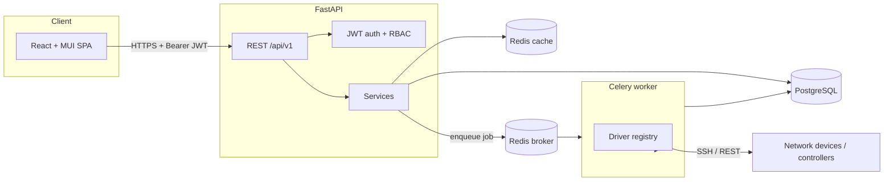
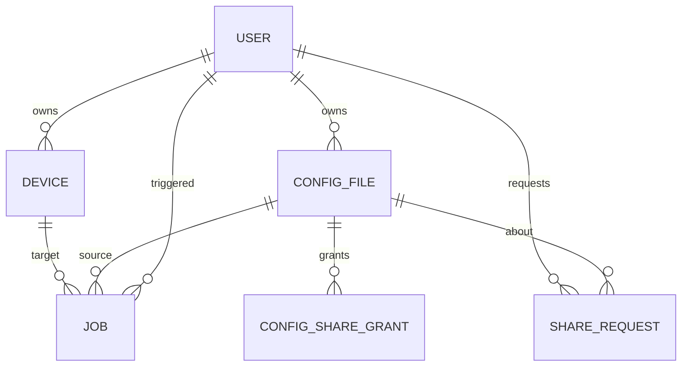

# Architecture

Golden Config is a full-stack application split into a **React SPA** and a **FastAPI**
backend, backed by **PostgreSQL** and **Redis**, with device communication handled by a
**Celery** worker through a **pluggable driver layer**.

## High-level flow

## Key flows

### Capture ("Create config file")

1. User clicks **Backup** on a device.
2. API creates a `Job(type=backup, status=pending)` and dispatches a Celery task.
3. The worker builds a `DeviceTarget`, resolves the driver, and calls `backup()`.
4. The captured text is stored as a new `ConfigFile` owned by the user, and the job is
   marked `succeeded`.

### Apply ("Config")

1. User picks a **platform-compatible** config file and clicks **Apply**.
2. API validates `config.platform == device.platform`, creates a `Job(type=apply)`, and
   dispatches it.
3. The worker calls `apply(config, dry_run)`. NAPALM computes a diff and commits (or, in
   dry-run, discards). REST drivers PUT a JSON document.

### Sharing

1. A user requests access to another user's config file (`ShareRequest`, status `pending`).
2. The owner accepts → a `ConfigShareGrant` is created, giving the requester read access.
3. Access checks in `config_service` honour ownership, admin role, and grants.

## Driver layer

Drivers live in [backend/app/drivers](../backend/app/drivers) and self-register with a
registry keyed by platform. Each driver supports:

* **mock** transport — returns realistic sample config (default; no hardware needed).
* **real** transport — SSH via Netmiko/NAPALM, or REST via httpx.

Adding a vendor is just a new subclass with `sample_config()` and the `_real_*` methods
(usually inherited from `NetmikoDriver` or `RestControllerDriver`).

## Security

* JWT access + refresh tokens; access tokens carry the user role.
* RBAC: `admin` > `operator` > `viewer`. Operators+ can manage devices and run jobs.
* Device credentials are encrypted at rest with Fernet (`app/core/crypto.py`).
* An append-only `AuditLog` records logins and mutating actions.

## Data model

